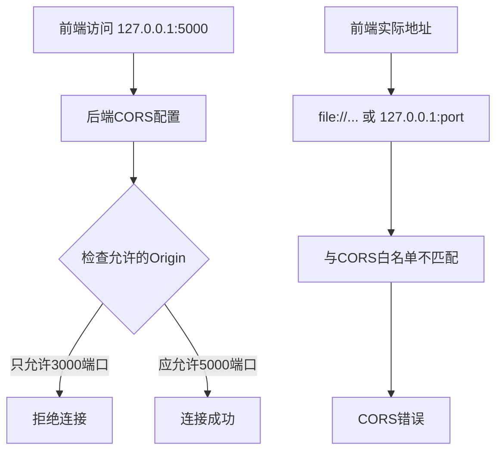
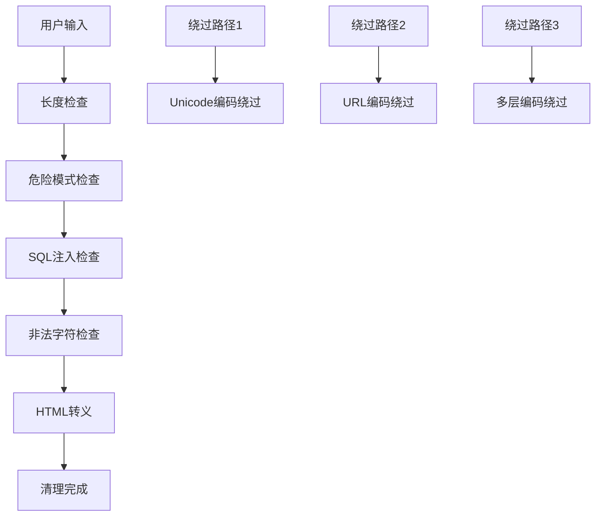
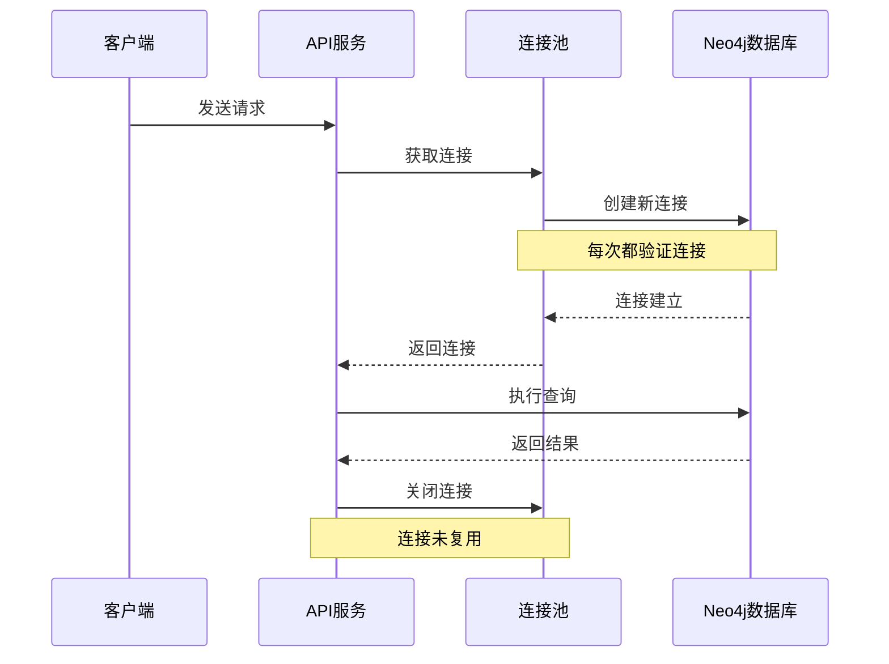
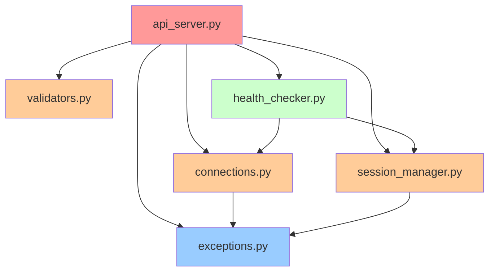
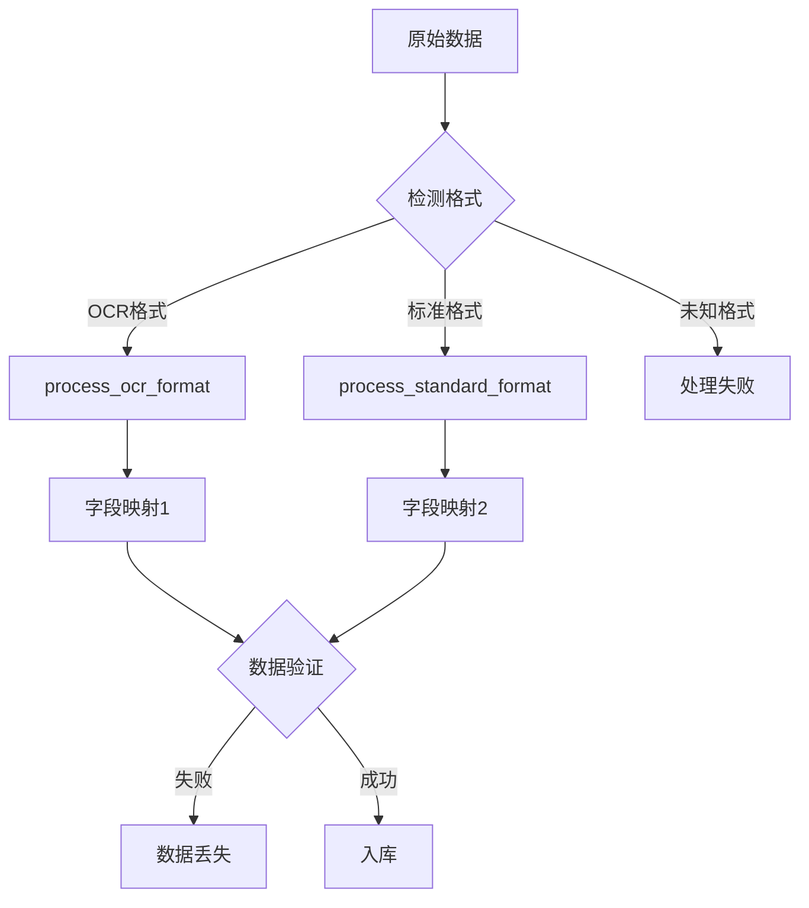

# 政策法规RAG问答系统 - 代码质量与功能性问题分析

## 概述

本文档通过全面分析政策法规RAG问答系统的代码库，识别出系统中存在的功能性问题、安全隐患、性能问题和代码质量问题。分析范围涵盖前端、后端、数据处理脚本以及系统架构设计。

## 严重功能性问题

### 1. 前后端连接配置错误

#### 问题描述
前后端无法正确连接的主要原因是CORS配置不匹配：



**具体位置**: `backend/api_server.py:37`
```python
CORS(app, origins=['http://localhost:3000', 'http://127.0.0.1:3000'])
```

**问题分析**：
- 后端只允许3000端口的跨域请求
- 前端配置访问5000端口：`http://127.0.0.1:5000`
- 如果前端直接打开HTML文件，Origin为`file://`协议
- CORS白名单与实际访问地址不匹配

**影响**：前端无法向后端发送请求，所有API调用失败

### 2. 启动脚本路径问题

#### 问题描述
项目存在多个启动入口，导致路径混乱：

**文件分布**：
- `api_server.py` (根目录) - 启动脚本
- `backend/api_server.py` - 实际服务代码

**具体位置**: `api_server.py:12-16`
```python
# 切换到backend目录
os.chdir(backend_dir)

# 导入并运行API服务器
from api_server import app
```

**问题**：
- 启动时改变工作目录可能影响相对路径
- 模块导入依赖工作目录切换
- 不符合Python项目的最佳实践

### 3. 连接初始化缺陷

#### 问题描述
在 `connections.py` 中，Ollama连接管理器初始化存在兼容性问题：

**具体位置**: `backend/connections.py:235-263`
- 模型验证逻辑对不同API响应格式的兼容性不足
- 远程Ollama服务返回格式可能与本地服务不同
- 虽然代码有容错处理，但可能影响初始化速度

**影响**：Ollama服务初始化较慢或失败，影响LLM功能

### 4. 数据库查询逻辑问题

#### 问题描述
在 `api_server.py` 的 `generate_policy_answer` 函数中存在数据访问逻辑缺陷：

**具体位置**: `backend/api_server.py:130-150`
```python
for record in neo4j_results:
    policy_title = record.get('policy_title', '未知政策')
    section_title = record.get('section_title', '')
    # ... 其他字段访问
```

**问题分析**：
- `connection_manager.neo4j.execute_query` 返回的是包含 `record.data()` 的列表
- 但代码直接对结果使用 `.get()` 方法
- 正确做法应该是先调用 `record.data()` 或确保返回的就是字典

**影响**：政策查询功能可能失效，用户无法获得正确答案

### 5. 前端错误处理不完善

#### 问题描述
前端 `index.html` 中的错误处理机制存在多个问题：

**具体位置**: `frontend/index.html:200-230`
```javascript
// 连接状态检查频率设置
setInterval(checkConnectionStatus, 30000); // 30秒检查一次
```

**问题分析**：
- 初始检查间隔为30秒，但用户交互响应慢
- 错误消息过于简单，无法帮助用户诊断问题
- 缺乏对CORS错误的特殊处理
- 超时设置不合理：`timeout: 5000` 但fetch不支持timeout属性

**具体问题**：
```javascript
const response = await fetch(PING_URL, {
    method: 'GET',
    mode: 'cors',
    timeout: 5000  // ❌ fetch不支持timeout属性
});
```

**影响**：用户无法获得准确的连接状态信息，难以诊断连接问题

## 安全性问题

### 1. 输入验证绕过风险

#### 问题描述
在 `validators.py` 中发现输入验证可能被绕过：

**具体位置**: `backend/validators.py:45-85`



**问题**：
- 正则表达式模式可能被Unicode字符绕过
- 缺乏对URL编码、Unicode标准化的处理
- HTML转义在某些边缘情况下可能不足

### 2. CORS配置风险

#### 问题描述
在 `api_server.py` 中CORS配置存在安全风险：

**具体位置**: `backend/api_server.py:30`
```python
CORS(app, origins=['http://localhost:3000', 'http://127.0.0.1:3000'])
```

**问题**：
- 硬编码的Origin列表不适合生产环境
- 缺乏动态Origin验证机制
- 未配置其他CORS安全选项（credentials、headers等）

### 3. 敏感信息泄露

#### 问题描述
错误处理中可能泄露敏感信息：

**具体位置**: `backend/exceptions.py:90-110`
- 异常信息可能包含数据库连接字符串
- 系统路径信息可能暴露在错误堆栈中
- 调试模式下运行可能暴露过多信息

## 性能问题

### 1. 数据库连接池效率问题

#### 问题描述
Neo4j连接管理存在性能瓶颈：

**具体位置**: `backend/connections.py:35-80`



**问题**：
- 健康检查频率过高，每次查询都进行验证
- 连接池配置不合理，可能导致连接泄露
- 缺乏连接超时和重试机制

### 2. 前端资源加载效率问题

#### 问题描述
前端资源加载和渲染存在性能问题：

**具体位置**: `frontend/index.html:200+`
- 频繁的DOM操作（每5秒更新状态）
- 缺乏消息渲染优化（大量消息时性能下降）
- 未实现虚拟滚动或分页机制

### 3. 内存泄露风险

#### 问题描述
会话管理可能存在内存泄露：

**具体位置**: `backend/session_manager.py:185-220`
- 会话清理机制依赖定时器，可能失效
- 大量并发会话时内存占用持续增长
- 缺乏强制内存限制机制

## 代码质量问题

### 1. 模块间耦合度过高

#### 问题描述
系统各模块之间存在紧耦合关系：



**问题**：
- 循环依赖风险高
- 单元测试困难
- 模块修改影响范围大

### 2. 配置管理混乱

#### 问题描述
系统配置分散在多个文件中：

**问题分布**：
- `api_server.py`: 数据库连接配置
- `import_policy_data.py`: 重复的连接配置  
- `frontend/index.html`: 硬编码的API地址
- 各脚本文件: 分散的配置参数

**影响**：
- 配置不一致导致的错误
- 部署困难
- 维护成本高

### 3. 错误代码重复

#### 问题描述
在多个文件中发现重复的错误处理代码：

**重复位置**：
- `import_policy_data.py`: 数据库连接检查
- `api_server.py`: 连接验证逻辑
- 各测试脚本: 相似的错误处理

### 4. 文档与代码不一致

#### 问题描述
代码注释和实际实现存在偏差：

**具体案例**：
- `session_manager.py` 中标注支持多轮对话，但实现不完整
- API文档声明支持流式响应，但代码中明确设置 `stream=False`
- 健康检查文档与实际检查项目不符

## 数据一致性问题

### 1. OCR数据格式处理不统一

#### 问题描述
在 `import_policy_data.py` 中发现数据格式处理不一致：

**具体位置**: `scripts/import_policy_data.py:74-85`
- OCR格式和标准格式的处理逻辑分离
- 字段映射不一致可能导致数据丢失
- 缺乏数据验证机制



### 2. 数据库事务管理缺失

#### 问题描述
数据导入过程缺乏事务管理：

**影响**：
- 导入失败时可能产生不完整数据
- 数据一致性无法保证
- 回滚机制缺失

## 可用性问题

### 1. 用户体验问题

#### 问题描述
前端用户体验存在多个问题：

**具体表现**：
- 加载状态缺乏进度指示
- 错误信息对用户不友好
- 缺乏操作引导和帮助信息
- 响应时间长时无提示

### 2. 降级机制不完善

#### 问题描述
系统缺乏完善的降级机制：

**具体位置**: `backend/api_server.py:45-65`
- LLM服务不可用时降级策略简单
- 缺乏对部分功能失效的优雅处理
- 用户无法了解哪些功能可用

## 维护性问题

### 1. 日志系统不完善

#### 问题描述
系统日志记录存在不足：

- 日志级别配置不合理
- 缺乏结构化日志格式
- 敏感信息可能被记录
- 日志轮转和清理机制缺失

### 2. 测试覆盖率不足

#### 问题描述
系统测试覆盖范围有限：

**现状分析**：
- 主要依赖集成测试
- 单元测试覆盖率低
- 缺乏边界条件测试
- 错误路径测试不足

### 3. 部署复杂度高

#### 问题描述
系统部署和配置复杂：

- 多个独立的启动脚本
- 依赖服务配置分散
- 缺乏容器化部署方案
- 环境变量管理混乱

## 推荐改进措施

### 高优先级（严重问题）

1. **修复前后端连接配置**
   - 更新CORS配置以支持正确的端口和协议
   - 添加开发环境和生产环境的动态配置
   - 实现前端的正确部署方式

   **解决方案**：
   ```python
   # backend/api_server.py
   # 根据环境配置CORS
   if os.getenv('ENVIRONMENT') == 'development':
       CORS(app, origins=['*'])  # 开发环境允许所有源
   else:
       CORS(app, origins=['http://localhost:3000', 'http://127.0.0.1:3000', 'http://127.0.0.1:5000'])
   ```

2. **统一启动脚本和路径管理**
   - 使用项目根目录的统一启动脚本
   - 避免运行时切换工作目录
   - 规范化模块导入路径

   **解决方案**：
   ```python
   # start_server.py (项目根目录)
   import sys
   import os
   sys.path.insert(0, os.path.join(os.path.dirname(__file__), 'backend'))
   from backend.api_server import app
   app.run(host='127.0.0.1', port=5000)
   ```

3. **修复连接初始化缺陷**
   - 增强Ollama客户端的兼容性检查
   - 实现初始化重试逻辑
   - 添加降级启动模式

4. **完善数据库查询逻辑**
   - 确保Neo4j查询结果的正确处理
   - 添加查询结果验证
   - 实现查询失败重试

### 中优先级（性能和安全）

1. **优化连接池管理**
   - 调整健康检查频率
   - 实现连接复用机制
   - 添加连接监控

2. **改进CORS配置**
   - 实现动态Origin验证
   - 添加安全头配置
   - 环境相关配置分离

3. **完善错误处理**
   - 标准化错误响应格式
   - 避免敏感信息泄露
   - 实现错误分级处理

### 低优先级（代码质量）

1. **重构模块架构**
   - 解除模块间紧耦合
   - 实现依赖注入
   - 标准化接口定义

2. **统一配置管理**
   - 集中化配置文件
   - 环境变量标准化
   - 配置验证机制

3. **提升测试覆盖率**
   - 增加单元测试
   - 实现自动化测试
   - 建立测试基准

## 快速修复方案

### 立即解决前后端连接问题

**步骤1：修复CORS配置**

修改 `backend/api_server.py` 第37行：
```python
# 修改前：
CORS(app, origins=['http://localhost:3000', 'http://127.0.0.1:3000'])

# 修改后：
CORS(app, origins=['*'])  # 临时允许所有域名，解决开发环境问题
# 或者更安全的方式：
# CORS(app, origins=['http://localhost:3000', 'http://127.0.0.1:3000', 
#                   'http://127.0.0.1:5000', 'file://'])
```

**步骤2：使用正确的启动方式**

在项目根目录执行：
```bash
# 使用现有的启动脚本
python api_server.py

# 或者直接在backend目录启动
cd backend
python api_server.py
```

**步骤3：验证连接**

1. 启动后端后，在浏览器访问：`http://127.0.0.1:5000/ping`
2. 应该看到：`{"status": "ok", "timestamp": "...", "message": "服务正在运行"}`
3. 然后直接打开 `frontend/index.html` 文件测试连接

**步骤4：检查服务状态**

访问 `http://127.0.0.1:5000/health` 查看详细的系统健康状态。

### 临时绕过Ollama连接问题

如果Ollama服务不可用，系统仍可以运行在降级模式下：
1. 后端会使用基本的信息检索功能
2. 不会生成AI增强的回答，但会返回检索到的政策条文
3. 所有其他功能（会话管理、健康检查等）正常工作

## 风险评估

### 系统可用性风险：极高
- **前后端连接完全断开**：CORS配置错误导致系统无法使用
- 连接初始化失败可能导致系统无法启动
- 数据库查询问题影响核心功能

### 用户体验风险：高
- 用户无法访问系统任何功能
- 错误信息不明确，难以诊断问题
- 连接状态显示不准确

### 安全风险：中
- 输入验证绕过可能导致注入攻击
- CORS配置问题可能被利用

### 性能风险：中
- 连接池效率问题影响并发性能
- 内存泄露可能导致系统崩溃

### 维护风险：高
- 代码耦合度高增加维护难度
- 配置分散导致部署复杂