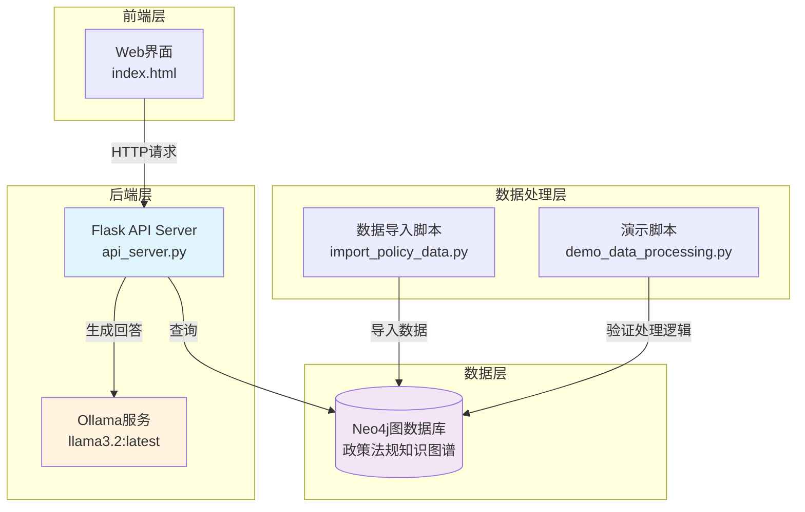
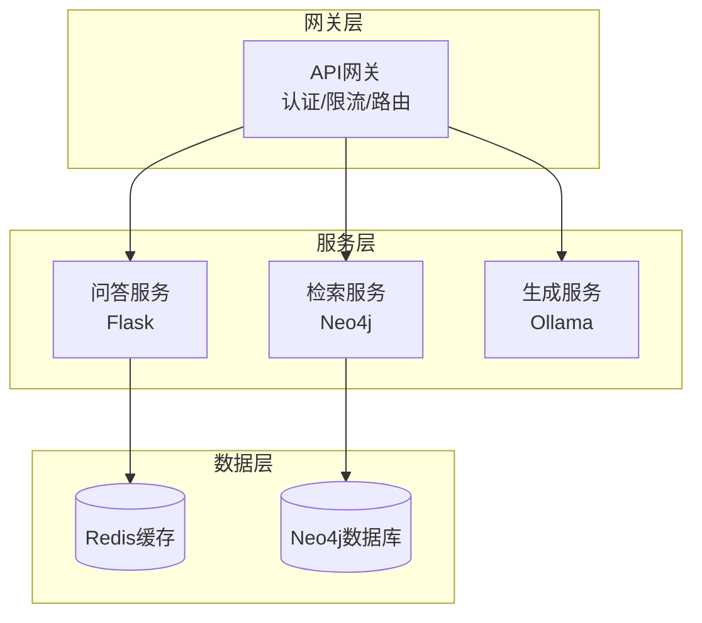
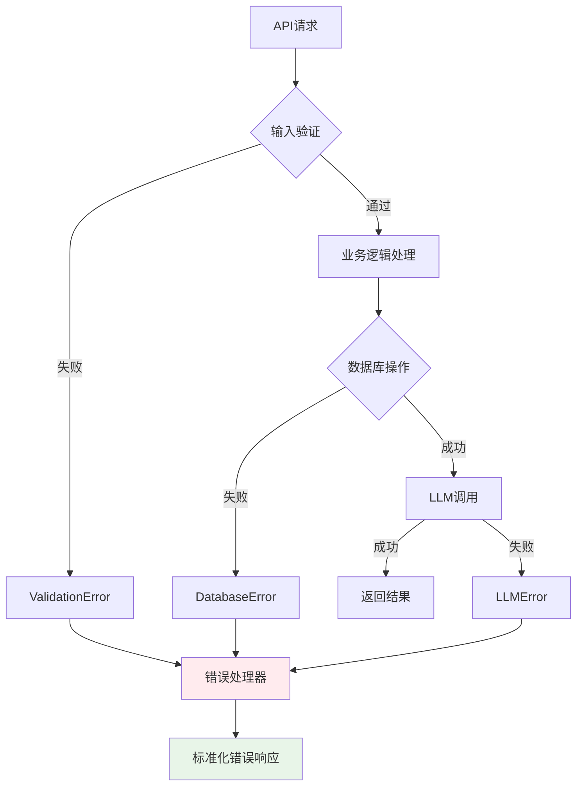

# 政策法规RAG问答系统 - 代码库分析报告

## 概述

政策法规RAG问答系统是一个基于检索增强生成(RAG)架构的智能问答系统，结合了Neo4j图数据库和Ollama大语言模型，为用户提供政策法规相关的智能问答服务。

### 技术栈
- **后端**: Flask 3.0.0 + Python 3.12
- **数据库**: Neo4j 5.14.1 (图数据库)
- **AI模型**: Ollama (llama3.2:latest)
- **前端**: 原生HTML/CSS/JavaScript
- **依赖管理**: requirements.txt + npm (仅用于前端服务器)

## 系统架构



## 代码库结构分析

### 核心模块

#### 1. 后端API服务 (`backend/api_server.py`)
- **功能**: 提供RESTful API接口，处理问答请求
- **核心端点**: `/api/ask` (POST)
- **依赖**: Flask, Flask-CORS, Neo4j驱动, Ollama客户端

#### 2. 前端界面 (`frontend/index.html`)
- **功能**: 提供用户交互界面，聊天式问答体验
- **特性**: 连接状态监控、实时消息展示、错误处理

#### 3. 数据处理模块 (`scripts/`)
- **import_policy_data.py**: 原始数据导入脚本(存在问题)
- **import_policy_data_fixed.py**: 修复版数据导入脚本
- **demo_data_processing.py**: 数据处理演示脚本

## 已识别的功能性问题

### 问题1: 数据导入脚本架构缺陷 ⚠️ 

**问题描述**:
```python
# 问题代码: api_server.py 存在重复导入
from neo4j import GraphDatabase
LLM_BINDING = os.getenv("LLM_BINDING")
# ... 其他配置
from neo4j import GraphDatabase  # 重复导入
```

**影响**: 
- 代码冗余，可能导致混淆
- 维护性降低

### 问题2: 错误处理不够健壮 ⚠️

**问题描述**:
后端API中的错误处理过于简单：
```python
except Exception as e:
    return {
        "answer": f"查询过程中出现错误: {str(e)}",
        "entities": []
    }
```

**影响**:
- 异常信息可能暴露系统内部结构
- 缺乏分类错误处理
- 调试困难

### 问题3: 缺乏输入验证和安全检查 ⚠️

**问题描述**:
```python
@app.route('/api/ask', methods=['POST'])
def ask():
    data = request.get_json()
    question = data.get('question', '')
    if not question:
        return jsonify({'error': 'No question provided'}), 400
```

**安全风险**:
- 未限制输入长度，可能导致DoS攻击
- 未验证输入内容，可能存在注入风险
- 缺乏请求频率限制

### 问题4: 数据格式处理不统一 ⚠️

**问题描述**:
系统存在两种数据格式但处理逻辑分散：
- OCR格式: `main_body`结构
- 标准格式: `chapters`和`articles`结构

**影响**:
- 增加维护复杂度
- 数据一致性难以保证

### 问题5: 连接管理缺陷 ⚠️

**问题描述**:
```python
# Neo4j驱动全局创建，缺乏连接池管理
driver = GraphDatabase.driver(NEO4J_URI, auth=(NEO4J_USERNAME, NEO4J_PASSWORD))

# Ollama客户端配置缺乏超时设置
if LLM_BINDING_HOST:
    client = ollama.Client(host=LLM_BINDING_HOST)
else:
    client = ollama.Client()
```

**影响**:
- 连接资源浪费
- 无超时控制可能导致请求挂起
- 缺乏连接健康检查

### 问题6: 前端状态管理问题 ⚠️

**问题描述**:
```javascript
// 连接状态检查使用实际API调用，浪费资源
function updateConnectionStatus() {
    fetch('http://127.0.0.1:5000/api/ask', {
        method: 'POST',
        headers: { 'Content-Type': 'application/json' },
        body: JSON.stringify({ question: 'test' }),
        mode: 'cors'
    })
    // ...
}
```

**影响**:
- 无效API调用浪费服务器资源
- 可能影响日志记录
- 缺乏专用健康检查端点

### 问题7: 缺乏会话管理 ⚠️

**问题描述**:
系统不支持多轮对话，每次请求都是独立的：

**影响**:
- 无法处理上下文相关问题
- 用户体验受限
- 无法实现个性化服务

## 系统改进方向

### 1. 安全性增强

#### 输入验证和清理
```python
from werkzeug.security import escape
import re

def validate_question(question):
    if not question or len(question.strip()) == 0:
        return False, "问题不能为空"
    if len(question) > 1000:
        return False, "问题长度不能超过1000字符"
    # 过滤恶意内容
    if re.search(r'[<>"\';\\]', question):
        return False, "问题包含非法字符"
    return True, None
```

#### API安全增强
- 添加请求频率限制(Rate Limiting)
- 实现API密钥认证
- 添加CORS策略配置
- 输入内容过滤和转义

### 2. 错误处理改进

#### 分层错误处理
```python
class SystemError(Exception):
    """系统级错误"""
    pass

class DatabaseError(SystemError):
    """数据库连接错误"""
    pass

class LLMError(SystemError):
    """大模型服务错误"""
    pass

def handle_error(error):
    if isinstance(error, DatabaseError):
        return {"error": "数据库连接失败，请稍后重试", "code": "DB_ERROR"}
    elif isinstance(error, LLMError):
        return {"error": "AI服务暂时不可用，请稍后重试", "code": "LLM_ERROR"}
    else:
        return {"error": "系统错误，请联系管理员", "code": "SYSTEM_ERROR"}
```

### 3. 性能优化

#### 连接池管理
```python
from neo4j import GraphDatabase
import threading

class Neo4jConnectionPool:
    def __init__(self, uri, auth, max_pool_size=10):
        self.driver = GraphDatabase.driver(
            uri, auth=auth, 
            max_connection_pool_size=max_pool_size
        )
        self._lock = threading.Lock()
    
    def get_session(self):
        return self.driver.session()
    
    def close(self):
        self.driver.close()
```

#### 缓存机制
- 实现Redis缓存层
- 缓存常见问题答案
- 缓存数据库查询结果

### 4. 功能增强

#### 多轮对话支持
```python
class ConversationManager:
    def __init__(self):
        self.sessions = {}
    
    def get_context(self, session_id):
        return self.sessions.get(session_id, [])
    
    def add_message(self, session_id, role, content):
        if session_id not in self.sessions:
            self.sessions[session_id] = []
        self.sessions[session_id].append({
            "role": role, 
            "content": content,
            "timestamp": datetime.now()
        })
```

#### 流式响应
```python
@app.route('/api/ask-stream', methods=['POST'])
def ask_stream():
    def generate():
        # 实现流式生成
        for chunk in llm_stream_response(question):
            yield f"data: {json.dumps(chunk)}\n\n"
    
    return Response(generate(), mimetype='text/plain')
```

### 5. 监控和日志

#### 结构化日志
```python
import logging
import json

class StructuredLogger:
    def __init__(self):
        logging.basicConfig(level=logging.INFO)
        self.logger = logging.getLogger(__name__)
    
    def log_request(self, endpoint, params, response_time, status):
        log_data = {
            "endpoint": endpoint,
            "params": params,
            "response_time_ms": response_time,
            "status": status,
            "timestamp": datetime.now().isoformat()
        }
        self.logger.info(json.dumps(log_data))
```

#### 健康检查端点
```python
@app.route('/health', methods=['GET'])
def health_check():
    checks = {
        "database": check_neo4j_connection(),
        "llm_service": check_ollama_connection(),
        "memory_usage": get_memory_usage()
    }
    
    all_healthy = all(checks.values())
    status_code = 200 if all_healthy else 503
    
    return jsonify({
        "status": "healthy" if all_healthy else "unhealthy",
        "checks": checks,
        "timestamp": datetime.now().isoformat()
    }), status_code
```

### 6. 架构升级

#### 微服务化


#### 容器化部署
```dockerfile
# Dockerfile示例
FROM python:3.12-slim

WORKDIR /app
COPY requirements.txt .
RUN pip install -r requirements.txt

COPY . .
EXPOSE 5000

CMD ["gunicorn", "--bind", "0.0.0.0:5000", "app:app"]
```

### 7. 数据管理改进

#### 统一数据处理接口
```python
class PolicyDataProcessor:
    def process(self, data, format_type=None):
        if format_type is None:
            format_type = self.detect_format(data)
        
        if format_type == 'ocr_format':
            return self.process_ocr_format(data)
        elif format_type == 'standard_format':
            return self.process_standard_format(data)
        else:
            raise ValueError(f"Unsupported format: {format_type}")
```

#### 增量更新机制
```python
class IncrementalUpdater:
    def update_policy(self, policy_id, new_data):
        with self.driver.session() as session:
            # 检查现有数据
            existing = session.run(
                "MATCH (p:Policy {policy_id: $id}) RETURN p",
                id=policy_id
            ).single()
            
            if existing:
                # 增量更新
                self.merge_policy_data(session, policy_id, new_data)
            else:
                # 新增
                self.create_policy_data(session, policy_id, new_data)
```

### 问题5解决方案: 连接管理优化

#### Neo4j连接池管理器

```python
from neo4j import GraphDatabase
from contextlib import contextmanager

class Neo4jConnectionManager:
    """Neo4j连接池管理器"""
    
    def __init__(self, uri: str, auth: tuple, max_pool_size: int = 10):
        self._driver = GraphDatabase.driver(
            uri, auth=auth,
            max_connection_pool_size=max_pool_size,
            connection_timeout=30
        )
    
    @contextmanager
    def get_session(self):
        """获取数据库会话"""
        session = None
        try:
            session = self._driver.session()
            yield session
        except Exception as e:
            raise DatabaseError(f"数据库操作失败: {e}", "session_error")
        finally:
            if session:
                session.close()
    
    def is_healthy(self) -> bool:
        """检查连接健康状态"""
        try:
            with self._driver.session() as session:
                result = session.run("RETURN 1 as test")
                return result.single()["test"] == 1
        except Exception:
            return False
```

#### Ollama连接管理器

```python
import ollama
import time

class OllamaConnectionManager:
    """Ollama连接管理器"""
    
    def __init__(self, host: str, model: str, timeout: int = 120):
        self.host = host
        self.model = model
        self.timeout = timeout
        self._client = ollama.Client(host=host, timeout=timeout)
    
    def chat(self, messages: list, **kwargs):
        """发送聊天请求"""
        try:
            return self._client.chat(
                model=self.model,
                messages=messages,
                **kwargs
            )
        except Exception as e:
            raise LLMServiceError(f"LLM服务调用失败: {e}", self.model)
    
    def is_healthy(self) -> bool:
        """检查LLM服务健康状态"""
        try:
            import requests
            health_url = f"{self.host}/api/tags"
            response = requests.get(health_url, timeout=10)
            return response.status_code == 200
        except Exception:
            return False
```

### 问题7解决方案: 会话管理系统

#### 会话管理器

```python
import uuid
from datetime import datetime, timedelta
from typing import Dict, List, Optional

class ConversationSession:
    """对话会话对象"""
    
    def __init__(self, session_id: str, max_history: int = 10):
        self.session_id = session_id
        self.created_at = datetime.now()
        self.last_activity = self.created_at
        self.messages: List[Dict] = []
        self.max_history = max_history
    
    def add_message(self, role: str, content: str, entities: List = None):
        """添加消息到会话历史"""
        message = {
            'role': role,
            'content': content,
            'timestamp': datetime.now().isoformat(),
            'entities': entities or []
        }
        
        self.messages.append(message)
        self.last_activity = datetime.now()
        
        # 保持历史记录在限制范围内
        if len(self.messages) > self.max_history * 2:
            self.messages = self.messages[-self.max_history * 2:]
    
    def get_context_for_llm(self) -> List[Dict]:
        """获取用于LLM的上下文消息"""
        return [{
            'role': msg['role'],
            'content': msg['content']
        } for msg in self.messages[-6:]]
    
    def is_expired(self, timeout_minutes: int = 30) -> bool:
        """检查会话是否过期"""
        timeout_threshold = datetime.now() - timedelta(minutes=timeout_minutes)
        return self.last_activity < timeout_threshold

class ConversationManager:
    """对话管理器"""
    
    def __init__(self, session_timeout_minutes: int = 30):
        self.session_timeout_minutes = session_timeout_minutes
        self.sessions: Dict[str, ConversationSession] = {}
    
    def create_session(self) -> str:
        """创建新的对话会话"""
        session_id = str(uuid.uuid4())
        self.sessions[session_id] = ConversationSession(session_id)
        return session_id
    
    def get_session(self, session_id: str) -> Optional[ConversationSession]:
        """获取指定会话"""
        session = self.sessions.get(session_id)
        
        if session and session.is_expired(self.session_timeout_minutes):
            del self.sessions[session_id]
            return None
        
        return session
    
    def add_message_to_session(self, session_id: str, role: str, 
                              content: str, entities: List = None):
        """向会话添加消息"""
        session = self.get_session(session_id)
        if not session:
            raise SessionError(f"会话不存在或已过期: {session_id}", session_id)
        
        session.add_message(role, content, entities)
        return True
    
    def get_context_for_question(self, session_id: str, current_question: str) -> str:
        """获取包含上下文的完整问题"""
        session = self.get_session(session_id)
        if not session:
            return current_question
        
        context_messages = session.get_context_for_llm()
        if not context_messages:
            return current_question
        
        context_prompt = "根据以下对话历史，回答用户的新问题：\n\n"
        context_prompt += "对话历史：\n"
        
        for msg in context_messages:
            role_name = "用户" if msg['role'] == 'user' else "助手"
            context_prompt += f"{role_name}: {msg['content']}\n"
        
        context_prompt += f"\n当前问题: {current_question}"
        return context_prompt
```

## 优先级改进建议

### 高优先级 (必须立即修复)
1. **增强错误处理** - 避免敏感信息泄露
2. **添加输入验证** - 防止安全风险
3. **连接池管理** - 提升性能和稳定性
4. **会话管理系统** - 支持多轮对话

### 中优先级 (短期内改进)
1. **实现健康检查端点** - 替代当前的连接状态检查
2. **结构化日志** - 便于故障排查
3. **请求频率限制** - 防止滥用
4. **API文档** - 提升开发体验

### 低优先级 (长期规划)
1. **流式响应** - 提升交互体验
2. **微服务化** - 提升系统可扩展性
3. **容器化部署** - 简化运维管理

## 关键问题解决方案设计

### 问题2解决方案: 健壮的错误处理机制

#### 分层异常处理架构



#### 自定义异常类体系

```python
class PolicySystemError(Exception):
    """系统基础异常类"""
    def __init__(self, message, error_code=None, details=None):
        self.message = message
        self.error_code = error_code or 'SYSTEM_ERROR'
        self.details = details or {}
        super().__init__(self.message)

class ValidationError(PolicySystemError):
    """输入验证错误"""
    def __init__(self, message, field=None):
        super().__init__(message, 'VALIDATION_ERROR', {'field': field})

class DatabaseError(PolicySystemError):
    """数据库连接/查询错误"""
    def __init__(self, message, operation=None):
        super().__init__(message, 'DATABASE_ERROR', {'operation': operation})

class LLMServiceError(PolicySystemError):
    """大语言模型服务错误"""
    def __init__(self, message, model=None, timeout=False):
        super().__init__(message, 'LLM_ERROR', {'model': model, 'timeout': timeout})

class SessionError(PolicySystemError):
    """会话管理错误"""
    def __init__(self, message, session_id=None):
        super().__init__(message, 'SESSION_ERROR', {'session_id': session_id})
```

#### 错误处理装饰器

```python
from functools import wraps
import logging
import uuid
from datetime import datetime

def handle_errors(func):
    """统一错误处理装饰器"""
    @wraps(func)
    def wrapper(*args, **kwargs):
        try:
            return func(*args, **kwargs)
        except ValidationError as e:
            return jsonify({
                'success': False,
                'error': {
                    'code': e.error_code,
                    'message': e.message,
                    'type': 'validation_error'
                }
            }), 400
        except DatabaseError as e:
            return jsonify({
                'success': False,
                'error': {
                    'code': e.error_code,
                    'message': '数据库服务暂时不可用，请稍后重试',
                    'type': 'database_error'
                }
            }), 503
        except Exception as e:
            error_id = str(uuid.uuid4())[:8]
            return jsonify({
                'success': False,
                'error': {
                    'code': 'INTERNAL_ERROR',
                    'message': f'系统内部错误，请联系管理员 (错误ID: {error_id})',
                    'type': 'internal_error'
                }
            }), 500
    return wrapper
```

### 问题3解决方案: 输入验证和安全检查

#### 输入验证器

```python
import re
from typing import Tuple, Optional
from werkzeug.security import escape

class InputValidator:
    """输入验证器"""
    
    DANGEROUS_PATTERNS = [
        r'<script[^>]*>.*?</script>',  # XSS脚本
        r'javascript:',               # JavaScript协议
        r'\bUNION\b.*\bSELECT\b',    # SQL注入
    ]
    
    @staticmethod
    def validate_question(question: str) -> Tuple[bool, Optional[str]]:
        """验证用户问题输入"""
        if not question or len(question.strip()) == 0:
            return False, "问题不能为空"
        if len(question) > 1000:
            return False, "问题长度不能超过1000字符"
        
        # 危险内容检测
        for pattern in InputValidator.DANGEROUS_PATTERNS:
            if re.search(pattern, question, re.IGNORECASE):
                return False, "问题包含潜在危险内容"
        
        return True, None
    
    @staticmethod
    def sanitize_question(question: str) -> str:
        """清理用户输入"""
        if not question:
            return ""
        
        # HTML实体转义
        question = escape(question)
        
        # 标准化空白字符
        question = re.sub(r'\s+', ' ', question.strip())
        
        return question
```

#### 请求频率限制

```python
from collections import defaultdict, deque
from datetime import datetime, timedelta

class RateLimiter:
    """请求频率限制器"""
    
    def __init__(self, requests_per_minute=30):
        self.requests_per_minute = requests_per_minute
        self.requests = defaultdict(deque)
    
    def is_allowed(self, client_ip: str) -> Tuple[bool, Optional[str]]:
        """检查是否允许请求"""
        now = datetime.now()
        minute_ago = now - timedelta(minutes=1)
        
        # 清理过期记录
        while (self.requests[client_ip] and 
               self.requests[client_ip][0] < minute_ago):
            self.requests[client_ip].popleft()
        
        # 检查频率限制
        if len(self.requests[client_ip]) >= self.requests_per_minute:
            return False, f"请求过于频繁，每分钟最多{self.requests_per_minute}次请求"
        
        # 记录新请求
        self.requests[client_ip].append(now)
        return True, None
```