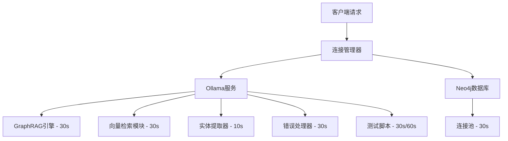
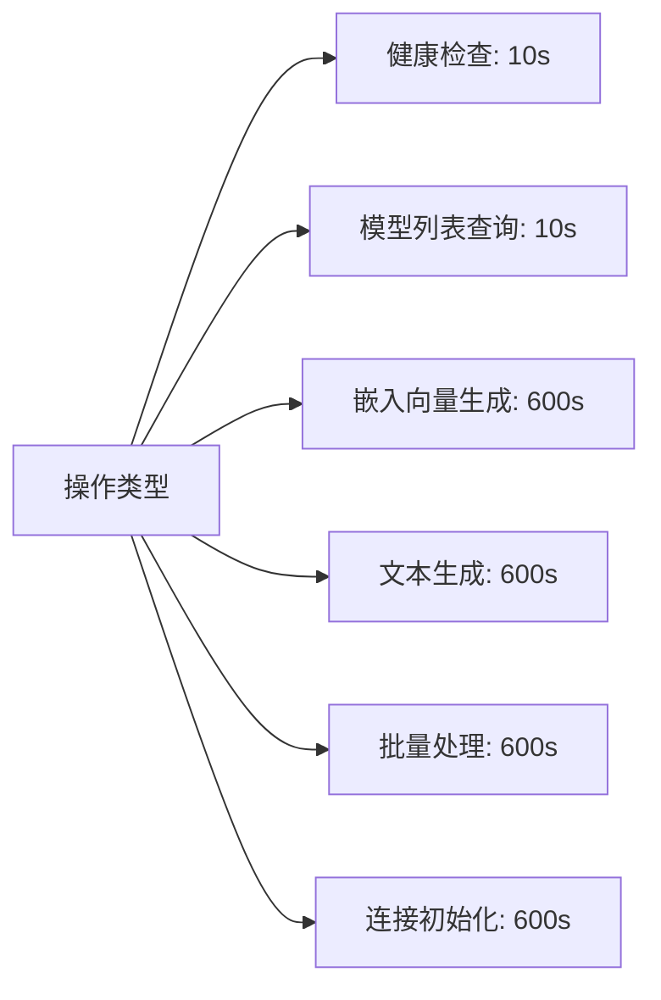

# 政策法规RAG问答系统连接超时优化设计

## 概述

针对系统中出现的 `HTTPConnectionPool(host='120.232.79.82', port=11434): Read timed out. (read timeout=30)` 错误，本设计文档分析了现有超时配置情况，并提供统一的超时时间调整方案。

### 问题分析

错误信息中的 `read timeout=30` 是**本地客户端设置的超时时间**，而非远程Ollama服务设置的超时。当本地请求在30秒内没有收到服务器响应时，客户端主动断开连接并抛出此异常。

## 技术架构

### 现有超时配置分布

系统中存在多个超时配置点，分布在不同的模块中：



### 超时配置详细清单

| 模块 | 文件路径 | 当前超时(秒) | 调用类型 |
|------|----------|--------------|----------|
| GraphRAG引擎 | backend/graphrag_engine.py:L353 | 30 | POST /api/generate |
| 向量检索模块 | backend/vector_retrieval.py:L118 | 30 | POST /api/embed |
| 测试连接脚本 | scripts/test_ollama_connection.py:L35 | 30 | POST /api/chat |
| 问答演示脚本 | scripts/policy_qa_demo.py:L39 | 60 | POST /api/chat |
| 连接管理器 | backend/connections.py | 120 | 类初始化参数 |
| 实体提取器验证 | backend/entity_extractor.py:L85 | 10 | GET /api/tags |
| 错误处理器 | backend/ollama_error_handler.py | 30 | 类初始化参数 |
| 增强功能测试 | scripts/test_enhanced_features.py:L258 | 30 | POST请求 |

## 设计方案

### 超时时间标准化

根据不同操作的特点制定统一的超时标准：



### 配置分层架构

| 配置层级 | 超时时间 | 适用场景 |
|----------|----------|----------|
| 快速验证 | 10秒 | 健康检查、服务可用性检查 |
| 标准操作 | 600秒 | 文本生成、嵌入向量计算 |
| 批量处理 | 600秒 | 大量数据处理、导入操作 |
| 连接管理 | 600秒 | 连接池初始化、错误恢复 |

### 核心模块修改方案

#### 1. GraphRAG引擎模块
- **文件**: `backend/graphrag_engine.py`
- **位置**: 第353行
- **修改**: `timeout=30` → `timeout=600`

#### 2. 向量检索模块  
- **文件**: `backend/vector_retrieval.py`
- **位置**: 第118行
- **修改**: `timeout=30` → `timeout=600`

#### 3. 连接管理器
- **文件**: `backend/connections.py`
- **位置**: 类初始化参数
- **修改**: `timeout: int = 120` → `timeout: int = 600`

#### 4. 错误处理器
- **文件**: `backend/ollama_error_handler.py`
- **位置**: 类属性
- **修改**: `self.timeout = 30` → `self.timeout = 600`

#### 5. 测试脚本
- **文件**: `scripts/test_ollama_connection.py`
- **位置**: 第35行
- **修改**: `timeout=30` → `timeout=600`

#### 6. 问答演示脚本
- **文件**: `scripts/policy_qa_demo.py`
- **位置**: 第39行
- **当前**: `timeout=60`
- **修改**: 保持不变（已接近目标值）

### 配置管理优化

#### 环境变量统一管理
建议增加环境变量支持，实现灵活配置：

```python
OLLAMA_TIMEOUT = int(os.getenv('OLLAMA_TIMEOUT', 600))
OLLAMA_HEALTH_CHECK_TIMEOUT = int(os.getenv('OLLAMA_HEALTH_CHECK_TIMEOUT', 10))
```

#### 超时配置常量化
在配置文件中定义超时常量：

```python
class TimeoutConfig:
    HEALTH_CHECK = 10      # 健康检查超时
    STANDARD_API = 600     # 标准API调用超时
    BATCH_PROCESS = 600    # 批量处理超时
    CONNECTION_INIT = 600  # 连接初始化超时
```

## 实现优先级

### 高优先级修改
1. GraphRAG引擎超时配置 - 影响核心问答功能
2. 向量检索模块超时配置 - 影响检索性能
3. 连接管理器超时配置 - 影响整体稳定性

### 中优先级修改
1. 错误处理器超时配置 - 改善容错能力
2. 测试脚本超时配置 - 提升测试可靠性

### 低优先级修改
1. 增强功能测试脚本 - 开发调试工具
2. 环境变量配置支持 - 运维便利性提升

## 风险评估

### 潜在风险
1. **资源占用增加**: 超时时间延长可能导致请求排队，增加内存使用
2. **响应延迟**: 用户感知的响应时间可能增加
3. **连接池耗尽**: 长时间占用连接可能影响并发处理能力

### 风险缓解措施
1. **分层超时策略**: 根据操作重要性设置不同超时时间
2. **连接池监控**: 实时监控连接池状态，及时发现问题
3. **优雅降级**: 在高负载情况下提供简化响应

## 监控指标

### 关键指标
- API响应时间分布
- 超时错误发生频率
- 连接池使用率
- 资源利用率趋势

### 告警阈值
- 平均响应时间 > 300秒
- 超时错误率 > 5%
- 连接池使用率 > 80%

## 测试策略

### 功能测试
1. 各模块超时配置验证
2. 长时间任务处理能力测试
3. 并发请求压力测试

### 回归测试
1. 现有功能正常性验证
2. 错误处理机制有效性测试
3. 性能基准对比测试