# HotpotQA数据导入失败处理设计

## 概述

基于用户遇到的HotpotQA数据导入失败问题，设计一个完整的数据导入错误处理和恢复机制。该方案旨在解决数据格式不匹配、Cypher语法错误、类型安全以及批处理失败等关键问题，确保数据导入流程的稳定性和可靠性。

## 问题分析

### 当前错误分类

#### 1. 数据格式错误
- **问题**：测试数据集缺少必需的"answer"字段
- **现象**：`问题数据缺少必需字段: answer`
- **影响**：导致0/20个问题有效，无法进行后续处理

#### 2. Cypher语法错误  
- **问题**：Neo4j 5.x版本中过时的模式表达式语法
- **现象**：`A pattern expression should only be used in order to test the existence of a pattern`
- **影响**：图结构优化失败

#### 3. 类型安全错误
- **问题**：时间计算中`NoneType`与`float`运算
- **现象**：`unsupported operand type(s) for -: 'NoneType' and 'float'`
- **影响**：整个导入流程崩溃

#### 4. 批处理管理问题
- **问题**：批次处理缺乏健壮的错误恢复机制
- **影响**：单个批次失败可能导致整体流程中断

## 架构设计

### 核心组件架构

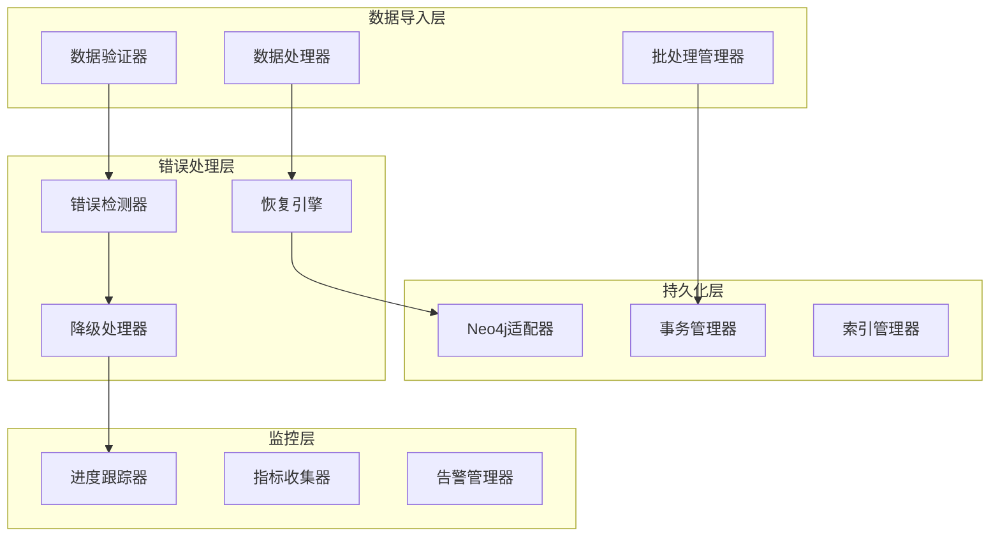

## 错误处理策略

### 数据验证与修复

#### 数据格式验证器增强

| 验证类型 | 检查项 | 修复策略 | 降级方案 |
|---------|--------|---------|----------|
| 必需字段验证 | question, answer, context | 自动补全缺失字段 | 跳过无效记录 |
| 数据类型验证 | 字段类型一致性 | 类型转换 | 使用默认值 |
| 内容质量验证 | 文本长度、格式 | 内容清洗 | 标记为低质量 |
| 关系完整性验证 | supporting_facts引用 | 重新构建引用 | 移除无效引用 |

#### 数据修复引擎设计

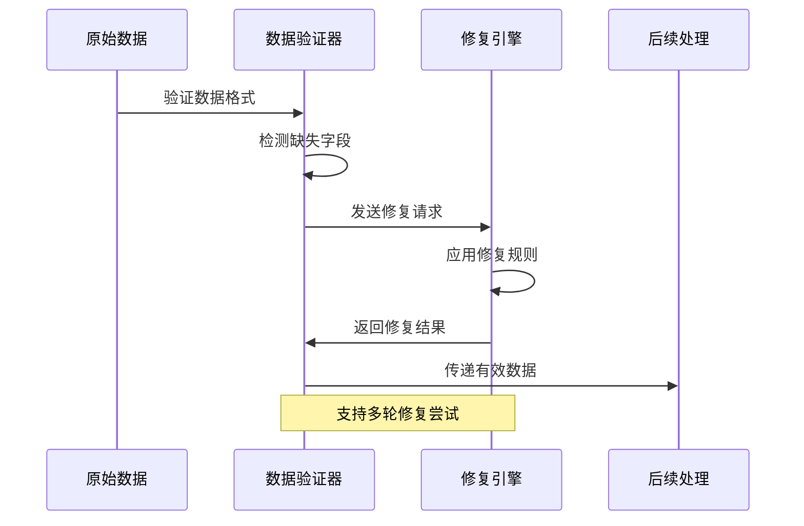

### Cypher查询兼容性

#### 版本兼容策略

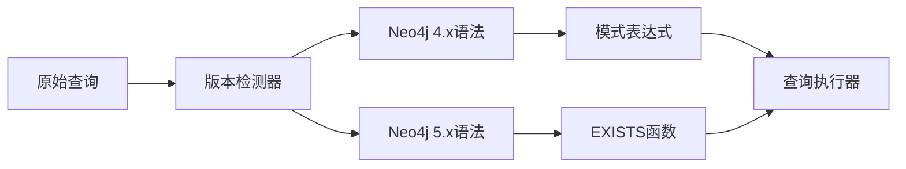

#### 查询改写规则

| 原始语法 | Neo4j 5.x改写 | 用途 |
|---------|-------------- |------|
| `SIZE((e)<-[:R]-(n))` | `SIZE { (e)<-[:R]-(n) }` | 计算关系数量 |
| `(n)-[r]-(m)` | `EXISTS { (n)-[r]-(m) }` | 存在性检查 |
| 模式表达式 | 模式理解 | 复杂图遍历 |

### 类型安全保障

#### 时间计算安全包装

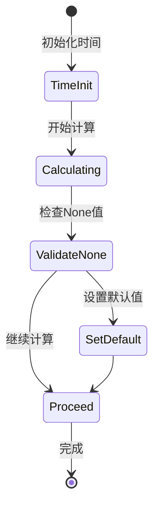

#### 数值运算保护机制

| 运算类型 | 保护策略 | 默认行为 | 异常处理 |
|---------|---------|---------|---------|
| 时间差计算 | None值检查 | 使用0.0替代 | 记录警告日志 |
| 除法运算 | 分母为0检查 | 返回0或无穷大 | 抛出安全异常 |
| 百分比计算 | 分母非正数检查 | 返回0% | 使用替代算法 |
| 统计聚合 | 空集合检查 | 返回默认统计值 | 标记数据缺失 |

## 批处理管理设计

### 弹性批处理架构

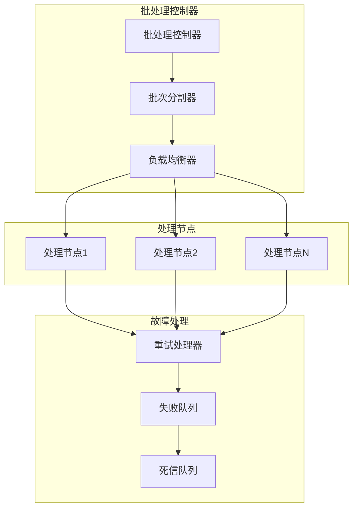

### 重试与降级策略

#### 重试机制设计

| 错误类型 | 重试次数 | 重试间隔 | 降级策略 |
|---------|---------|---------|---------|
| 网络连接错误 | 3次 | 指数退避 | 切换到本地服务 |
| 数据库死锁 | 5次 | 随机间隔 | 分解事务 |
| 内存不足 | 2次 | 立即重试 | 减小批次大小 |
| 语法错误 | 1次 | 无延迟 | 跳过并记录 |

#### 降级处理流程

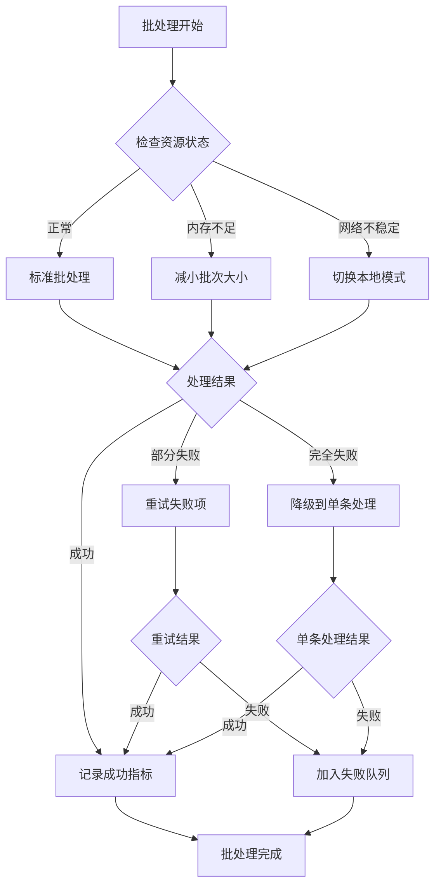

## 事务管理与数据一致性

### 分布式事务设计

#### 事务分级策略

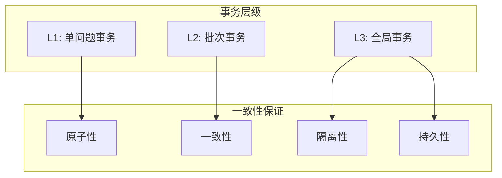

#### 事务恢复机制

| 失败场景 | 检测方法 | 恢复策略 | 数据保护 |
|---------|---------|---------|---------|
| 单条记录失败 | 异常捕获 | 跳过继续处理 | 隔离失败记录 |
| 批次事务失败 | 事务回滚 | 分解为小批次 | 保持部分结果 |
| 连接中断 | 心跳检测 | 重建连接 | 使用检查点 |
| 系统崩溃 | 进程监控 | 从检查点恢复 | WAL日志保护 |

### 数据一致性验证

#### 一致性检查器

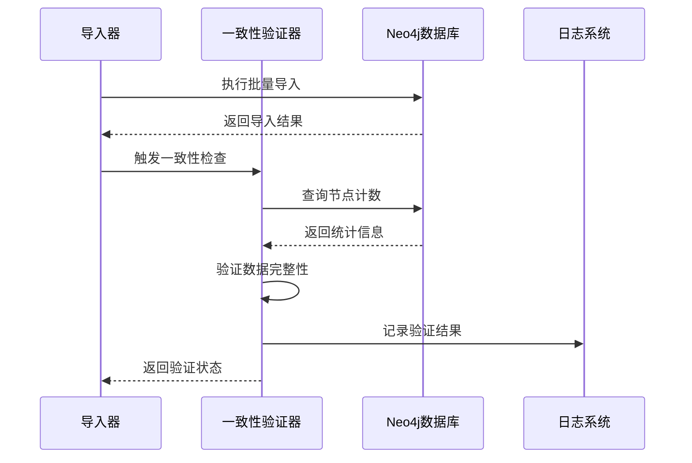

## 监控与告警系统

### 实时监控指标

#### 关键性能指标(KPI)

| 指标类别 | 具体指标 | 阈值设置 | 告警级别 |
|---------|---------|---------|---------|
| 处理性能 | 每分钟处理问题数 | < 10个/分钟 | 警告 |
| 错误率 | 失败问题占比 | > 20% | 严重 |
| 资源使用 | 内存使用率 | > 80% | 警告 |
| 网络状态 | Ollama响应时间 | > 30秒 | 严重 |
| 数据质量 | 数据完整性评分 | < 0.8 | 警告 |

#### 监控数据流

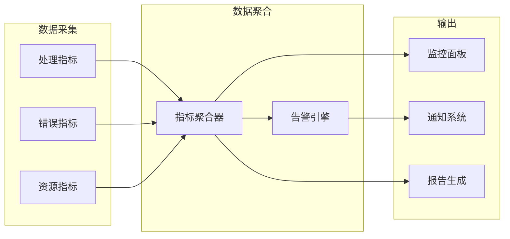

### 自动化故障恢复

#### 自愈能力设计

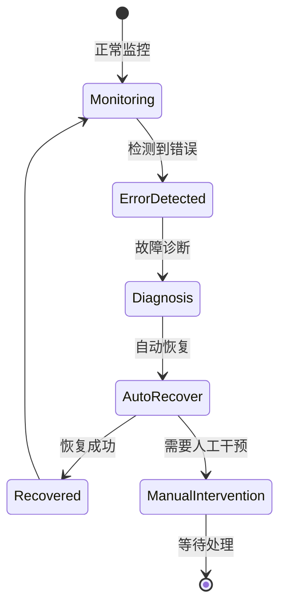

#### 恢复动作映射

| 故障类型 | 自动恢复动作 | 恢复时间预期 | 备用方案 |
|---------|-------------|-------------|----------|
| Ollama服务不可用 | 重启服务/切换节点 | 2-5分钟 | 使用本地模型 |
| Neo4j连接失败 | 重建连接池 | 30秒-2分钟 | 切换备用数据库 |
| 内存泄漏 | 重启处理进程 | 1-3分钟 | 降级处理模式 |
| 数据不一致 | 触发数据修复 | 5-15分钟 | 回滚到检查点 |

## 测试策略

### 测试金字塔

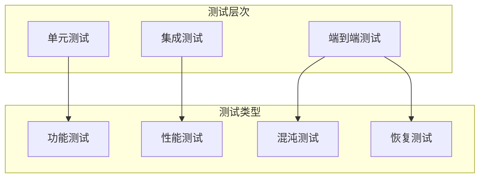

#### 错误注入测试

| 注入类型 | 测试场景 | 预期行为 | 验证指标 |
|---------|---------|---------|---------|
| 网络分区 | Ollama服务不可达 | 切换到本地处理 | 处理延续性 |
| 数据损坏 | JSON格式错误 | 数据修复/跳过 | 错误处理率 |
| 资源耗尽 | 内存/磁盘满 | 优雅降级 | 系统稳定性 |
| 并发冲突 | 数据库锁竞争 | 重试机制生效 | 事务成功率 |
