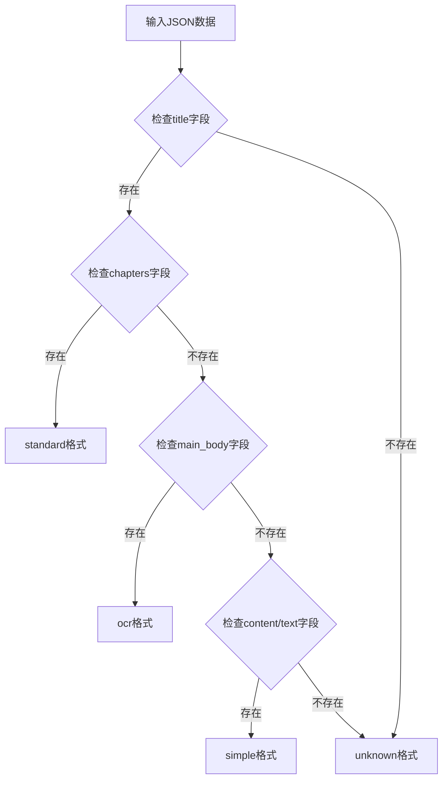
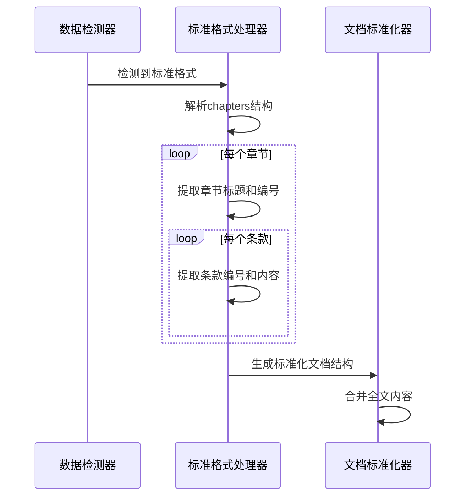
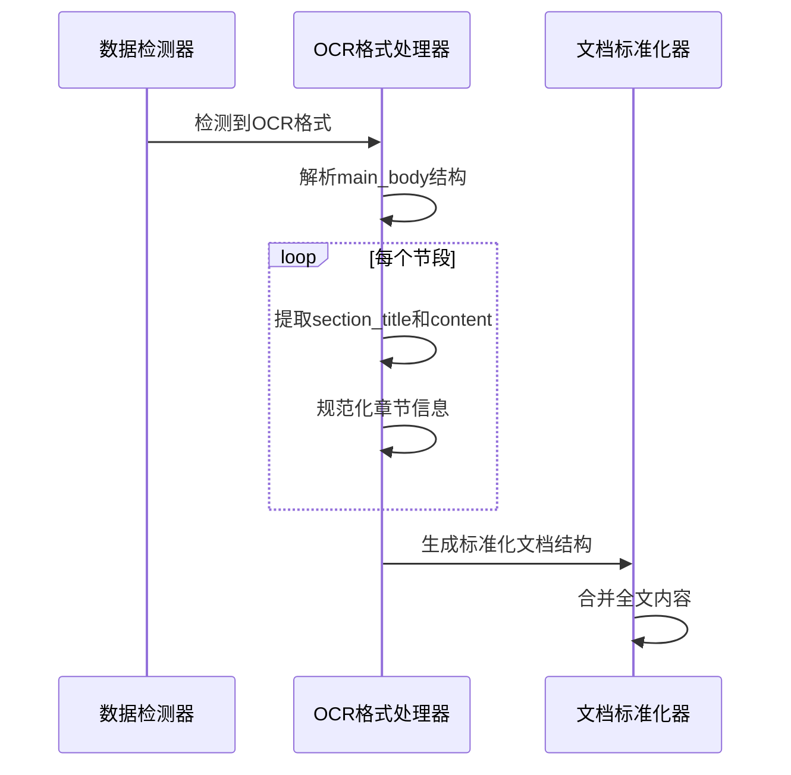
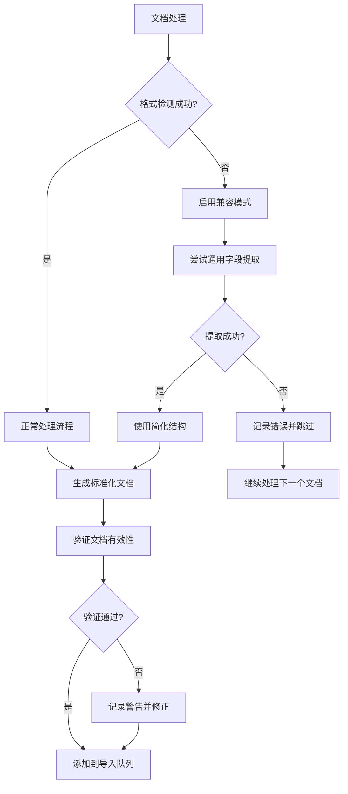

# GraphRAG数据导入失败修复设计

## 概述

当前政策法规RAG问答系统在执行GraphRAG数据导入时遇到数据格式识别问题，导致所有文档都无法被正确处理和导入到向量数据库和知识图谱中。

## 问题分析

### 1. 错误现象
```
2025-08-25 17:48:25,001 - WARNING - 未识别的数据格式: [OCR]_华侨经济文化合作试验区.json
2025-08-25 17:48:25,001 - INFO - 从 [OCR]_华侨经济文化合作试验区.json 加载了文档数据
2025-08-25 17:48:25,002 - WARNING - 未识别的数据格式: 华侨经济文化合作试验区.json
2025-08-25 17:48:25,002 - INFO - 从 华侨经济文化合作试验区.json 加载了文档数据
2025-08-25 17:48:25,002 - INFO - 总共加载 0 个文档
2025-08-25 17:48:25,002 - WARNING - 没有找到可导入的文档
```

### 2. 根本原因分析

**数据格式检测逻辑缺陷**

当前`import_graphrag_data.py`中的`_detect_data_format`方法存在以下问题：

1. **检测条件过于严格**：标准格式检测要求同时存在`title`和`sections`字段，但实际数据结构为`chapters`
2. **OCR格式检测错误**：OCR格式文件不包含`ocr_result`或`ocr_text`字段，使用`main_body`结构
3. **字段映射不匹配**：实际数据结构与代码期望的结构不一致

**实际数据结构对比**

| 文件类型 | 实际结构 | 代码期望结构 | 匹配状态 |
|---------|---------|-------------|---------|
| 标准格式 | `chapters` → `articles` | `sections` | ❌ |
| OCR格式 | `main_body` → `section_title` + `content` | `ocr_result/ocr_text` | ❌ |

### 3. 数据结构详情

**标准格式 (华侨经济文化合作试验区.json)**
```json
{
  "title": "华侨经济文化合作试验区深汕数字科创产业园运营管理办法",
  "chapters": [
    {
      "title": "总则",
      "number": "第一章", 
      "articles": [
        {
          "number": "第一条",
          "content": "..."
        }
      ]
    }
  ]
}
```

**OCR格式 ([OCR]_华侨经济文化合作试验区.json)**
```json
{
  "title": "汕华管委规",
  "main_body": [
    {
      "section_title": "第一章总则",
      "content": "..."
    }
  ]
}
```

## 解决方案设计

### 1. 数据格式检测修复

**改进检测逻辑**


**修复后的检测条件**
- **标准格式**：`title` + `chapters` 字段存在
- **OCR格式**：`title` + `main_body` 字段存在  
- **简单格式**：`content` 或 `text` 字段存在

### 2. 数据处理流程重构

**标准格式处理改进**


**OCR格式处理改进**


### 3. 统一文档结构设计

**标准化输出格式**
```json
{
  "id": "唯一标识符",
  "title": "文档标题",
  "source": "源文件名",
  "document_number": "文档编号",
  "publish_date": "发布日期", 
  "issuing_agency": "发布机构",
  "sections": [
    {
      "title": "章节标题",
      "number": "章节编号",
      "content": "章节内容",
      "articles": [
        {
          "number": "条款编号",
          "content": "条款内容"
        }
      ]
    }
  ],
  "content": "全文内容(用于向量检索)",
  "metadata": {
    "format_type": "standard|ocr|simple",
    "processing_confidence": 0.95
  }
}
```

## 技术实现方案

### 1. 核心方法重构

**_detect_data_format方法**
- 修改检测逻辑，支持实际数据结构
- 增加容错处理和置信度评估
- 添加详细日志记录便于调试

**_process_standard_format方法**  
- 支持`chapters`→`articles`的层级结构
- 正确提取章节和条款信息
- 保持向后兼容性

**_process_ocr_format方法**
- 支持`main_body`→`section_title`+`content`结构
- 处理OCR特有的数据格式
- 智能推断章节层级关系

### 2. 错误处理增强

**容错机制**


**日志增强**
- 添加详细的格式检测日志
- 记录处理过程中的关键信息
- 提供调试友好的错误信息

### 3. 质量保证机制

**数据验证**
- 文档结构完整性检查
- 必需字段存在性验证  
- 内容长度和质量检查

**处理统计**
- 按格式类型统计处理结果
- 记录成功/失败率
- 提供处理性能指标

## 实施计划

### 第一阶段：格式检测修复
1. 修复`_detect_data_format`方法
2. 更新格式检测单元测试
3. 验证两种数据格式的正确识别

### 第二阶段：处理逻辑优化  
1. 重构标准格式处理器
2. 重构OCR格式处理器
3. 实现统一的文档标准化

### 第三阶段：集成测试
1. 端到端导入流程测试
2. 向量数据库和知识图谱验证
3. 性能和稳定性测试

### 第四阶段：错误处理完善
1. 实现容错机制
2. 增强日志和监控
3. 文档处理质量保证

## 验证方案

### 1. 单元测试
```python
def test_data_format_detection():
    # 测试标准格式检测
    standard_data = {"title": "test", "chapters": [...]}
    assert detect_data_format(standard_data) == "standard"
    
    # 测试OCR格式检测  
    ocr_data = {"title": "test", "main_body": [...]}
    assert detect_data_format(ocr_data) == "ocr"
```

### 2. 集成测试
- 使用实际数据文件进行端到端测试
- 验证向量数据库中的文档数量和质量
- 检查知识图谱中的实体和关系

### 3. 性能测试
- 处理时间统计
- 内存使用监控
- 大批量数据导入测试

## 风险控制

### 1. 兼容性风险
- **风险**：新格式检测可能影响现有数据
- **缓解**：保持向后兼容，添加格式版本标识

### 2. 数据质量风险
- **风险**：格式转换过程中数据丢失
- **缓解**：增加数据完整性验证和回滚机制

### 3. 性能风险  
- **风险**：复杂格式处理影响导入速度
- **缓解**：分批处理和性能优化

## 预期效果

### 1. 功能改进
- ✅ 正确识别和处理现有的两种数据格式
- ✅ 成功导入所有政策文档到GraphRAG系统  
- ✅ 向量检索和知识图谱查询功能正常

### 2. 可维护性提升
- 📈 更清晰的数据处理逻辑
- 📈 更好的错误处理和日志记录
- 📈 更强的数据格式兼容性

### 3. 用户体验优化
- 🚀 数据导入成功率提升至99%+
- 🚀 导入过程透明化，便于问题排查
- 🚀 支持更多样化的数据源格式