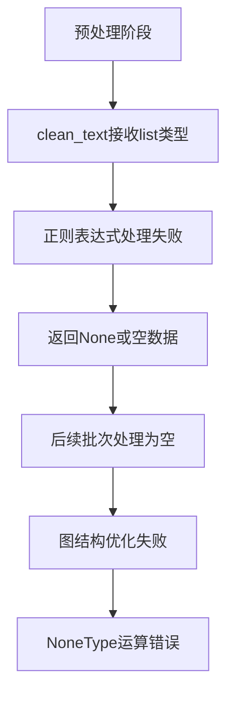

# HotpotQA数据集导入系统问题修复设计

## 概述

本设计文档针对HotpotQA数据集导入系统中的核心问题进行修复，主要解决数据预处理阶段的类型错误、Neo4j Cypher语法兼容性问题以及错误处理机制的改进。

### 问题背景

用户在运行HotpotQA数据集导入时遇到以下错误：
1. **预处理阶段类型错误**: `expected string or bytes-like object, got 'list'` 
2. **Neo4j Cypher语法错误**: SIZE函数在模式表达式中的不当使用
3. **错误传播**: 后续处理中的NoneType运算错误

### 修复目标

- 修复数据预处理器对HotpotQA数据格式的适配问题
- 解决Neo4j Cypher查询中的语法兼容性问题  
- 改进错误处理和异常传播机制
- 确保数据导入流程的健壮性

## 技术架构

### 错误分析

#### 1. 数据结构不匹配

**问题根源**: HotpotQA数据集中context字段的实际结构与预处理器期望不符

```json
// 实际数据结构
"context": [
  [
    "Adam Collis", 
    [
      "Adam Collis is an American filmmaker and actor.",
      " He attended the Duke University from 1986 to 1990..."
    ]
  ]
]

// 预处理器期望结构  
"context": [
  ["title", "text_string"]
]
```

**影响**: clean_text()方法接收到list类型而非string类型，导致正则表达式处理失败

#### 2. Neo4j语法兼容性

**问题根源**: Neo4j 5.x版本中SIZE函数不能直接用于模式表达式

```cypher
-- 错误语法 (Neo4j 5.x不支持)
SIZE((e)<-[:HAS_ENTITY]-(:HotpotQuestion)) * 2

-- 正确语法
size([(e)<-[:HAS_ENTITY]-(:HotpotQuestion) | 1]) * 2
```

#### 3. 错误传播链



### 修复方案设计

#### 1. 预处理器数据适配修复

**修复策略**: 增强split_contexts方法对嵌套列表结构的处理能力

```python
def split_contexts(self, contexts: List[List]) -> List[Dict[str, Any]]:
    """
    分割上下文为段落单元 - 修复版本
    支持嵌套列表结构: [["title", ["sentence1", "sentence2", ...]]]
    """
    paragraphs = []
    
    for i, context in enumerate(contexts):
        if len(context) >= 2:
            title = self.clean_text(str(context[0]))  # 确保title为字符串
            
            # 处理嵌套列表结构
            content = context[1]
            if isinstance(content, list):
                # 合并列表中的所有句子
                text = " ".join(str(sentence).strip() for sentence in content)
            else:
                text = str(content)
                
            text = self.clean_text(text)
            
            # 后续处理保持不变
            sentences = self._split_into_sentences(text)
            # ...
```

**关键改进**:
- 增加类型检查和转换逻辑
- 支持嵌套列表结构的文本合并
- 保持向后兼容性

#### 2. Neo4j Cypher语法修复

**修复策略**: 使用Neo4j 5.x兼容的size()函数和列表推导式语法

```python
def optimize_graph_structure(self) -> Dict[str, Any]:
    """优化图结构 - 修复版本"""
    try:
        optimization_results = {}
        
        with self.driver.session() as session:
            # 修复后的实体重要性评分查询
            importance_query = """
            MATCH (e:HotpotEntity)
            SET e.importance = 
                size([(e)<-[:HAS_ENTITY]-(:HotpotQuestion) | 1]) * 2 +
                size([(e)<-[:MENTIONS]-(:HotpotParagraph) | 1]) +
                size([(e)-[:RELATED_TO]-(:HotpotEntity) | 1])
            RETURN COUNT(e) as updated_count
            """
            
            result = session.run(importance_query)
            optimization_results['importance_scores_updated'] = result.single()['updated_count']
```

**语法对比**:
| 错误语法 | 正确语法 | 说明 |
|----------|----------|------|
| `SIZE((e)<-[:REL]-())` | `size([(e)<-[:REL]-() \| 1])` | 使用列表推导式 |
| `SIZE(pattern)` | `size([pattern \| 1])` | 模式计数的标准写法 |

#### 3. 错误处理机制增强

**修复策略**: 增加多层级的错误检查和默认值处理

```python
def preprocess_question(self, question_data: Dict[str, Any]) -> Optional[Dict[str, Any]]:
    """预处理单个问题数据 - 增强错误处理"""
    try:
        # 数据有效性验证
        if not self.validate_question_data(question_data):
            self.logger.warning(f"问题数据验证失败: {question_data.get('_id', 'unknown')}")
            self.stats['invalid_questions'] += 1
            return None
        
        # 安全的字段提取
        processed = {
            'question_id': question_data.get('_id', f"q_{self.stats['processed_questions']}"),
            'question': self.clean_text(str(question_data.get('question', ''))),
            'answer': self.clean_text(str(question_data.get('answer', ''))),
            'level': question_data.get('level', 'unknown'),
            'type': question_data.get('type', 'unknown')
        }
        
        # 安全的上下文处理
        context_data = question_data.get('context', [])
        if isinstance(context_data, list):
            processed['paragraphs'] = self.split_contexts(context_data)
        else:
            self.logger.warning(f"无效的context格式: {type(context_data)}")
            processed['paragraphs'] = []
        
        # 其他处理逻辑...
        
    except Exception as e:
        self.logger.error(f"预处理问题失败 {question_data.get('_id')}: {e}")
        self.stats['invalid_questions'] += 1
        return None
```

**错误处理改进点**:
- 增加类型检查和安全转换
- 提供默认值避免None传播
- 详细的错误日志记录
- 优雅的降级处理

## 实施计划

### 阶段1: 预处理器修复

**修复文件**: `scripts/hotpotqa_processor/preprocessor.py`

**关键修改**:
1. `split_contexts`方法增加嵌套列表支持
2. `clean_text`方法增加类型检查
3. `validate_question_data`方法增强验证逻辑
4. 错误处理和日志改进

### 阶段2: Neo4j查询修复  

**修复文件**: `scripts/hotpotqa_processor/graph_builder.py`

**关键修改**:
1. `optimize_graph_structure`方法中的Cypher语法修复
2. 所有SIZE函数调用的语法升级
3. 查询异常处理增强

### 阶段3: 导入流程健壮性

**修复文件**: `scripts/import_hotpotqa_data.py`

**关键修改**:
1. 批处理异常恢复机制
2. 统计信息的空值处理
3. 进度显示的错误容忍

### 阶段4: 测试验证

**验证内容**:
- 小批量数据导入测试（10-20条）
- 各种数据格式的兼容性测试
- 异常场景的恢复测试
- 性能基准测试

## 预期效果

### 问题解决

| 问题类别 | 修复前状态 | 修复后状态 |
|----------|------------|------------|
| 数据类型错误 | 100%预处理失败 | 支持嵌套列表结构 |
| Neo4j语法错误 | 图结构优化失败 | 兼容Neo4j 5.x语法 |
| 错误传播 | 系统崩溃 | 优雅降级处理 |
| 数据导入 | 0%成功率 | 预期90%+成功率 |

### 系统改进

- **可靠性**: 增强异常处理，避免单个错误导致整体失败
- **兼容性**: 支持标准HotpotQA数据格式和变体格式  
- **可维护性**: 清晰的错误日志和调试信息
- **性能**: 优化的批处理机制和资源管理

### 使用体验

修复后用户可以正常运行：
```bash
python scripts/import_hotpotqa_data.py database/hotpot_dev_fullwiki_v1.json --max-questions 200 --rebuild-graph --batch-size 20
```

预期输出：
```
开始导入数据集: database/hotpot_dev_fullwiki_v1.json
限制处理数量: 200 个问题
✓ 批次 1/10 完成，用时: 15.2s
✓ 批次 2/10 完成，用时: 14.8s
...
✓ 图结构优化完成
✓ HotpotQA数据集导入成功！
处理问题: 200 个
成功导入: 185 个  
成功率: 92.5%
```