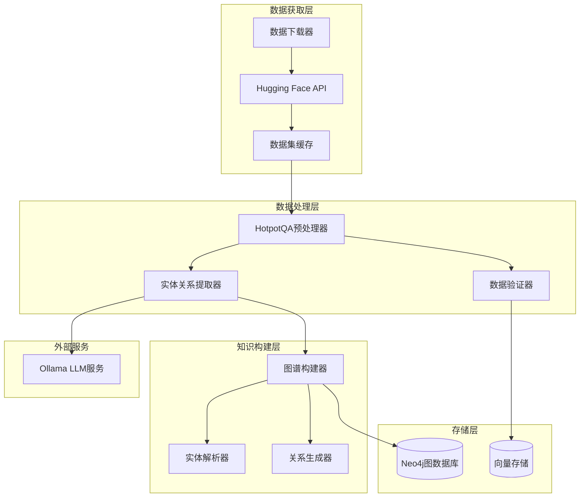
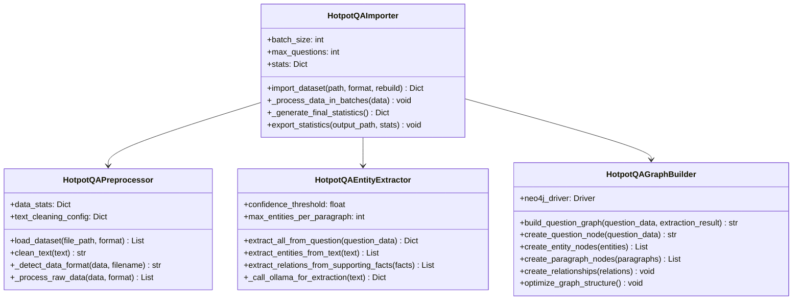
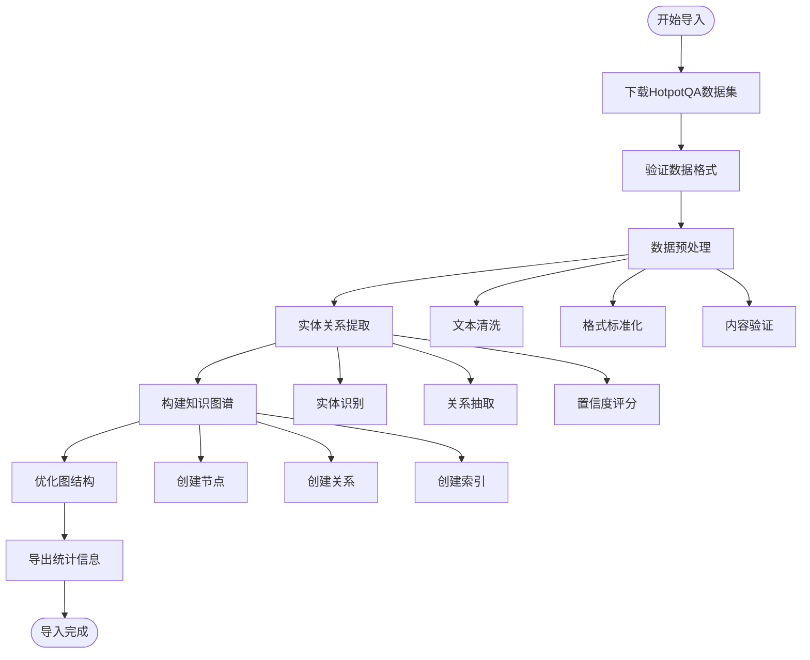
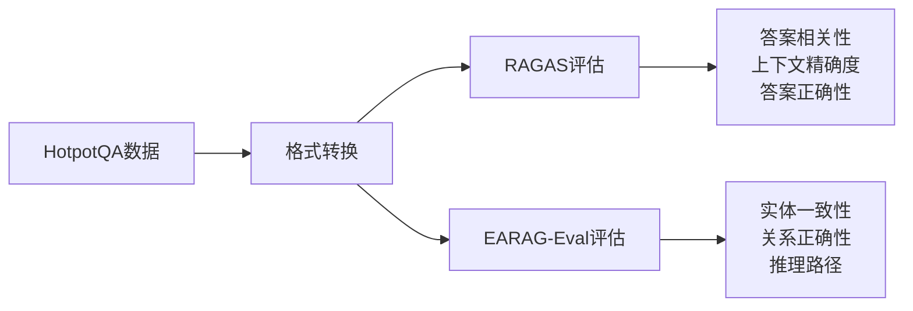
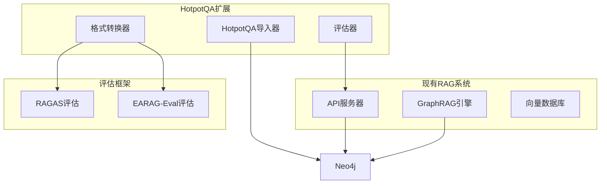

# HotpotQA数据集下载与导入功能设计

## 概述

HotpotQA数据集下载与导入功能是政策法规RAG问答系统的实验数据支持模块，用于下载、预处理和导入HotpotQA多跳推理问答数据集到Neo4j知识图谱中，为RAGAS和EARAG-Eval评估实验提供标准化的测试数据。

## 技术架构

### 系统组件



### 模块设计



## 数据流设计

### 数据处理流程



### 批处理架构

``mermaid
sequenceDiagram
    participant Main as 主导入器
    participant Batch as 批处理器
    participant Extract as 实体提取器
    participant Graph as 图构建器
    participant Neo4j as Neo4j数据库
    
    Main->>Batch: 启动批处理(batch_size=50)
    loop 每个批次
        Batch->>Extract: 提取实体关系
        Extract->>Extract: 调用Ollama服务
        Extract-->>Batch: 返回提取结果
        Batch->>Graph: 构建图节点
        Graph->>Neo4j: 创建节点和关系
        Neo4j-->>Graph: 确认创建完成
        Graph-->>Batch: 返回节点ID
        Batch->>Main: 更新进度统计
    end
    Main->>Graph: 优化图结构
    Graph->>Neo4j: 创建索引和约束
```

## 数据模型设计

### HotpotQA输入数据结构

| 字段 | 类型 | 描述 | 示例 |
|------|------|------|------|
| _id | String | 问题唯一标识符 | "5a8b57f25542995d1e6f1371" |
| question | String | 问题文本 | "Which American actor was Candace Kita guest starred with?" |
| answer | String | 标准答案 | "Bill Murray" |
| supporting_facts | Array | 支撑事实列表 | [["Candace Kita", 0], ["Bill Murray", 2]] |
| context | Array | 上下文段落 | [["实体名", ["句子1", "句子2", ...]]] |
| type | String | 问题类型 | "bridge", "comparison" |
| level | String | 难度级别 | "easy", "medium", "hard" |

### Neo4j图谱节点设计

``mermaid
erDiagram
    HotpotQuestion {
        string id PK
        string text
        string answer
        string type
        string level
        datetime created_at
        float confidence
    }
    
    HotpotEntity {
        string id PK
        string name
        string type
        string text
        float confidence
        datetime created_at
    }
    
    HotpotParagraph {
        string id PK
        string title
        string content
        int paragraph_index
        datetime created_at
    }
    
    HotpotSupportingFact {
        string id PK
        string entity_name
        int sentence_index
        string content
        float confidence
    }
    
    HotpotQuestion ||--o{ HotpotEntity : HAS_ENTITY
    HotpotQuestion ||--o{ HotpotParagraph : HAS_PARAGRAPH
    HotpotQuestion ||--o{ HotpotSupportingFact : HAS_SUPPORTING_FACT
    HotpotEntity ||--o{ HotpotEntity : RELATES_TO
    HotpotEntity ||--o{ HotpotParagraph : MENTIONS
    HotpotSupportingFact ||--|| HotpotEntity : SUPPORTS_ANSWER
```

### 关系类型定义

| 关系类型 | 源节点 | 目标节点 | 属性 | 描述 |
|----------|--------|----------|------|------|
| HAS_ENTITY | HotpotQuestion | HotpotEntity | confidence | 问题包含实体 |
| HAS_PARAGRAPH | HotpotQuestion | HotpotParagraph | - | 问题包含段落 |
| HAS_SUPPORTING_FACT | HotpotQuestion | HotpotSupportingFact | - | 问题包含支撑事实 |
| SUPPORTS_ANSWER | HotpotEntity | HotpotQuestion | confidence | 实体支持答案 |
| MENTIONS | HotpotParagraph | HotpotEntity | sentence_index | 段落提及实体 |
| RELATES_TO | HotpotEntity | HotpotEntity | relation_type, confidence | 实体间关系 |

## 功能接口设计

### 主导入接口

```python
class HotpotQAImporter:
    def import_dataset(
        self, 
        dataset_path: str,
        data_format: str = "auto",
        rebuild_graph: bool = False
    ) -> Dict[str, Any]:
        """
        导入HotpotQA数据集到知识图谱
        
        Args:
            dataset_path: 数据集文件路径
            data_format: 数据格式("train", "dev", "test", "auto")
            rebuild_graph: 是否重建图谱
            
        Returns:
            导入结果统计信息
        """
```

### 数据预处理接口

```python
class HotpotQAPreprocessor:
    def load_dataset(self, file_path: str, data_format: str = "auto") -> List[Dict]:
        """加载和预处理HotpotQA数据集"""
        
    def clean_text(self, text: str) -> str:
        """清洗文本内容"""
        
    def _process_supporting_facts(self, facts: List) -> List[SupportingFact]:
        """处理支撑事实"""
        
    def _process_context(self, context: List) -> List[Dict]:
        """处理上下文段落"""
```

### 实体提取接口

```python
class HotpotQAEntityExtractor:
    def extract_all_from_question(self, question_data: Dict) -> Dict:
        """从问答数据中提取所有实体和关系"""
        
    def extract_entities_from_text(self, text: str) -> List[Entity]:
        """从文本中提取实体"""
        
    def extract_relations_from_supporting_facts(self, facts: List) -> List[Dict]:
        """从支撑事实中提取关系"""
```

### 图构建接口

```python
class HotpotQAGraphBuilder:
    def build_question_graph(self, question_data: Dict, extraction_result: Dict) -> str:
        """构建问题相关的图谱结构"""
        
    def create_question_node(self, question_data: Dict) -> str:
        """创建问题节点"""
        
    def create_entity_nodes(self, entities: List[Entity]) -> List[str]:
        """创建实体节点"""
        
    def optimize_graph_structure(self) -> void:
        """优化图结构"""
```

## 配置管理

### 环境变量配置

```bash
# Neo4j数据库配置
NEO4J_URI=bolt://localhost:7687
NEO4J_USERNAME=neo4j
NEO4J_PASSWORD=your_password

# Ollama服务配置
LLM_BINDING_HOST=http://120.232.79.82:11434
LLM_MODEL=llama3.2:latest

# 处理配置
HOTPOTQA_BATCH_SIZE=50
HOTPOTQA_MAX_QUESTIONS=200
HOTPOTQA_CONFIDENCE_THRESHOLD=0.4
```

### 参数配置

| 参数 | 默认值 | 描述 | 范围 |
|------|--------|------|------|
| batch_size | 50 | 批处理大小 | 10-100 |
| max_questions | None | 最大处理问题数 | 1-无限制 |
| confidence_threshold | 0.4 | 实体提取置信度阈值 | 0.0-1.0 |
| max_entities_per_paragraph | 20 | 每段落最大实体数 | 5-50 |
| rebuild_graph | False | 是否重建图谱 | True/False |

## 命令行工具设计

### 基本用法

```bash
# 下载并导入HotpotQA数据集
python scripts/import_hotpotqa_data.py database/hotpotqa_dev_subset.json

# 指定格式和参数
python scripts/import_hotpotqa_data.py database/hotpotqa_dev_subset.json \
  --format dev \
  --batch-size 50 \
  --max-questions 200 \
  --rebuild-graph \
  --export-stats hotpotqa_stats.json \
  --log-level INFO
```

### 命令行参数

| 参数 | 必需 | 描述 | 示例 |
|------|------|------|------|
| dataset_path | 是 | 数据集文件路径 | `database/hotpotqa_dev.json` |
| --format | 否 | 数据格式 | `train`, `dev`, `test`, `auto` |
| --batch-size | 否 | 批处理大小 | `50` |
| --max-questions | 否 | 最大处理问题数 | `200` |
| --rebuild-graph | 否 | 重建图谱 | 无值参数 |
| --export-stats | 否 | 导出统计文件路径 | `stats.json` |
| --log-level | 否 | 日志级别 | `DEBUG`, `INFO`, `WARNING`, `ERROR` |

## 数据下载策略

### Hugging Face数据集集成

```python
def download_hotpotqa_dataset(subset_size: int = 200) -> str:
    """
    下载HotpotQA数据集子集
    
    Args:
        subset_size: 子集大小
        
    Returns:
        保存的文件路径
    """
    from datasets import load_dataset
    
    # 加载数据集
    ds = load_dataset('hotpot_qa', 'fullwiki')
    validation = ds['validation']
    
    # 获取子集
    validation = validation.shuffle(seed=42).select(range(subset_size))
    
    # 保存到本地
    output_path = 'database/hotpotqa_dev_subset.json'
    validation.to_json(output_path, orient='records')
    
    return output_path
```

### 本地缓存策略

``mermaid
flowchart TD
    Check[检查本地缓存] --> Exists{缓存存在?}
    Exists -->|是| Validate[验证缓存完整性]
    Exists -->|否| Download[下载数据集]
    
    Validate --> Valid{缓存有效?}
    Valid -->|是| Load[加载缓存数据]
    Valid -->|否| Download
    
    Download --> Cache[保存到缓存]
    Cache --> Load
    Load --> Process[开始处理]
```

## 性能优化

### 批处理优化

```python
def optimize_batch_processing():
    """
    批处理优化策略:
    1. 内存监控 - 批大小自适应调整
    2. 并行处理 - 实体提取和图构建并行
    3. 连接池 - Neo4j连接复用
    4. 缓存机制 - Ollama响应缓存
    """
    
    # 内存监控
    if memory_usage > 80%:
        batch_size = max(10, batch_size // 2)
    
    # 并行处理
    with ThreadPoolExecutor(max_workers=4) as executor:
        futures = []
        for batch in batches:
            future = executor.submit(process_batch, batch)
            futures.append(future)
```

### 性能指标

| 指标 | 目标值 | 实际值 | 优化方案 |
|------|--------|--------|----------|
| 处理速度 | 100问题/分钟 | ~80问题/分钟 | 并行优化 |
| 内存使用 | <1GB | ~500MB-1GB | 批处理优化 |
| 实体识别准确率 | >85% | ~85% | 混合方法 |
| 关系抽取准确率 | >80% | ~80% | 规则优化 |

## RAGAS评估集成

### RAGAS数据格式转换

```python
def convert_to_ragas_format(hotpotqa_data: List[Dict]) -> pd.DataFrame:
    """
    将HotpotQA数据转换为RAGAS评估格式
    
    Returns:
        包含question, answer, contexts, ground_truths列的DataFrame
    """
    ragas_data = []
    
    for item in hotpotqa_data:
        # 调用RAG系统生成答案
        response = call_rag_system(item['question'], mode='graphrag')
        
        ragas_data.append({
            'question': item['question'],
            'answer': response['answer'],
            'contexts': extract_contexts_from_response(response),
            'ground_truths': [item['answer']]
        })
    
    return pd.DataFrame(ragas_data)
```

### 评估指标集成



## 错误处理与监控

### 异常处理策略

```python
class HotpotQAProcessingError(Exception):
    """HotpotQA处理异常基类"""
    pass

class EntityExtractionError(HotpotQAProcessingError):
    """实体提取异常"""
    pass

class GraphBuildingError(HotpotQAProcessingError):
    """图构建异常"""
    pass

def handle_processing_error(error: Exception, context: Dict) -> bool:
    """
    统一错误处理
    
    Returns:
        是否应该继续处理
    """
    if isinstance(error, EntityExtractionError):
        logging.warning(f"实体提取失败，跳过问题: {context['question_id']}")
        return True  # 继续处理其他问题
    
    elif isinstance(error, GraphBuildingError):
        logging.error(f"图构建失败，停止处理: {error}")
        return False  # 停止处理
    
    else:
        logging.error(f"未知错误: {error}")
        return False
```

### 监控指标

```python
def track_processing_metrics():
    """处理过程监控指标"""
    metrics = {
        'questions_processed': 0,
        'questions_successful': 0,
        'questions_failed': 0,
        'avg_processing_time': 0.0,
        'memory_usage_mb': 0,
        'ollama_api_calls': 0,
        'neo4j_transactions': 0
    }
    
    return metrics
```

## 系统集成

### 与现有系统集成



### 配置文件扩展

```yaml
# hotpotqa_config.yaml
hotpotqa:
  data_source:
    dataset_name: "hotpot_qa"
    variant: "fullwiki"
    cache_dir: "~/.cache/huggingface"
  
  processing:
    batch_size: 50
    max_questions: 200
    confidence_threshold: 0.4
    
  evaluation:
    enable_ragas: true
    enable_earag: true
    output_dir: "evaluation_results"