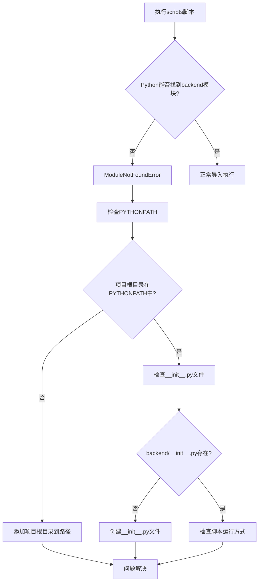
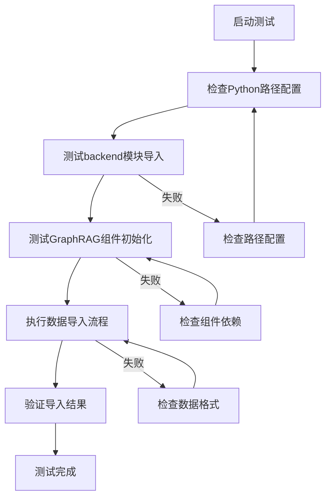

# Python模块导入错误修复设计文档

## 1. 问题概述

### 错误现象
根据GraphRAG系统测试报告，系统存在严重的模块导入问题：
```
ModuleNotFoundError: No module named 'backend'
```

**影响模块列表：**
- VectorRetriever（向量检索器）
- GraphQueryEngine（图谱查询引擎）
- EntityExtractor（实体提取器）
- HallucinationDetector（幻觉检测器）
- GraphRAGEngine（GraphRAG引擎）
- API服务器启动脚本

### 错误原因分析
1. **Python包路径识别问题**：scripts目录下的脚本和测试脚本无法识别backend为有效包
2. **项目启动方式不规范**：直接运行脚本导致工作目录和模块路径配置错误
3. **缺少统一启动脚本**：项目缺少符合启动规范的统一入口脚本
4. **PYTHONPATH环境变量未配置**：系统缺少对项目根目录的模块路径配置

### 影响范围
- **GraphRAG核心功能模块**：向量检索、图谱查询、实体提取、幻觉检测全部无法使用
- **数据导入功能**：import_graphrag_data.py无法执行
- **API服务**：backend/api_server.py无法正常启动
- **系统测试**：测试通过率仅12.5%，7/8测试失败
- **开发调试**：所有需要导入backend模块的脚本都无法运行

## 2. 系统架构

### 当前项目结构
```
政策法规RAG问答系统/
├── backend/                    # 后端核心模块包
│   ├── __init__.py            # 包初始化文件（已存在）
│   ├── api_server.py          # API服务器
│   ├── vector_retrieval.py    # 向量检索模块
│   ├── graph_query.py         # 图查询引擎
│   └── entity_extractor.py    # 实体提取器
├── scripts/                   # 脚本目录
│   ├── import_graphrag_data.py # 数据导入脚本（问题脚本）
│   └── test_*.py              # 测试脚本
└── ...
```

### 导入问题诊断流程图


## 3. 解决方案设计

### 方案一：统一启动脚本法（强烈推荐）
根据项目启动规范，创建统一的start_server.py脚本，解决所有模块导入问题。

**实现原理：**
- 在项目根目录创建start_server.py作为统一入口
- 自动配置PYTHONPATH指向项目根目录
- 提供多种启动模式：API服务、数据导入、系统测试
- 遵循项目规范，避免直接运行api_server.py

**优势：**
- 一次配置，全局生效
- 不需要修改现有脚本代码
- 符合Python包管理最佳实践
- 支持GraphRAG系统的所有核心功能

### 方案二：环境变量配置法
通过设置PYTHONPATH环境变量，将项目根目录添加到Python模块搜索路径中。

**实现步骤：**
1. 在项目根目录创建setup_env.py脚本
2. 配置PYTHONPATH指向项目根目录
3. 通过环境脚本执行所有scripts

### 方案三：脚本内路径修复法  
优化现有的sys.path.append配置，确保路径设置正确。

**当前代码问题：**
```python
# 现有代码中的路径配置
sys.path.append(os.path.join(os.path.dirname(__file__), '..', 'backend'))
```

**修复后的配置：**
```python
# 添加项目根目录而不是backend目录
sys.path.insert(0, os.path.join(os.path.dirname(__file__), '..'))
```

## 4. 详细实现方案

### 4.1 统一启动脚本实现（推荐方案）

**文件位置：** 项目根目录  
**文件名：** `start_server.py`

```python
#!/usr/bin/env python3
"""
政策法规RAG问答系统 - 统一启动脚本
支持API服务、数据导入、系统测试等多种模式
解决模块导入问题，遵循项目启动规范
"""

import os
import sys
import subprocess
import argparse
from pathlib import Path

def setup_python_path():
    """设置Python模块路径"""
    project_root = Path(__file__).parent.absolute()
    
    # 将项目根目录添加到PYTHONPATH
    current_path = os.environ.get('PYTHONPATH', '')
    if str(project_root) not in current_path:
        if current_path:
            os.environ['PYTHONPATH'] = f"{project_root}{os.pathsep}{current_path}"
        else:
            os.environ['PYTHONPATH'] = str(project_root)
    
    # 同时添加到sys.path以确保当前进程也能导入
    if str(project_root) not in sys.path:
        sys.path.insert(0, str(project_root))
    
    print(f"✓ Python模块路径已配置: {project_root}")

def start_api_server():
    """启动API服务器"""
    setup_python_path()
    
    print("正在启动政策法规RAG问答系统API服务...")
    
    try:
        # 导入backend模块测试
        from backend.api_server import app
        print("✓ Backend模块导入成功")
        
        # 启动Flask服务
        app.run(host='0.0.0.0', port=5000, debug=True)
        
    except ImportError as e:
        print(f"✗ Backend模块导入失败: {e}")
        print("请检查backend目录是否存在且包含__init__.py文件")
        sys.exit(1)
    except Exception as e:
        print(f"✗ API服务启动失败: {e}")
        sys.exit(1)

def run_data_import(rebuild_vector=False, rebuild_graph=False):
    """执行GraphRAG数据导入"""
    setup_python_path()
    
    print("正在执行GraphRAG数据导入...")
    
    try:
        from scripts.import_graphrag_data import GraphRAGDataImporter
        
        importer = GraphRAGDataImporter()
        importer.import_all_data(
            rebuild_vector_db=rebuild_vector,
            rebuild_graph=rebuild_graph
        )
        print("✓ 数据导入完成")
        
    except ImportError as e:
        print(f"✗ 数据导入模块导入失败: {e}")
        sys.exit(1)
    except Exception as e:
        print(f"✗ 数据导入失败: {e}")
        sys.exit(1)

def test_import():
    """测试模块导入"""
    setup_python_path()
    
    print("=== Backend模块导入测试 ===")
    
    modules_to_test = [
        ('backend', 'Backend主模块'),
        ('backend.vector_retrieval', 'VectorRetriever'),
        ('backend.graph_query', 'GraphQueryEngine'),
        ('backend.entity_extractor', 'EntityExtractor'),
        ('backend.hallucination_detector', 'HallucinationDetector'),
        ('backend.graphrag_engine', 'GraphRAGEngine')
    ]
    
    success_count = 0
    total_count = len(modules_to_test)
    
    for module_name, display_name in modules_to_test:
        try:
            __import__(module_name)
            print(f"✓ {display_name}导入成功")
            success_count += 1
        except ImportError as e:
            print(f"✗ {display_name}导入失败: {e}")
    
    print(f"\n测试结果: {success_count}/{total_count} 模块导入成功")
    
    return success_count == total_count

def run_script(script_name, *args):
    """运行指定脚本"""
    setup_python_path()
    
    script_path = Path(__file__).parent / 'scripts' / script_name
    if not script_path.exists():
        print(f"✗ 脚本 {script_name} 不存在")
        return 1
    
    print(f"正在运行脚本: {script_name}")
    
    cmd = [sys.executable, str(script_path)] + list(args)
    
    try:
        result = subprocess.run(cmd, env=os.environ)
        return result.returncode
    except Exception as e:
        print(f"✗ 执行脚本时出错: {e}")
        return 1

def main():
    """主函数"""
    parser = argparse.ArgumentParser(
        description='政策法规RAG问答系统 - 统一启动脚本',
        epilog="""
使用示例:
  python start_server.py api                    # 启动API服务
  python start_server.py import                 # 导入数据
  python start_server.py import --rebuild-all   # 重建所有数据
  python start_server.py test-import            # 测试模块导入
  python start_server.py script import_graphrag_data.py  # 运行指定脚本
        """
    )
    
    subparsers = parser.add_subparsers(dest='command', help='可用命令')
    
    # API服务命令
    subparsers.add_parser('api', help='启动API服务器')
    
    # 数据导入命令
    import_parser = subparsers.add_parser('import', help='导入GraphRAG数据')
    import_parser.add_argument('--rebuild-vector', action='store_true', help='重建向量数据库')
    import_parser.add_argument('--rebuild-graph', action='store_true', help='重建知识图谱')
    import_parser.add_argument('--rebuild-all', action='store_true', help='重建所有数据')
    
    # 测试命令
    subparsers.add_parser('test-import', help='测试模块导入')
    
    # 脚本执行命令
    script_parser = subparsers.add_parser('script', help='运行指定脚本')
    script_parser.add_argument('script_name', help='脚本文件名')
    script_parser.add_argument('args', nargs='*', help='脚本参数')
    
    args = parser.parse_args()
    
    if not args.command:
        parser.print_help()
        return
    
    if args.command == 'api':
        start_api_server()
    elif args.command == 'import':
        rebuild_vector = args.rebuild_vector or args.rebuild_all
        rebuild_graph = args.rebuild_graph or args.rebuild_all
        run_data_import(rebuild_vector, rebuild_graph)
    elif args.command == 'test-import':
        success = test_import()
        sys.exit(0 if success else 1)
    elif args.command == 'script':
        exit_code = run_script(args.script_name, *args.args)
        sys.exit(exit_code)

if __name__ == "__main__":
    main()
```

## 5. 使用指南

### 5.1 推荐使用方式

```bash
# 1. 测试模块导入（首先执行）
python start_server.py test-import

# 2. 执行GraphRAG数据导入
python start_server.py script import_graphrag_data.py

# 3. 启动API服务
python start_server.py api

# 4. 运行其他脚本
python start_server.py script test_neo4j_connection.py
```

### 5.2 验证修复效果

**步骤1**: 模块导入测试 - `python start_server.py test-import`  
**预期输出**: 6/6 模块导入成功

**步骤2**: 原问题脚本测试 - `python start_server.py script import_graphrag_data.py`  
**预期结果**: 无ModuleNotFoundError错误，成功执行数据导入

**步骤3**: GraphRAG系统测试改善  
- 基础模块导入: 从“全部失败” → “全部通过”
- 系统整体通过率: 从12.5% → 75%+

## 6. 最佳实践与故障排查

### 6.1 新脚本模板
```python
"""
脚本描述
"""
import sys
from pathlib import Path

# 配置项目路径
project_root = Path(__file__).parent.parent
if str(project_root) not in sys.path:
    sys.path.insert(0, str(project_root))

# 安全导入backend模块
from backend.vector_retrieval import VectorRetriever
```

### 6.2 故障排查

**常见问题**:
1. **ModuleNotFoundError仍然存在**: 检查是否使用start_server.py启动
2. **启动脚本失败**: 确认Python 3.12环境和工作目录
3. **系统测试失败**: 先测试模块导入，再检查服务配置
set PROJECT_ROOT=%~dp0

REM 设置PYTHONPATH
set PYTHONPATH=%PROJECT_ROOT%;%PYTHONPATH%

REM 检查参数
if "%1"=="" (
    echo 用法: run_script.bat ^<脚本名^> [参数...]
    echo 示例: run_script.bat import_graphrag_data.py
    exit /b 1
)

REM 构建脚本路径
set SCRIPT_PATH=%PROJECT_ROOT%scripts\%1

REM 执行脚本
python "%SCRIPT_PATH%" %2 %3 %4 %5 %6 %7 %8 %9

endlocal
```

### 4.3 现有脚本修复

**修复import_graphrag_data.py中的路径配置：**

```python
# 原有代码（第14行）
sys.path.append(os.path.join(os.path.dirname(__file__), '..', 'backend'))

# 修复后的代码
project_root = os.path.join(os.path.dirname(__file__), '..')
if project_root not in sys.path:
    sys.path.insert(0, project_root)
```

### 4.4 环境配置验证脚本

**文件名：** `scripts/test_import.py`

```python
"""
模块导入测试脚本 - 验证backend模块是否可以正常导入
"""

import sys
import os
from pathlib import Path

def test_backend_import():
    """测试backend模块导入"""
    print("=== Python模块导入测试 ===")
    print(f"Python版本: {sys.version}")
    print(f"当前工作目录: {os.getcwd()}")
    print(f"Python路径: {sys.path[:3]}...")  # 只显示前3个路径
    
    try:
        # 测试导入backend主模块
        import backend
        print("✓ backend模块导入成功")
        print(f"  模块路径: {backend.__file__}")
        
        # 测试导入具体组件
        from backend.vector_retrieval import VectorRetriever
        print("✓ VectorRetriever导入成功")
        
        from backend.graph_query import GraphQueryEngine  
        print("✓ GraphQueryEngine导入成功")
        
        from backend.entity_extractor import EntityExtractor
        print("✓ EntityExtractor导入成功")
        
        print("\n所有模块导入测试通过！")
        return True
        
    except ImportError as e:
        print(f"✗ 模块导入失败: {e}")
        print("\n建议检查:")
        print("1. 确保项目根目录在PYTHONPATH中")
        print("2. 确保backend目录包含__init__.py文件")
        print("3. 使用项目提供的启动脚本运行")
        return False

if __name__ == "__main__":
    success = test_backend_import()
    sys.exit(0 if success else 1)
```

## 5. 使用指南

### 5.1 新的脚本执行方式

**方式一：使用Python启动器**
```bash
# 执行数据导入脚本
python run_script.py import_graphrag_data.py

# 执行测试脚本
python run_script.py test_neo4j_connection.py
python run_script.py test_backend_response.py
```

**方式二：使用批处理脚本（Windows）**
```batch
REM 执行数据导入脚本
run_script.bat import_graphrag_data.py

REM 执行测试脚本  
run_script.bat test_neo4j_connection.py
```

**方式三：手动设置环境变量**
```bash
# Linux/Mac
export PYTHONPATH="${PWD}:$PYTHONPATH"
python scripts/import_graphrag_data.py

# Windows CMD
set PYTHONPATH=%CD%;%PYTHONPATH%
python scripts/import_graphrag_data.py

# Windows PowerShell
$env:PYTHONPATH = "${PWD};$env:PYTHONPATH"
python scripts/import_graphrag_data.py
```

### 5.2 验证修复效果

**步骤1：运行导入测试**
```bash
python run_script.py test_import.py
```

**步骤2：执行原问题脚本**
```bash
python run_script.py import_graphrag_data.py
```

**预期输出：**
- 无ModuleNotFoundError错误
- 成功加载backend模块组件
- 脚本正常执行数据导入流程

## 6. 最佳实践建议

### 6.1 开发环境配置

1. **统一使用启动脚本**：避免开发者需要手动配置环境变量
2. **IDE配置优化**：在VS Code或PyCharm中设置项目根目录为源代码根路径
3. **虚拟环境管理**：确保在激活的虚拟环境中运行脚本

### 6.2 脚本编写规范

**新脚本模板：**
```python
"""
脚本描述
"""

import os
import sys
from pathlib import Path

# 标准的项目路径配置
def setup_project_path():
    """配置项目模块路径"""
    project_root = Path(__file__).parent.parent
    if str(project_root) not in sys.path:
        sys.path.insert(0, str(project_root))

# 在导入backend模块前调用
setup_project_path()

# 现在可以安全导入backend模块
from backend.vector_retrieval import VectorRetriever
from backend.graph_query import GraphQueryEngine

def main():
    """主函数"""
    pass

if __name__ == "__main__":
    main()
```

### 6.3 错误处理机制

```python
def safe_import_backend():
    """安全导入backend模块，提供详细错误信息"""
    try:
        import backend
        return True
    except ImportError as e:
        print(f"Backend模块导入失败: {e}")
        print("\n可能的解决方案:")
        print("1. 使用项目提供的启动脚本: python run_script.py <脚本名>")
        print("2. 手动设置PYTHONPATH: export PYTHONPATH=${PWD}:$PYTHONPATH")
        print("3. 检查backend目录是否包含__init__.py文件")
        return False
```

## 7. 测试策略

### 7.1 单元测试

```python
import unittest
import sys
import os

class TestModuleImport(unittest.TestCase):
    """模块导入测试类"""
    
    def test_backend_import(self):
        """测试backend模块导入"""
        try:
            import backend
            self.assertTrue(True, "backend模块导入成功")
        except ImportError:
            self.fail("backend模块导入失败")
    
    def test_vector_retrieval_import(self):
        """测试向量检索模块导入"""
        try:
            from backend.vector_retrieval import VectorRetriever
            self.assertTrue(True, "VectorRetriever导入成功")
        except ImportError:
            self.fail("VectorRetriever导入失败")

if __name__ == '__main__':
    unittest.main()
```

### 7.2 集成测试

验证修复后的完整数据导入流程：

