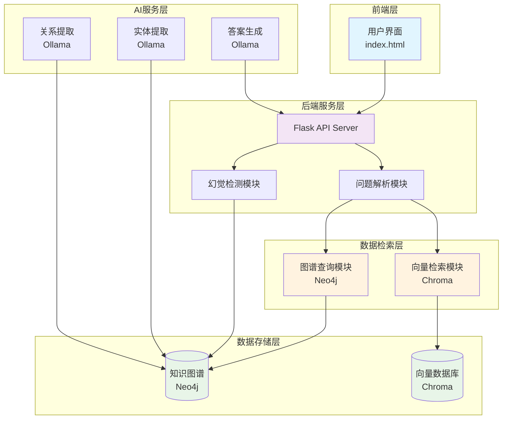
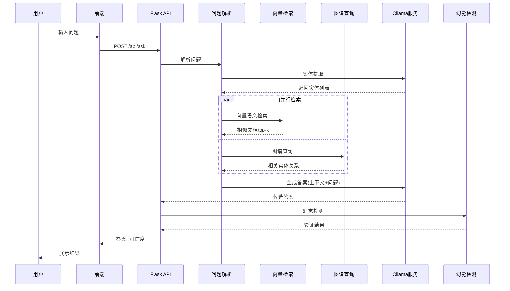
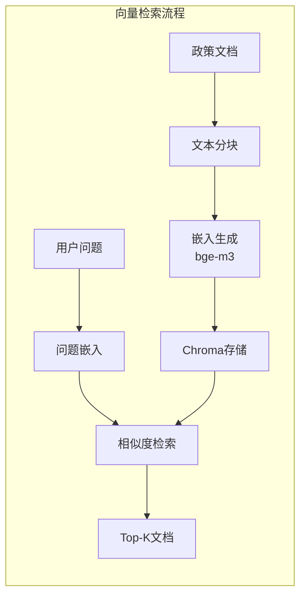
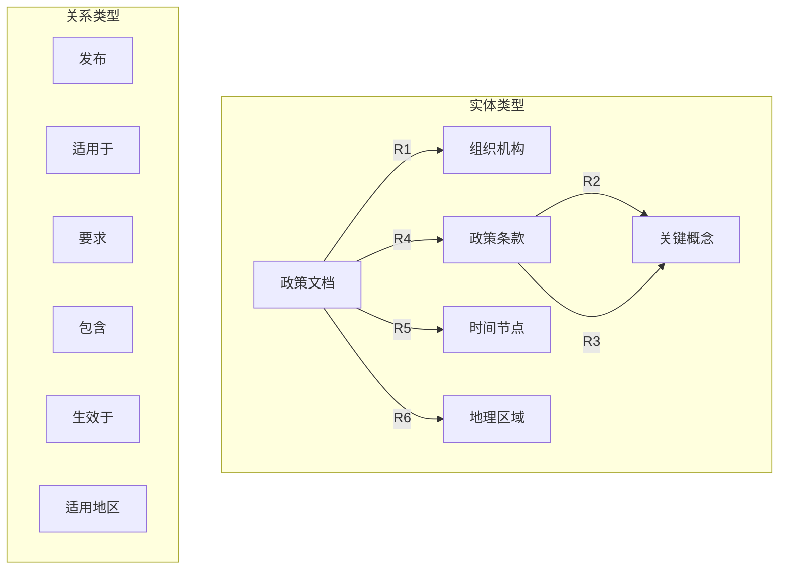
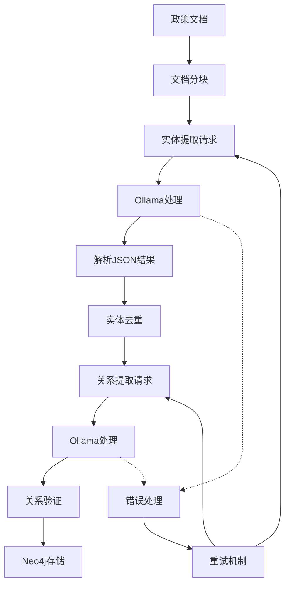
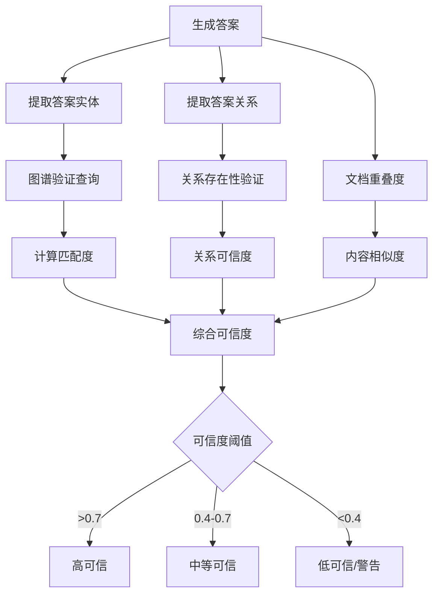
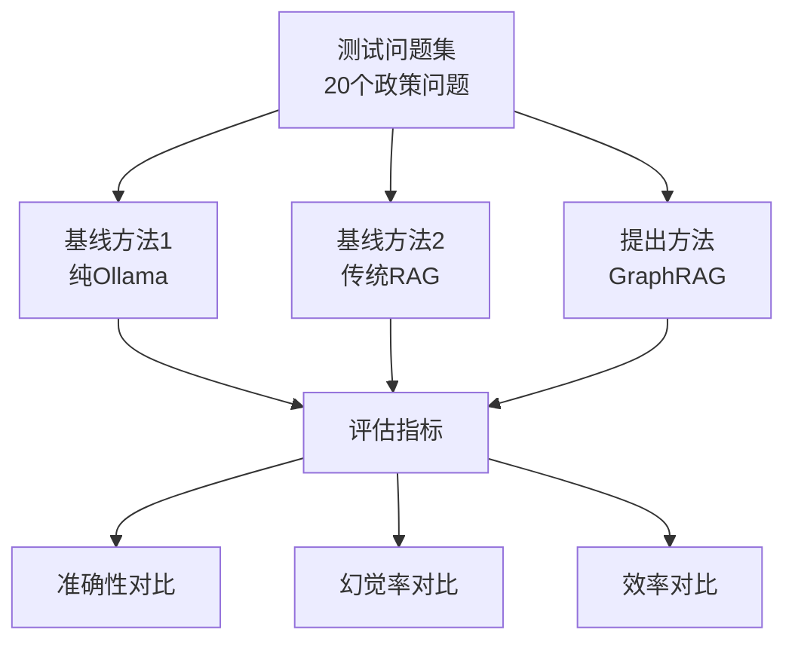

# GraphRAG政策问答系统扩展设计

## 1. 概述

### 1.1 扩展目标
基于现有政策法规RAG问答系统，添加GraphRAG模块，通过图谱增强的检索生成技术，提升政策问答的语义准确性并减少大模型幻觉问题。

### 1.2 核心创新点
- **轻量级GraphRAG框架**：针对小规模政策文档(100-500条)设计的图谱增强检索方案
- **双重验证机制**：结合Neo4j知识图谱和向量检索的答案验证
- **幻觉检测模块**：基于图谱一致性的答案可信度评估

### 1.3 技术价值
- 解决传统RAG在政策问答中的语义理解不足问题
- 提供可验证的准确性提升和幻觉减少效果
- 适合学术研究和论文发表的实验框架

## 2. 扩展架构设计

### 2.1 整体架构



### 2.2 核心数据流



## 3. 核心模块设计

### 3.1 向量检索模块

#### 3.1.1 Chroma集成架构



#### 3.1.2 关键实现

| 组件 | 技术选择 | 配置参数 |
|------|----------|----------|
| 向量数据库 | Chroma | 本地持久化存储 |
| 嵌入模型 | bge-m3:latest | 384维向量 |
| 分块策略 | 固定长度 | 512字符，50字符重叠 |
| 检索参数 | Top-K检索 | K=5, 余弦相似度 |

### 3.2 图谱查询模块

#### 3.2.1 知识图谱结构



#### 3.2.2 Cypher查询模式

| 查询类型 | 模式 | 示例 |
|----------|------|------|
| 实体查询 | `MATCH (n) WHERE n.name CONTAINS $entity` | 查找包含"中小企业"的节点 |
| 关系查询 | `MATCH (a)-[r]->(b) WHERE type(r) = $relation` | 查找"适用于"关系 |
| 路径查询 | `MATCH path = (a)-[*1..3]-(b)` | 查找1-3跳路径 |
| 上下文查询 | `MATCH (doc)-[:CONTAINS]->(clause)` | 查找文档包含的条款 |

### 3.3 实体关系提取模块

#### 3.3.1 Ollama提示工程

**实体提取提示模板**:
```
你是一个政策文档分析专家。请从以下政策文本中提取关键实体，按JSON格式返回：

文本：{document_text}

请提取以下类型的实体：
- 组织机构(ORG)：政府部门、企业、机构
- 政策概念(CONCEPT)：政策术语、专业概念
- 地理位置(LOCATION)：国家、省市、区域
- 时间信息(TIME)：日期、期限、时间段

输出格式：
{
  "entities": [
    {"text": "实体名称", "label": "类型", "confidence": 0.9}
  ]
}
```

**关系提取提示模板**:
```
分析以下文本中实体间的关系，输出JSON格式：

文本：{text_with_entities}
实体：{entity_list}

关系类型：发布、适用于、要求、包含、管理、审批

输出格式：
{
  "relations": [
    {"source": "实体1", "target": "实体2", "relation": "关系类型", "confidence": 0.8}
  ]
}
```

#### 3.3.2 数据处理流程



### 3.4 幻觉检测模块

#### 3.4.1 检测策略

| 检测维度 | 方法 | 权重 |
|----------|------|------|
| 实体一致性 | 答案实体与图谱匹配度 | 0.4 |
| 关系验证 | 答案中关系在图谱中存在性 | 0.3 |
| 文档溯源 | 答案内容与检索文档重叠度 | 0.2 |
| 语义连贯性 | 答案逻辑一致性评分 | 0.1 |

#### 3.4.2 可信度计算



## 4. API接口设计

### 4.1 增强的问答接口

```python
@app.route('/api/ask', methods=['POST'])
def enhanced_ask():
    """
    GraphRAG增强问答接口
    
    Request:
    {
        "question": "中小企业的税收政策是什么？",
        "use_graph": true,
        "return_confidence": true
    }
    
    Response:
    {
        "answer": "根据相关政策...",
        "confidence": 0.85,
        "risk_level": "low",
        "sources": [
            {
                "type": "document",
                "title": "政策文档标题",
                "relevance": 0.9
            },
            {
                "type": "graph_entity",
                "entity": "中小企业",
                "relations": ["适用于", "要求"]
            }
        ],
        "warnings": []
    }
    """
```

### 4.2 图谱分析接口

```python
@app.route('/api/graph/analyze', methods=['POST'])
def analyze_entities():
    """
    实体关系分析接口
    
    Request:
    {
        "text": "政策文本内容",
        "extract_entities": true,
        "extract_relations": true
    }
    
    Response:
    {
        "entities": [...],
        "relations": [...],
        "graph_summary": "提取了X个实体，Y个关系"
    }
    """
```

## 5. 前端增强设计

### 5.1 界面布局

```
┌─────────────────────────────────────────┐
│              政策问答系统                │
├─────────────────────────────────────────┤
│  问题输入框                [发送]        │
├─────────────────────────────────────────┤
│  答案区域                               │
│  ┌─ 可信度: ●●●○○ (0.75)              │
│  │  ⚠️ 警告: 部分信息待验证              │
│  └─ 答案内容...                        │
├─────────────────────────────────────────┤
│  引用来源                               │
│  📄 文档来源 (3)                       │
│  🔗 图谱关系 (2)                       │
└─────────────────────────────────────────┘
```

### 5.2 可视化组件

```javascript
// 可信度显示组件
function renderConfidence(confidence, riskLevel) {
    const colors = {
        'low': '#4CAF50',
        'medium': '#FF9800', 
        'high': '#F44336'
    };
    
    return `
        <div class="confidence-bar">
            <div class="confidence-fill" 
                 style="width: ${confidence * 100}%; background: ${colors[riskLevel]}">
            </div>
            <span class="confidence-text">${(confidence * 100).toFixed(0)}%</span>
        </div>
    `;
}

// 警告提示组件
function renderWarnings(warnings) {
    if (!warnings.length) return '';
    
    return warnings.map(warning => 
        `<div class="warning-item">⚠️ ${warning}</div>`
    ).join('');
}
```

## 6. 实验评估方案

### 6.1 评估指标

| 指标类别 | 具体指标 | 计算方法 |
|----------|----------|----------|
| 准确性 | BLEU分数 | 与标准答案的n-gram重叠度 |
| 准确性 | 语义相似度 | 使用sentence-transformers计算 |
| 可靠性 | 幻觉率 | 未验证实体数/总实体数 |
| 效率 | 响应时间 | API处理总耗时(秒) |
| 覆盖度 | 答案完整性 | 关键信息覆盖比例 |

### 6.2 对比实验设计



### 6.3 数据集准备

| 数据源 | 数量 | 特点 |
|--------|------|------|
| 中国政府网政策 | 200条 | 中文，结构化好 |
| 地方政策法规 | 150条 | 中文，内容丰富 |
| 企业政策指南 | 100条 | 实用性强 |
| **总计** | **450条** | **覆盖多个领域** |

## 7. 技术实现细节

### 7.1 关键依赖

```python
# requirements.txt 新增依赖
chromadb==0.4.15
sentence-transformers==2.2.2
numpy==1.24.3
scikit-learn==1.3.0
```

### 7.2 配置管理

```env
# .env 新增配置
# Chroma向量数据库
CHROMA_PERSIST_DIR=./data/chroma_db
EMBEDDING_MODEL=all-MiniLM-L6-v2

# GraphRAG参数
GRAPH_RETRIEVAL_TOP_K=5
VECTOR_RETRIEVAL_TOP_K=5
CONFIDENCE_THRESHOLD=0.4
ENTITY_EXTRACTION_MODEL=llama3.2:latest
RELATION_EXTRACTION_MODEL=llama3.2:latest

# 实验参数
EXPERIMENT_MODE=true
LOG_LEVEL=INFO
```

### 7.3 性能优化策略

| 优化点 | 策略 | 预期效果 |
|--------|------|----------|
| 向量检索 | 批量嵌入生成 | 减少50%计算时间 |
| 图谱查询 | Cypher查询优化 | 提升30%查询速度 |
| 缓存机制 | Redis缓存常用查询 | 减少70%重复计算 |
| 并行处理 | 异步IO处理 | 提升40%并发能力 |

