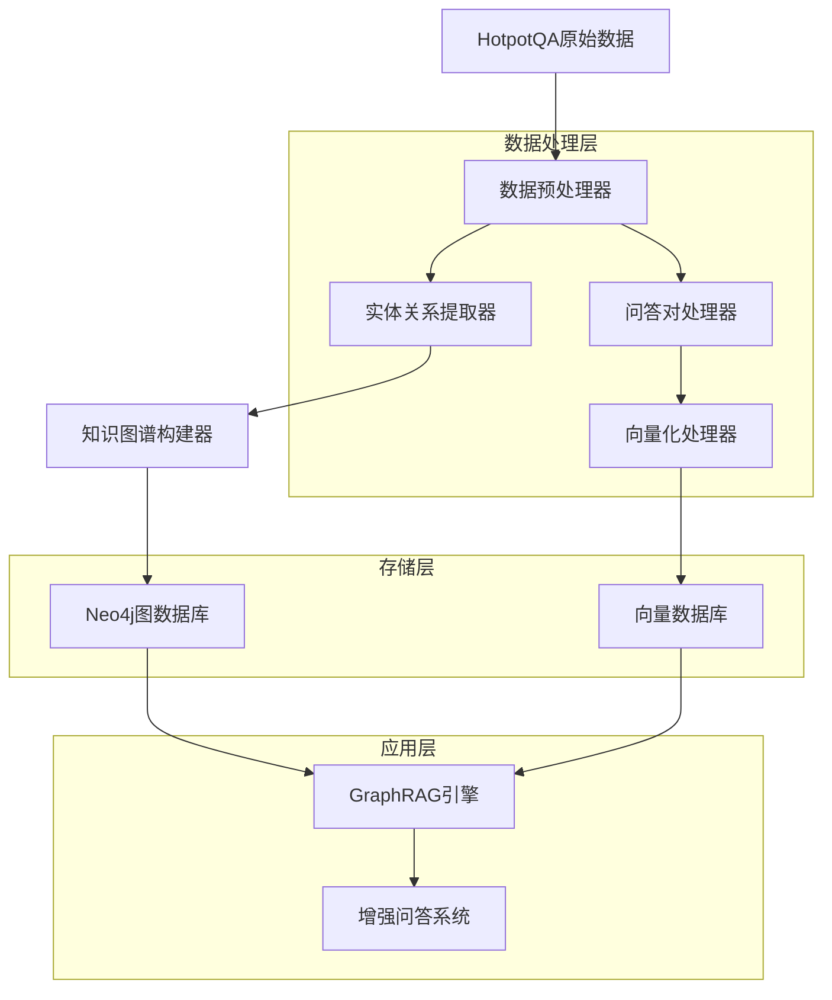
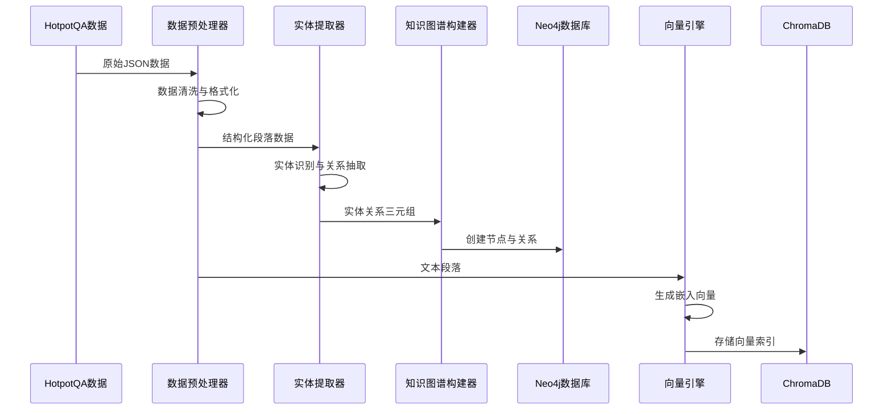
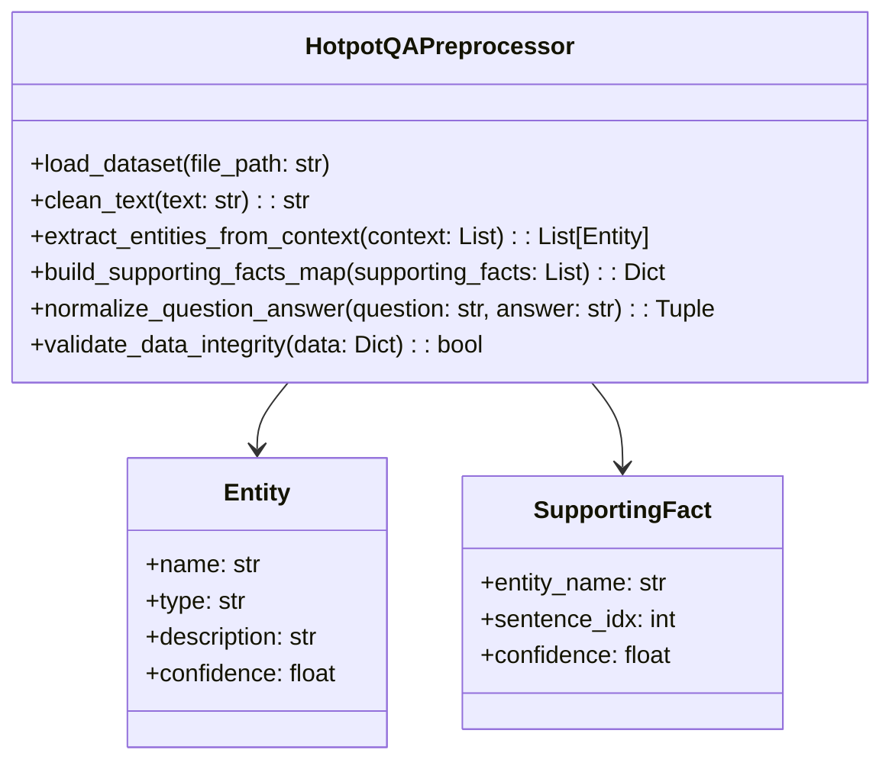
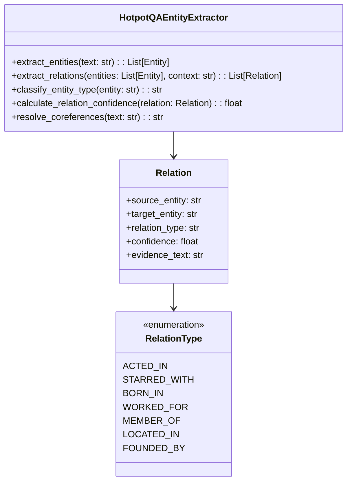
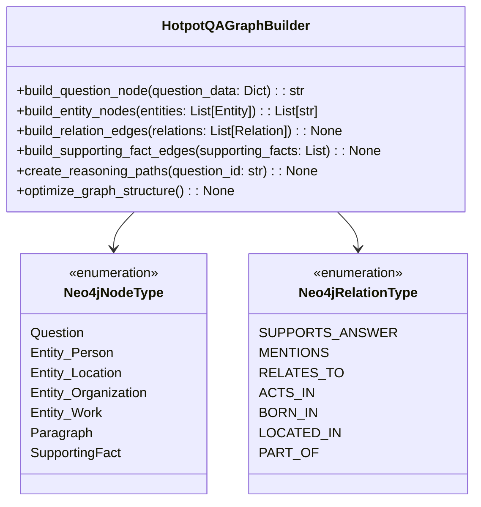
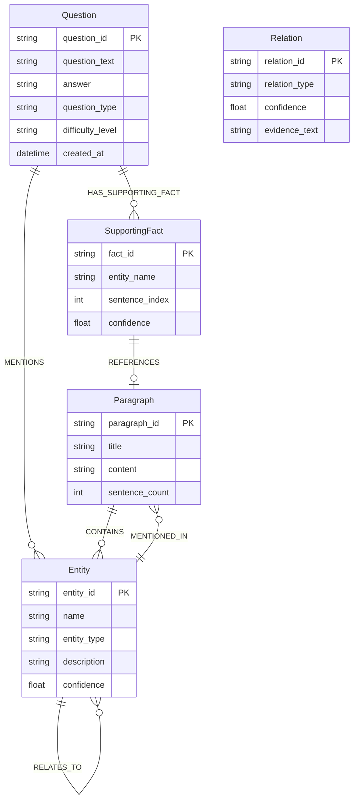
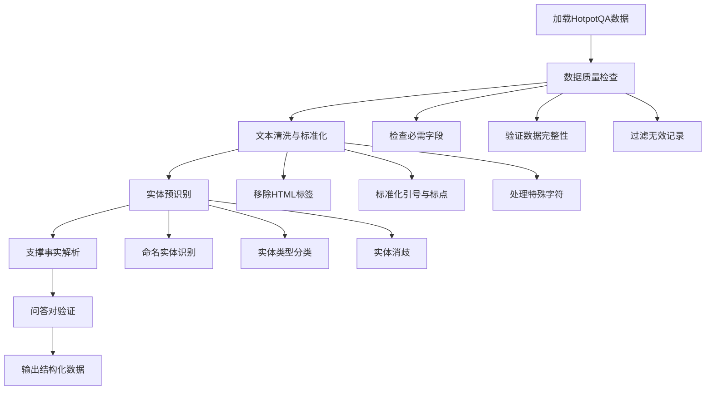
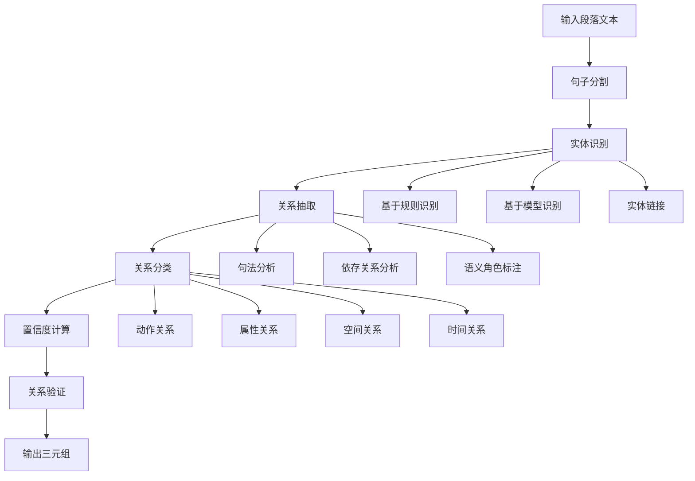
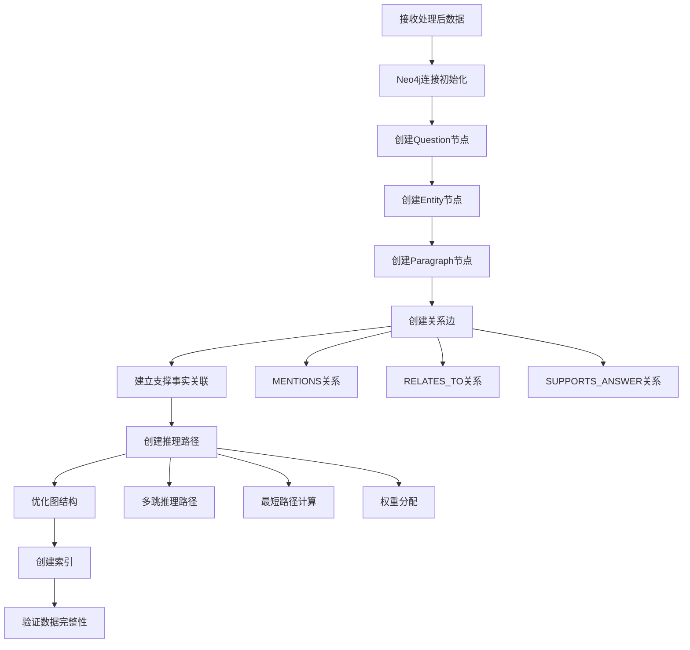
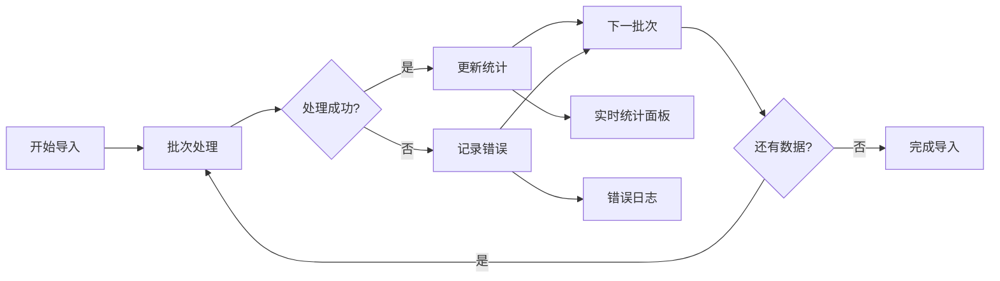

# HotpotQA数据集处理与知识图谱导入设计

## 概述

本设计方案描述如何将HotpotQA数据集进行切割处理并构建结构化知识图谱，然后导入到现有的政策法规RAG问答系统的Neo4j图数据库中。HotpotQA是一个多跳推理问答数据集，包含复杂的问题-答案对和相关的支撑段落，非常适合用于测试和增强RAG系统的多步推理能力。

## 技术架构

### 整体架构图



### 数据流架构



## HotpotQA数据结构分析

### 原始数据格式

HotpotQA数据集包含以下主要字段：

```json
{
    "_id": "unique_question_id",
    "question": "Which American actor was Candace Kita guest starred with?",
    "answer": "Bill Murray",
    "supporting_facts": [
        ["Candace Kita", 0],
        ["Bill Murray", 2]
    ],
    "context": [
        [
            "Candace Kita",
            [
                "Candace Kita is an American actress known for...",
                "She guest starred in several TV shows..."
            ]
        ],
        [
            "Bill Murray",
            [
                "William James Murray is an American actor...",
                "He starred in numerous comedy films..."
            ]
        ]
    ],
    "type": "bridge",
    "level": "medium"
}
```

### 数据特征分析

| 特征 | 描述 | 处理策略 |
|------|------|----------|
| 多跳推理 | 需要连接多个实体才能回答 | 构建实体间的推理路径 |
| 支撑事实 | 明确标注答案依据的段落 | 作为高置信度的实体关系 |
| 实体丰富 | 包含人物、地点、组织等 | 多类型实体节点创建 |
| 关系复杂 | 实体间存在多种关系类型 | 细粒度关系分类 |

## 核心组件设计

### 1. HotpotQA数据预处理器



### 2. 实体关系提取器



### 3. 知识图谱构建器



## 数据模型设计

### Neo4j图数据模型



### 实体类型分类体系

| 实体类型 | 子类型 | 示例 | 属性 |
|----------|--------|------|------|
| Person | Actor, Director, Writer | Bill Murray, Candace Kita | birth_date, nationality |
| Location | City, Country, Venue | New York, United States | coordinates, population |
| Organization | Company, School, Team | NBC, Harvard University | founded_date, type |
| Work | Movie, Book, Song | Ghostbusters, The Great Gatsby | release_date, genre |
| Event | Award, Competition | Oscar, World Cup | date, location |

## 数据处理流程

### 1. 数据预处理阶段



### 2. 实体关系抽取阶段



### 3. 图数据库导入阶段



## 实现细节

### 文件组织结构

```
scripts/
├── hotpotqa_processor/
│   ├── __init__.py
│   ├── preprocessor.py          # 数据预处理
│   ├── entity_extractor.py      # 实体关系抽取
│   ├── graph_builder.py         # 图构建
│   └── utils.py                 # 工具函数
├── import_hotpotqa_data.py      # 主导入脚本
└── test_hotpotqa_import.py      # 测试脚本
```

### 核心算法设计

#### 1. 实体识别算法

```python
def extract_entities_with_context(self, paragraph: str, title: str) -> List[Entity]:
    """
    基于上下文的实体识别算法
    
    Args:
        paragraph: 段落文本
        title: 段落标题（作为强实体信号）
        
    Returns:
        识别出的实体列表
    """
    entities = []
    
    # 1. Title实体（高置信度）
    if title and title.strip():
        entities.append(Entity(
            name=title.strip(),
            type=self.classify_entity_by_context(title, paragraph),
            confidence=0.95,
            description=paragraph[:200] + "..."
        ))
    
    # 2. 基于Ollama的实体识别
    if self.ollama_available:
        llm_entities = self.extract_entities_via_llm(paragraph)
        entities.extend(llm_entities)
    
    # 3. 基于规则的实体识别
    rule_entities = self.extract_entities_via_rules(paragraph)
    entities.extend(rule_entities)
    
    # 4. 实体去重与合并
    entities = self.merge_duplicate_entities(entities)
    
    return entities
```

#### 2. 关系抽取算法

```python
def extract_relations_from_supporting_facts(
    self, 
    question: str, 
    answer: str, 
    supporting_facts: List[Tuple[str, int]]
) -> List[Relation]:
    """
    基于支撑事实的关系抽取
    
    Args:
        question: 问题文本
        answer: 答案文本
        supporting_facts: 支撑事实列表 [(entity_name, sentence_idx)]
        
    Returns:
        抽取的关系列表
    """
    relations = []
    
    # 1. 问题-答案关系
    answer_entities = self.extract_entities(answer)
    question_entities = self.extract_entities(question)
    
    for q_entity in question_entities:
        for a_entity in answer_entities:
            relations.append(Relation(
                source_entity=q_entity.name,
                target_entity=a_entity.name,
                relation_type="ANSWERS_QUESTION",
                confidence=0.9,
                evidence_text=f"Q: {question} A: {answer}"
            ))
    
    # 2. 支撑事实关系
    for entity_name, sentence_idx in supporting_facts:
        relations.append(Relation(
            source_entity=entity_name,
            target_entity=answer,
            relation_type="SUPPORTS_ANSWER",
            confidence=0.85,
            evidence_text=f"Supporting fact from {entity_name}"
        ))
    
    return relations
```

#### 3. 图构建优化算法

```python
def optimize_graph_structure(self) -> None:
    """
    图结构优化算法
    """
    with self.driver.session() as session:
        # 1. 创建核心索引
        session.run("CREATE INDEX IF NOT EXISTS FOR (q:Question) ON q.question_id")
        session.run("CREATE INDEX IF NOT EXISTS FOR (e:Entity) ON e.name")
        session.run("CREATE INDEX IF NOT EXISTS FOR (e:Entity) ON e.entity_type")
        
        # 2. 计算实体重要性得分
        session.run("""
            MATCH (e:Entity)
            WITH e, 
                 size((e)-[:MENTIONS]-()) as mention_count,
                 size((e)-[:SUPPORTS_ANSWER]-()) as support_count
            SET e.importance_score = mention_count * 0.3 + support_count * 0.7
        """)
        
        # 3. 建立推理路径
        session.run("""
            MATCH (q:Question)-[:MENTIONS]->(e1:Entity),
                  (e1)-[:RELATES_TO*1..3]->(e2:Entity),
                  (e2)-[:SUPPORTS_ANSWER]->(a:Entity)
            WHERE a.name = q.answer
            MERGE (q)-[:HAS_REASONING_PATH {hops: length(path)}]->(a)
        """)
```

## 测试策略

### 单元测试覆盖

| 组件 | 测试类型 | 测试用例 |
|------|----------|----------|
| 数据预处理器 | 功能测试 | 数据格式验证、文本清洗、实体预识别 |
| 实体提取器 | 准确性测试 | 实体识别准确率、关系抽取准确率 |
| 图构建器 | 集成测试 | Neo4j连接、节点创建、关系建立 |

### 性能测试指标

| 指标 | 目标值 | 测试方法 |
|------|--------|----------|
| 数据处理速度 | >100 问题/分钟 | 批量处理测试 |
| 实体识别准确率 | >85% | 人工标注对比 |
| 关系抽取准确率 | >80% | 专家评估 |
| 图查询响应时间 | <2秒 | 压力测试 |

### 集成测试场景

```mermaid
flowchart TD
    A[准备测试数据] --> B[运行完整处理流程]
    B --> C[验证Neo4j数据]
    C --> D[测试GraphRAG查询]
    D --> E[对比答案质量]
    E --> F[生成测试报告]
    
    C --> C1[检查节点数量]
    C --> C2[验证关系完整性]
    C --> C3[确认索引有效性]
    
    D --> D1[简单实体查询]
    D --> D2[多跳推理查询]
    D --> D3[复杂关系查询]

## 具体实现方案

### 主导入脚本实现

```python
# scripts/import_hotpotqa_data.py

class HotpotQAImporter:
    """HotpotQA数据导入器"""
    
    def __init__(self):
        self.setup_connections()
        self.preprocessor = HotpotQAPreprocessor()
        self.entity_extractor = HotpotQAEntityExtractor(self.ollama_client)
        self.graph_builder = HotpotQAGraphBuilder(self.neo4j_driver)
        
    def import_dataset(self, dataset_path: str, batch_size: int = 100):
        """导入完整数据集"""
        print(f"开始导入HotpotQA数据集: {dataset_path}")
        
        # 1. 加载数据
        data = self.preprocessor.load_dataset(dataset_path)
        print(f"加载 {len(data)} 条问答记录")
        
        # 2. 批量处理
        for i in range(0, len(data), batch_size):
            batch = data[i:i+batch_size]
            self.process_batch(batch, i // batch_size + 1)
            
        # 3. 优化图结构
        self.graph_builder.optimize_graph_structure()
        
        print("导入完成!")
        
    def process_batch(self, batch: List[Dict], batch_num: int):
        """处理单个批次"""
        print(f"处理批次 {batch_num}: {len(batch)} 条记录")
        
        with self.neo4j_driver.session() as session:
            with session.begin_transaction() as tx:
                for question_data in batch:
                    try:
                        self.process_single_question(tx, question_data)
                    except Exception as e:
                        print(f"处理问题失败 {question_data.get('_id', 'unknown')}: {e}")
                        continue
```

### 实体关系抽取实现

```python
# scripts/hotpotqa_processor/entity_extractor.py

class HotpotQAEntityExtractor:
    """HotpotQA实体关系抽取器"""
    
    def __init__(self, ollama_client):
        self.ollama_client = ollama_client
        self.entity_types = {
            'PERSON': ['actor', 'director', 'writer', 'politician'],
            'LOCATION': ['city', 'country', 'state', 'venue'],
            'ORGANIZATION': ['company', 'school', 'team', 'government'],
            'WORK': ['movie', 'book', 'song', 'tv_show'],
            'EVENT': ['award', 'competition', 'ceremony']
        }
        
    def extract_entities_and_relations(self, question_data: Dict) -> Tuple[List[Entity], List[Relation]]:
        """从问答数据中抽取实体和关系"""
        entities = []
        relations = []
        
        # 1. 从context中提取实体
        for title, paragraphs in question_data['context']:
            # Title作为主实体
            main_entity = Entity(
                name=title,
                entity_type=self.classify_entity_type(title, paragraphs[0] if paragraphs else ""),
                description=paragraphs[0][:200] if paragraphs else "",
                confidence=0.95
            )
            entities.append(main_entity)
            
            # 从段落中抽取更多实体
            for paragraph in paragraphs:
                para_entities = self.extract_entities_from_text(paragraph)
                entities.extend(para_entities)
                
                # 建立实体与主实体的关系
                for entity in para_entities:
                    relation = self.infer_relation(main_entity, entity, paragraph)
                    if relation:
                        relations.append(relation)
        
        # 2. 基于支撑事实建立关系
        supporting_relations = self.extract_supporting_relations(
            question_data['question'],
            question_data['answer'],
            question_data['supporting_facts']
        )
        relations.extend(supporting_relations)
        
        return entities, relations
        
    def extract_entities_from_text(self, text: str) -> List[Entity]:
        """使用Ollama从文本中抽取实体"""
        if not self.ollama_client:
            return self.extract_entities_by_rules(text)
            
        prompt = f"""
        从以下文本中识别所有实体，包括人物、地点、组织、作品等。
        请以JSON格式返回，格式如下：
        {{
            "entities": [
                {{"name": "实体名称", "type": "实体类型", "confidence": 0.9}}
            ]
        }}
        
        文本：{text}
        """
        
        try:
            response = self.ollama_client.generate(prompt)
            result = json.loads(response)
            
            entities = []
            for ent_data in result.get('entities', []):
                entities.append(Entity(
                    name=ent_data['name'],
                    entity_type=ent_data['type'].upper(),
                    confidence=ent_data.get('confidence', 0.8),
                    description=text[:100] + "..."
                ))
            return entities
            
        except Exception as e:
            print(f"Ollama实体抽取失败: {e}")
            return self.extract_entities_by_rules(text)
```

### 图数据库构建实现

```python
# scripts/hotpotqa_processor/graph_builder.py

class HotpotQAGraphBuilder:
    """HotpotQA图构建器"""
    
    def __init__(self, neo4j_driver):
        self.driver = neo4j_driver
        self.stats = {
            'questions': 0,
            'entities': 0,
            'relations': 0,
            'paragraphs': 0
        }
        
    def build_question_graph(self, tx, question_data: Dict, entities: List[Entity], relations: List[Relation]):
        """构建单个问题的图结构"""
        question_id = question_data['_id']
        
        # 1. 创建Question节点
        self.create_question_node(tx, question_data)
        
        # 2. 创建Entity节点
        entity_ids = {}
        for entity in entities:
            entity_id = self.create_entity_node(tx, entity, question_id)
            entity_ids[entity.name] = entity_id
            
        # 3. 创建Paragraph节点
        for title, paragraphs in question_data['context']:
            paragraph_id = self.create_paragraph_node(tx, title, paragraphs, question_id)
            
            # 关联实体到段落
            if title in entity_ids:
                self.create_paragraph_entity_relation(tx, paragraph_id, entity_ids[title])
                
        # 4. 创建关系边
        for relation in relations:
            if relation.source_entity in entity_ids and relation.target_entity in entity_ids:
                self.create_entity_relation(tx, 
                    entity_ids[relation.source_entity],
                    entity_ids[relation.target_entity],
                    relation
                )
                
        # 5. 创建支撑事实关系
        self.create_supporting_fact_relations(tx, question_id, question_data['supporting_facts'])
        
    def create_question_node(self, tx, question_data: Dict) -> str:
        """创建问题节点"""
        query = """
        MERGE (q:HotpotQuestion {question_id: $question_id})
        SET q.question_text = $question,
            q.answer = $answer,
            q.question_type = $type,
            q.level = $level,
            q.created_at = datetime()
        RETURN q.question_id as question_id
        """
        
        params = {
            'question_id': question_data['_id'],
            'question': question_data['question'],
            'answer': question_data['answer'],
            'type': question_data.get('type', 'unknown'),
            'level': question_data.get('level', 'unknown')
        }
        
        result = tx.run(query, **params)
        record = result.single()
        if record:
            self.stats['questions'] += 1
            return record['question_id']
        return question_data['_id']
        
    def create_entity_node(self, tx, entity: Entity, question_id: str) -> str:
        """创建实体节点"""
        entity_id = f"ENT_{hashlib.md5(entity.name.encode()).hexdigest()[:8]}"
        
        query = """
        MERGE (e:HotpotEntity {entity_id: $entity_id})
        SET e.name = $name,
            e.entity_type = $entity_type,
            e.description = $description,
            e.confidence = $confidence
        WITH e
        MATCH (q:HotpotQuestion {question_id: $question_id})
        MERGE (q)-[:MENTIONS]->(e)
        RETURN e.entity_id as entity_id
        """
        
        params = {
            'entity_id': entity_id,
            'name': entity.name,
            'entity_type': entity.entity_type,
            'description': entity.description,
            'confidence': entity.confidence,
            'question_id': question_id
        }
        
        result = tx.run(query, **params)
        record = result.single()
        if record:
            self.stats['entities'] += 1
            return record['entity_id']
        return entity_id
```

## 部署配置

### 环境变量配置

在项目根目录的`.env`文件中添加以下配置：

```bash
# HotpotQA数据处理配置
HOTPOTQA_DATASET_PATH=./data/hotpotqa/
HOTPOTQA_BATCH_SIZE=50
HOTPOTQA_ENABLE_LLM_EXTRACTION=true
HOTPOTQA_MAX_ENTITIES_PER_PARAGRAPH=10

# 处理选项
HOTPOTQA_SKIP_EXISTING=true
HOTPOTQA_CREATE_INDEXES=true
HOTPOTQA_OPTIMIZE_GRAPH=true
```

### 数据文件准备

1. **下载HotpotQA数据集**
   ```bash
   wget https://hotpotqa.github.io/data/hotpot_train_v1.1.json
   wget https://hotpotqa.github.io/data/hotpot_dev_distractor_v1.json
   ```

2. **创建数据目录**
   ```bash
   mkdir -p data/hotpotqa
   mv hotpot_*.json data/hotpotqa/
   ```

### 运行命令

```bash
# 导入训练集数据
python start_server.py script scripts/import_hotpotqa_data.py --dataset train --batch-size 100

# 导入开发集数据
python start_server.py script scripts/import_hotpotqa_data.py --dataset dev --batch-size 50

# 验证导入结果
python start_server.py script scripts/test_hotpotqa_import.py
```

## 监控与维护

### 导入进度监控



### 质量评估指标

| 指标 | 计算方法 | 目标值 |
|------|----------|--------|
| 数据完整性 | 成功导入记录数/总记录数 | >95% |
| 实体识别覆盖率 | 识别实体数/预期实体数 | >90% |
| 关系抽取准确率 | 正确关系数/总关系数 | >85% |
| 图连通性 | 连通组件数/总节点数 | <0.1 |

### 故障处理策略

1. **内存不足**
   - 减小批处理大小
   - 启用分块处理模式
   - 清理临时数据

2. **Neo4j连接超时**
   - 增加连接超时时间
   - 优化Cypher查询
   - 使用事务批处理

3. **Ollama服务不可用**
   - 自动切换到规则抽取
   - 降级处理模式
   - 记录待重试任务
```