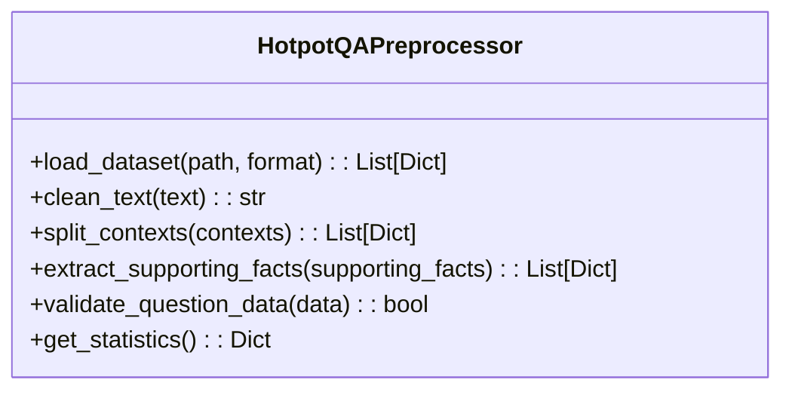
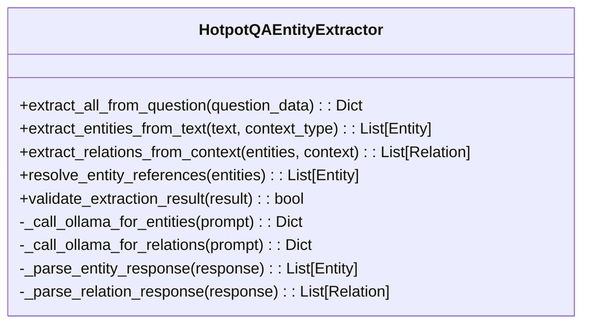
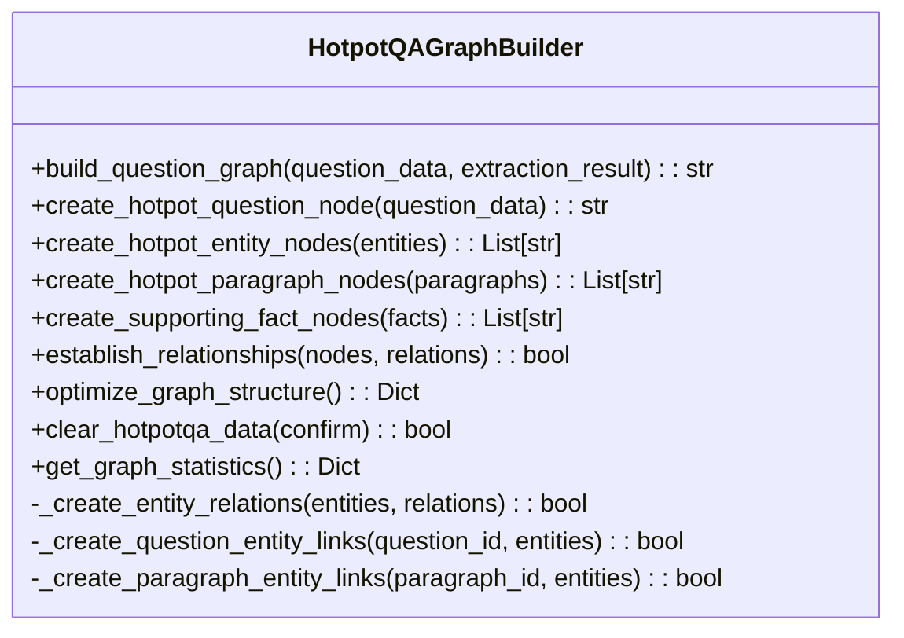

# HotpotQA数据集导入设计

## 概述

本设计文档描述了HotpotQA数据集导入功能的架构与实现方案。该功能是政策法规RAG问答系统的重要扩展，通过导入HotpotQA开放域问答数据集来构建知识图谱，用于RAG系统评估实验（对比RAGAS和EARAG-Eval）。

### 目标
- 从Hugging Face下载HotpotQA数据集并进行预处理
- 构建适配GraphRAG系统的知识图谱结构
- 支持小规模实验（100-200样本）以优化计算资源
- 生成RAGAS评估所需的标准化数据格式

### 技术栈
- **数据源**: HotpotQA数据集（Hugging Face Datasets）
- **图数据库**: Neo4j
- **实体提取**: Ollama大模型（远程服务）
- **向量嵌入**: bge-m3模型
- **处理框架**: Python + 批处理

## 系统架构

### 整体架构
``mermaid
graph TB
    subgraph "数据获取层"
        HF[Hugging Face Datasets] --> Download[数据下载]
        Download --> Cache[本地缓存]
    end
    
    subgraph "数据处理层"
        Cache --> Preprocessor[HotpotQA预处理器]
        Preprocessor --> EntityExtractor[实体提取器]
        EntityExtractor --> GraphBuilder[图构建器]
    end
    
    subgraph "数据存储层"
        GraphBuilder --> Neo4j[(Neo4j图数据库)]
        GraphBuilder --> Statistics[统计信息]
    end
    
    subgraph "外部服务"
        Ollama[Ollama远程服务] --> EntityExtractor
    end
    
    subgraph "评估数据"
        Neo4j --> RAGASGenerator[RAGAS数据生成器]
        RAGASGenerator --> CSVOutput[CSV评估数据]
    end
```

### 数据流架构
``mermaid
sequenceDiagram
    participant Importer as HotpotQAImporter
    participant Preprocessor as HotpotQAPreprocessor
    participant EntityExtractor as HotpotQAEntityExtractor
    participant GraphBuilder as HotpotQAGraphBuilder
    participant Neo4j as Neo4j数据库
    participant Ollama as Ollama服务
    
    Importer->>Preprocessor: 加载数据集(dataset_path)
    Preprocessor->>Preprocessor: 数据清洗与分割
    Preprocessor-->>Importer: 返回预处理结果
    
    loop 批处理
        Importer->>EntityExtractor: 提取实体关系(question_data)
        EntityExtractor->>Ollama: 调用实体提取API
        Ollama-->>EntityExtractor: 返回实体/关系JSON
        EntityExtractor->>EntityExtractor: 解析与验证
        EntityExtractor-->>Importer: 返回提取结果
        
        Importer->>GraphBuilder: 构建问题图谱
        GraphBuilder->>Neo4j: 创建HotpotQuestion节点
        GraphBuilder->>Neo4j: 创建HotpotEntity节点
        GraphBuilder->>Neo4j: 创建HotpotParagraph节点
        GraphBuilder->>Neo4j: 建立关系边
        Neo4j-->>GraphBuilder: 确认创建
        GraphBuilder-->>Importer: 返回节点ID
    end
    
    Importer->>GraphBuilder: 优化图结构
    Importer->>Importer: 生成统计报告
```

## 核心组件

### HotpotQA预处理器
负责原始HotpotQA数据的清洗和格式转换。



**核心功能**:
- **数据加载**: 支持从Hugging Face或本地JSON文件加载数据
- **文本清洗**: 移除HTML标签、标准化空格、处理特殊字符
- **上下文分割**: 将context字段分解为独立的段落单元
- **支持事实提取**: 解析supporting_facts字段为可查询的事实单元

### HotpotQA实体提取器
基于Ollama大模型进行智能实体识别和关系提取。



**核心功能**:
- **多源实体提取**: 从问题、答案、上下文段落中提取实体
- **关系识别**: 基于supporting_facts和上下文推断实体间关系
- **实体归一化**: 处理同义词和缩写（如"United States" = "USA"）
- **置信度评估**: 为每个实体和关系分配置信度分数

### HotpotQA图构建器
负责将提取的实体关系转换为Neo4j图结构。



**节点类型定义**:
- **HotpotQuestion**: 问题节点（question, answer, level, type）
- **HotpotEntity**: 实体节点（name, type, confidence, aliases）
- **HotpotParagraph**: 段落节点（title, text, order, source）
- **HotpotSupportingFact**: 支持事实节点（title, sentence_id, fact_text）

**关系类型定义**:
- **HAS_ENTITY**: 问题/段落包含实体
- **SUPPORTS_ANSWER**: 支持事实支持答案
- **MENTIONS**: 段落提及实体
- **RELATED_TO**: 实体间语义关系
- **DERIVED_FROM**: 答案来源于段落

## 数据模型

### HotpotQA图谱模型
``mermaid
erDiagram
    HotpotQuestion ||--o{ HotpotEntity : "HAS_ENTITY"
    HotpotQuestion ||--o{ HotpotSupportingFact : "SUPPORTS_ANSWER"
    HotpotParagraph ||--o{ HotpotEntity : "MENTIONS"
    HotpotParagraph ||--o{ HotpotSupportingFact : "CONTAINS"
    HotpotEntity ||--o{ HotpotEntity : "RELATED_TO"
    
    HotpotQuestion {
        string question_id PK
        string question
        string answer
        string level
        string type
        datetime created_at
    }
    
    HotpotEntity {
        string entity_id PK
        string name
        string entity_type
        float confidence
        string[] aliases
        string source_context
    }
    
    HotpotParagraph {
        string paragraph_id PK
        string title
        string text
        int order
        string source_type
    }
    
    HotpotSupportingFact {
        string fact_id PK
        string title
        int sentence_id
        string fact_text
        float relevance_score
    }
```

### 批处理架构
``mermaid
graph LR
    subgraph "批处理控制"
        Controller[HotpotQAImporter] --> BatchManager[批次管理器]
        BatchManager --> Progress[进度跟踪]
        BatchManager --> ErrorHandler[错误处理]
    end
    
    subgraph "数据处理管道"
        Input[原始数据] --> Batch1[批次1: 50问题]
        Input --> Batch2[批次2: 50问题]
        Input --> BatchN[批次N: 50问题]
        
        Batch1 --> ProcessPipeline[处理管道]
        Batch2 --> ProcessPipeline
        BatchN --> ProcessPipeline
    end
    
    subgraph "结果聚合"
        ProcessPipeline --> Stats[统计聚合]
        ProcessPipeline --> GraphDB[图数据库]
        Stats --> Report[最终报告]
    end
```

## API接口设计

### 命令行接口
``bash
python scripts/import_hotpotqa_data.py <dataset_path> [选项]

选项:
--format {train|dev|test|auto}    数据格式（默认: auto）
--batch-size INT                  批处理大小（默认: 50）
--max-questions INT               最大处理问题数
--rebuild-graph                   重建图谱（清除现有数据）
--export-stats PATH               导出统计信息路径
--log-level {DEBUG|INFO|WARNING|ERROR}  日志级别
```

### 编程接口
``python
# 创建导入器
importer = HotpotQAImporter(
    batch_size=50,
    max_questions=200
)

# 执行导入
stats = importer.import_dataset(
    dataset_path="database/hotpotqa_dev_subset.json",
    data_format="dev",
    rebuild_graph=True
)

# 导出统计
importer.export_statistics("stats.json", stats)
```

## 数据处理流程

### 数据获取与预处理
``mermaid
flowchart TD
    Start[开始] --> LoadHF[从Hugging Face加载数据集]
    LoadHF --> ValidateFormat[验证数据格式]
    ValidateFormat --> CreateSubset[创建子集200样本]
    CreateSubset --> SaveLocal[保存到本地JSON]
    SaveLocal --> Preprocess[文本预处理]
    
    Preprocess --> CleanHTML[清理HTML标签]
    CleanHTML --> NormalizeSpace[标准化空格]
    NormalizeSpace --> SplitContext[分割上下文段落]
    SplitContext --> ParseFacts[解析支持事实]
    ParseFacts --> PreprocessComplete[预处理完成]
```

### 实体关系提取流程
``mermaid
flowchart TD
    Start[接收问题数据] --> ExtractQuestion[从问题提取实体]
    ExtractQuestion --> ExtractAnswer[从答案提取实体]
    ExtractAnswer --> ExtractContext[从上下文提取实体]
    ExtractContext --> MergeEntities[合并去重实体]
    
    MergeEntities --> RelationExtraction[关系提取]
    RelationExtraction --> ValidateRelations[验证关系有效性]
    ValidateRelations --> ConfidenceScore[计算置信度]
    ConfidenceScore --> FilterLowConfidence[过滤低置信度结果]
    FilterLowConfidence --> Complete[提取完成]
```

### 图构建流程
``mermaid
flowchart TD
    Start[开始图构建] --> CreateQuestion[创建HotpotQuestion节点]
    CreateQuestion --> CreateEntities[创建HotpotEntity节点]
    CreateEntities --> CreateParagraphs[创建HotpotParagraph节点]
    CreateParagraphs --> CreateFacts[创建HotpotSupportingFact节点]
    
    CreateFacts --> LinkQuestionEntities[建立Question-Entity关系]
    LinkQuestionEntities --> LinkParagraphEntities[建立Paragraph-Entity关系]
    LinkParagraphEntities --> LinkSupportingFacts[建立SupportingFact关系]
    LinkSupportingFacts --> LinkEntityRelations[建立Entity-Entity关系]
    LinkEntityRelations --> OptimizeGraph[优化图结构]
    OptimizeGraph --> Complete[图构建完成]
```

## 性能优化策略

### 批处理优化
- **动态批次大小**: 根据Ollama服务响应时间调整批次大小
- **并行处理**: 在单批次内并行处理多个问题的实体提取
- **内存管理**: 及时释放已处理批次的内存
- **断点续传**: 支持从中断点继续处理

### Ollama服务优化
- **连接池管理**: 复用HTTP连接减少握手开销
- **请求重试**: 指数退避算法处理临时故障
- **超时控制**: 分级超时（实体提取: 600s，关系提取: 600s）
- **负载均衡**: 支持多个Ollama服务实例

### Neo4j数据库优化
- **批量写入**: 使用事务批量创建节点和关系
- **索引策略**: 为entity_id、question_id等字段建立索引
- **查询优化**: 限制深度遍历防止性能问题
- **连接池**: 复用数据库连接

## 测试策略

### 单元测试
``python
class TestHotpotQAPreprocessor:
    def test_load_dataset_from_huggingface()
    def test_clean_text_html_removal()
    def test_split_contexts_structure()
    def test_extract_supporting_facts()

class TestHotpotQAEntityExtractor:
    def test_extract_entities_from_question()
    def test_extract_relations_confidence()
    def test_resolve_entity_references()

class TestHotpotQAGraphBuilder:
    def test_create_question_node()
    def test_establish_relationships()
    def test_graph_optimization()
```

### 集成测试
- **端到端流程测试**: 完整的数据导入流程验证
- **数据一致性测试**: 验证导入后的图结构完整性
- **性能基准测试**: 测试不同批次大小的处理性能
- **错误恢复测试**: 验证服务中断后的恢复能力

### 数据质量验证
- **实体提取准确性**: 抽样验证实体识别的准确率
- **关系提取完整性**: 验证支持事实的关系完整性
- **图结构合理性**: 检查孤立节点和无效关系

## 错误处理机制

### 分层错误处理
``mermaid
graph TD
    ServiceError[服务级错误] --> OllamaTimeout[Ollama超时]
    ServiceError --> Neo4jConnection[Neo4j连接失败]
    ServiceError --> DataFormatError[数据格式错误]
    
    ProcessError[处理级错误] --> EntityExtractionFailed[实体提取失败]
    ProcessError --> RelationBuildFailed[关系构建失败]
    ProcessError --> GraphWriteFailed[图写入失败]
    
    DataError[数据级错误] --> MissingRequiredField[缺少必需字段]
    DataError --> InvalidQuestionFormat[无效问题格式]
    DataError --> EmptyContext[空上下文]
    
    RecoveryStrategy[恢复策略] --> Retry[重试机制]
    RecoveryStrategy --> Fallback[降级处理]
    RecoveryStrategy --> Skip[跳过处理]
```

### 错误恢复策略
- **Ollama服务不可用**: 降级到基于规则的实体提取
- **Neo4j连接失败**: 启用本地缓存，延后写入
- **数据格式异常**: 记录错误并继续处理下一个
- **内存不足**: 减小批次大小并清理缓存

## 监控与日志

### 处理进度监控
``python
# 实时进度跟踪
{
    "total_questions": 200,
    "processed": 150,
    "successful": 145,
    "failed": 5,
    "current_batch": 4,
    "estimated_remaining_time": "00:15:30",
    "processing_rate": "12.5 questions/min"
}
```

### 统计信息收集
- **处理统计**: 成功率、失败率、平均处理时间
- **实体统计**: 提取数量、类型分布、置信度分布
- **关系统计**: 关系类型、强度分布、网络密度
- **性能统计**: Ollama调用延迟、Neo4j写入时间

### 日志分级
- **INFO**: 批次进度、重要里程碑
- **WARNING**: 非致命错误、性能警告
- **ERROR**: 严重错误、处理失败
- **DEBUG**: 详细的处理步骤、API调用详情

## 部署与维护

### 环境依赖
```python
# requirements.txt 新增依赖
datasets==2.14.0          # Hugging Face数据集库
transformers>=4.21.0      # 可选：本地模型支持
torch>=1.12.0             # 可选：本地向量化
scikit-learn>=1.1.0       # 数据质量评估
```

### 配置管理
```python
# .env 环境变量
HOTPOTQA_BATCH_SIZE=50
HOTPOTQA_MAX_QUESTIONS=200
HOTPOTQA_CACHE_DIR=./cache/hotpotqa
OLLAMA_ENTITY_TIMEOUT=30
OLLAMA_RELATION_TIMEOUT=45
NEO4J_BATCH_SIZE=100
```

### 数据管理
- **缓存策略**: Hugging Face数据集缓存到本地
- **版本控制**: 数据集版本和处理脚本版本对应
- **清理机制**: 定期清理过期的临时文件和缓存
- **备份策略**: 导入前自动备份现有图数据库
