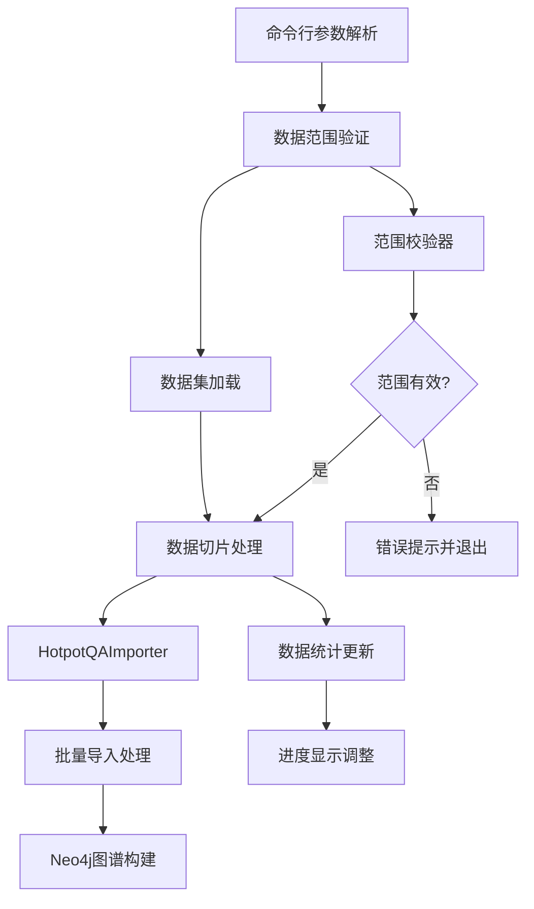
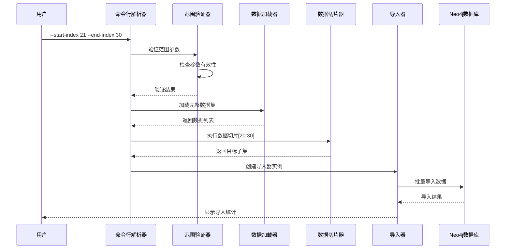

# HotpotQA 数据导入范围控制功能设计

## 概述

本设计文档描述了对 `import_hotpotqa_data.py` 脚本的修改方案，使其支持指定数据范围导入功能。用户可以通过命令行参数指定导入数据的起始和结束位置，例如导入第21-30条数据，实现精确的数据子集导入控制。

## 技术栈

- **Python**: 3.8+
- **数据处理**: JSON
- **数据存储**: Neo4j 图数据库
- **AI服务**: Ollama (实体提取)
- **参数解析**: argparse
- **日志记录**: logging

## 架构设计

### 核心组件交互



### 数据流向设计



## 功能特性

### 1. 数据范围控制

#### 参数定义
- `--start-index`: 起始数据索引 (从1开始计数，包含该位置)
- `--end-index`: 结束数据索引 (包含该位置)
- `--skip-count`: 跳过前N条数据 (可选，与start-index互斥)
- `--import-count`: 导入数据条数 (可选，与end-index配合使用)

#### 范围验证规则
- 起始索引必须 ≥ 1
- 结束索引必须 ≥ 起始索引
- 范围不能超出数据集实际大小
- 支持单条数据导入 (start-index = end-index)

### 2. 参数组合模式

| 模式 | 参数组合 | 示例 | 说明 |
|------|----------|------|------|
| 精确范围 | `--start-index --end-index` | `--start-index 21 --end-index 30` | 导入第21-30条 |
| 从起始位置 | `--start-index --import-count` | `--start-index 21 --import-count 10` | 从第21条开始导入10条 |
| 跳过模式 | `--skip-count --import-count` | `--skip-count 20 --import-count 10` | 跳过前20条，导入10条 |
| 仅起始 | `--start-index` | `--start-index 21` | 从第21条导入到末尾 |

### 3. 数据切片实现

#### 切片逻辑设计
```python
def apply_data_range_filter(
    data: List[Dict], 
    start_index: int = None, 
    end_index: int = None,
    skip_count: int = None,
    import_count: int = None
) -> Tuple[List[Dict], Dict[str, int]]:
    """
    应用数据范围过滤
    
    Returns:
        (filtered_data, range_info)
    """
```

#### 索引转换策略
- 用户输入: 1-based索引 (第1条、第2条...)
- 内部处理: 0-based索引 (list[0], list[1]...)
- 转换公式: `internal_index = user_index - 1`

### 4. 统计信息增强

#### 范围导入统计
```python
range_import_stats = {
    'original_dataset_size': int,      # 原始数据集大小
    'requested_start_index': int,      # 用户请求起始索引
    'requested_end_index': int,        # 用户请求结束索引  
    'actual_start_index': int,         # 实际处理起始索引
    'actual_end_index': int,           # 实际处理结束索引
    'filtered_dataset_size': int,      # 过滤后数据集大小
    'range_description': str           # 范围描述文字
}
```

## 实现方案

### 1. 命令行参数扩展

```python
# 在main()函数中添加新的参数组
range_group = parser.add_argument_group('数据范围控制')

# 精确范围控制
range_group.add_argument(
    '--start-index',
    type=int,
    help='起始数据索引（从1开始，包含该位置）'
)

range_group.add_argument(
    '--end-index', 
    type=int,
    help='结束数据索引（包含该位置）'
)

# 便捷模式
range_group.add_argument(
    '--skip-count',
    type=int,
    help='跳过前N条数据'
)

range_group.add_argument(
    '--import-count',
    type=int, 
    help='导入数据条数'
)
```

### 2. 数据范围验证器

```python
class DataRangeValidator:
    """数据范围参数验证器"""
    
    @staticmethod
    def validate_range_params(
        start_index: int = None,
        end_index: int = None, 
        skip_count: int = None,
        import_count: int = None,
        dataset_size: int = None
    ) -> Dict[str, Any]:
        """
        验证范围参数的有效性和一致性
        
        Returns:
            {
                'is_valid': bool,
                'error_message': str,
                'computed_start': int,
                'computed_end': int
            }
        """
```

### 3. 数据切片处理器

```python
class DataSliceProcessor:
    """数据切片处理器"""
    
    @staticmethod
    def slice_dataset(
        data: List[Dict], 
        start_index: int,
        end_index: int
    ) -> Tuple[List[Dict], Dict[str, Any]]:
        """
        根据指定范围切片数据集
        
        Args:
            data: 原始数据集
            start_index: 起始索引 (1-based)
            end_index: 结束索引 (1-based)
            
        Returns:
            (sliced_data, slice_info)
        """
```

### 4. HotpotQAImporter类修改

#### 构造函数扩展
```python
def __init__(
    self, 
    batch_size: int = 50, 
    max_questions: int = None,
    range_info: Dict[str, Any] = None  # 新增范围信息
):
```

#### 统计信息增强
```python
def _generate_final_statistics(self, optimization_results: Dict) -> Dict[str, Any]:
    """增强统计信息，包含范围导入详情"""
    
    final_stats = {
        'import_summary': {
            # 原有统计字段...
        },
        'range_import_info': self.range_info,  # 新增范围导入信息
        # 其他统计字段...
    }
```

### 5. 主函数集成

```python
def main():
    """主函数 - 集成范围控制功能"""
    
    # 1. 参数解析和验证
    range_validator = DataRangeValidator()
    validation_result = range_validator.validate_range_params(...)
    
    if not validation_result['is_valid']:
        print(f"参数错误: {validation_result['error_message']}")
        return 1
    
    # 2. 数据加载和切片
    importer = HotpotQAImporter(...)
    dataset_path = determine_dataset_path(args)
    
    # 加载完整数据集用于范围计算
    raw_data = load_full_dataset(dataset_path)
    
    # 应用范围过滤
    slice_processor = DataSliceProcessor()
    filtered_data, slice_info = slice_processor.slice_dataset(
        raw_data, 
        validation_result['computed_start'],
        validation_result['computed_end']
    )
    
    # 3. 执行导入
    stats = importer.import_filtered_dataset(filtered_data, slice_info)
```

## 用户交互设计

### 命令行使用示例

```bash
# 导入第21-30条数据
python scripts/import_hotpotqa_data.py --download-dev --start-index 21 --end-index 30

# 从第51条开始导入20条数据  
python scripts/import_hotpotqa_data.py database/hotpotqa.json --start-index 51 --import-count 20

# 跳过前100条，导入接下来的50条
python scripts/import_hotpotqa_data.py --download-test --skip-count 100 --import-count 50

# 导入单条数据（第100条）  
python scripts/import_hotpotqa_data.py database/hotpotqa.json --start-index 100 --end-index 100

# 从第200条导入到数据集末尾
python scripts/import_hotpotqa_data.py --download-train --start-index 200
```

### 进度显示优化

```
正在下载HotpotQA验证集...
✓ 验证集已准备就绪: database/cache/hotpotqa_dev_fullwiki_200samples.json
数据集原始大小: 200 个样本
指定导入范围: 第21-30条 (共10个样本)

开始导入数据集: database/cache/hotpotqa_dev_fullwiki_200samples.json
范围过滤: 第21-30条 → 实际处理10个问题

处理批次 1/1 (10 个问题)
批次 1 完成，用时: 15.3s, 成功: 8/10
进度: 100.0% | 成功率: 80.0%

==================================================
导入完成！
==================================================  
原始数据集: 200 个样本
导入范围: 第21-30条
实际处理: 10 个问题
成功导入: 8 个
失败: 2 个
成功率: 80.0%
```

### 错误处理和提示

```python
def provide_user_friendly_error_messages(validation_result: Dict) -> str:
    """提供用户友好的错误提示"""
    
    error_messages = {
        'invalid_start_index': "起始索引必须大于等于1",
        'invalid_end_index': "结束索引必须大于等于起始索引", 
        'range_exceeds_dataset': f"指定范围超出数据集大小 (最大: {dataset_size})",
        'conflicting_params': "不能同时使用 --start-index 和 --skip-count 参数",
        'missing_end_param': "使用 --import-count 时需要指定 --start-index 或 --skip-count"
    }
```

## 测试策略

### 1. 单元测试

```python
class TestDataRangeValidator:
    """数据范围验证器测试"""
    
    def test_valid_range_params(self):
        """测试有效的范围参数"""
        
    def test_invalid_range_params(self):
        """测试无效的范围参数"""
        
    def test_edge_cases(self):
        """测试边界情况"""

class TestDataSliceProcessor:
    """数据切片处理器测试"""
    
    def test_normal_slicing(self):
        """测试正常切片功能"""
        
    def test_boundary_slicing(self):
        """测试边界切片"""
```

### 2. 集成测试

```python
def test_end_to_end_range_import():
    """端到端范围导入测试"""
    
    # 准备测试数据
    test_data = create_test_hotpotqa_dataset(100)
    
    # 测试不同范围参数组合
    test_cases = [
        {'start_index': 1, 'end_index': 10},
        {'start_index': 21, 'end_index': 30}, 
        {'skip_count': 50, 'import_count': 10}
    ]
```

## 部署和维护

### 1. 向后兼容性

- 新增参数为可选参数，不影响现有脚本调用
- 保持原有的 `--max-questions` 参数功能
- 范围参数优先级高于 `--max-questions`

### 2. 性能考虑

- 仅加载必要的数据集大小信息用于验证
- 避免加载完整数据集进行范围计算（对于大型数据集）
- 保持批处理机制的高效性

### 3. 扩展性设计  

- 支持未来添加更多范围控制模式
- 预留接口支持条件过滤 (如按问题类型、难度等)
- 可扩展至其他数据导入脚本

## 预期效果

通过实施此设计，用户将能够：

1. **精确控制导入范围**: 指定导入数据的确切位置区间
2. **提升开发效率**: 快速导入小批量数据进行测试验证
3. **降低资源消耗**: 避免导入不必要的大量数据
4. **支持增量导入**: 分批次导入大型数据集
5. **增强调试能力**: 针对特定数据范围进行问题排查

该功能设计保持了与现有系统的完全兼容性，同时提供了灵活而强大的数据导入控制能力。