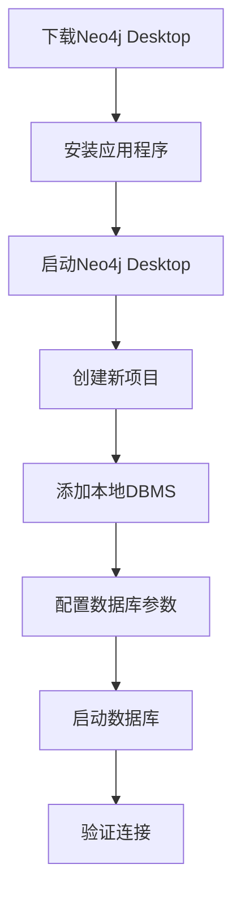

# Neo4j数据库配置与启动设计方案

## 1. 概述

本文档详细说明如何完善政策法规RAG问答系统中Neo4j数据库的配置和启动步骤，包括Neo4j Desktop图形界面版本和命令行版本的详细使用方法。

## 2. Neo4j数据库配置架构

### 2.1 连接配置参数

```
连接地址：neo4j://localhost:7687
用户名：neo4j  
密码：password（可自定义）
数据库名：neo4j（默认）
```

### 2.2 系统要求

- **操作系统**：Windows 10+、macOS 10.14+、Linux（Ubuntu 18.04+）
- **Java版本**：JDK 11或JDK 17（Neo4j 5.x要求）
- **内存要求**：至少4GB RAM（推荐8GB+）
- **磁盘空间**：至少2GB可用空间

## 3. Neo4j Desktop版本配置与启动

### 3.1 安装步骤



#### 3.1.1 下载与安装
1. **下载地址**：访问 [https://neo4j.com/download/](https://neo4j.com/download/)
2. **选择版本**：选择"Neo4j Desktop"
3. **注册账户**：填写邮箱获取激活码
4. **安装程序**：下载后运行安装包，按提示完成安装

#### 3.1.2 首次配置流程
1. **启动应用**：双击桌面图标启动Neo4j Desktop
2. **输入激活码**：使用注册时获得的激活码激活
3. **创建项目**：
   ```
   项目名称：政策法规RAG系统
   描述：政策法规问答系统的图数据库
   ```

### 3.2 数据库创建与配置

#### 3.2.1 创建本地DBMS
1. **添加数据库**：
   - 点击"Add" → "Local DBMS"
   - 数据库名称：`policy-rag-db`
   - 密码：设置为环境变量中的password
   - 版本：选择5.14.1或最新稳定版

2. **高级配置**：
   ```
   初始堆大小：512m
   最大堆大小：2g
   页面缓存：1g
   ```

#### 3.2.2 插件安装
1. **APOC插件**（推荐）：
   - 在插件选项卡中启用"APOC"
   - 用于数据导入和高级查询功能

2. **Graph Data Science插件**（可选）：
   - 启用"Graph Data Science"
   - 用于图算法和数据科学分析

### 3.3 启动与管理

#### 3.3.1 启动数据库
```
操作步骤：
1. 在项目面板中找到创建的数据库
2. 点击"Start"按钮启动数据库
3. 等待状态变为"Active"（绿色圆点）
4. 记录连接URL：bolt://localhost:7687
```

#### 3.3.2 浏览器访问
```
1. 点击"Open"按钮打开Neo4j Browser
2. 在浏览器地址栏输入：http://localhost:7474
3. 使用配置的用户名密码登录
4. 执行测试查询：MATCH (n) RETURN count(n)
```

## 4. Neo4j命令行版本配置与启动

### 4.1 安装配置

#### 4.1.1 下载安装
```bash
# Linux/macOS
curl -O https://dist.neo4j.org/neo4j-community-5.14.1-unix.tar.gz
tar -xzf neo4j-community-5.14.1-unix.tar.gz
cd neo4j-community-5.14.1

# Windows
# 下载neo4j-community-5.14.1-windows.zip并解压
```

#### 4.1.2 环境变量配置
```bash
# Linux/macOS
export NEO4J_HOME=/path/to/neo4j-community-5.14.1
export PATH=$NEO4J_HOME/bin:$PATH

# Windows
set NEO4J_HOME=C:\neo4j-community-5.14.1
set PATH=%NEO4J_HOME%\bin;%PATH%
```

### 4.2 配置文件设置

#### 4.2.1 主要配置文件
```
配置文件路径：$NEO4J_HOME/conf/neo4j.conf
```

#### 4.2.2 关键配置项
```properties
# 网络配置
server.default_listen_address=0.0.0.0
server.bolt.listen_address=:7687
server.http.listen_address=:7474

# 内存配置
server.memory.heap.initial_size=512m
server.memory.heap.max_size=2g
server.memory.pagecache.size=1g

# 认证配置
dbms.security.auth_enabled=true

# 日志配置
server.logs.user.level=INFO
```

### 4.3 启动命令详解

#### 4.3.1 基本启动命令
```bash
# 启动数据库
neo4j start

# 后台启动（Linux/macOS）
nohup neo4j start &

# Windows服务启动
neo4j install-service
neo4j start
```

#### 4.3.2 管理命令
```bash
# 检查状态
neo4j status

# 停止数据库
neo4j stop

# 重启数据库
neo4j restart

# 查看版本
neo4j version

# 控制台模式启动（调试用）
neo4j console
```

### 4.4 初始化配置

#### 4.4.1 设置初始密码
```bash
# 重置密码
neo4j-admin dbms set-initial-password "your_password"

# 或通过环境变量
export NEO4J_AUTH=neo4j/your_password
neo4j start
```

#### 4.4.2 验证安装
```bash
# 使用Cypher shell连接
cypher-shell -a bolt://localhost:7687 -u neo4j -p your_password

# 执行测试查询
neo4j> MATCH (n) RETURN count(n);
```

## 5. 环境变量配置

### 5.1 .env文件配置
```env
# Neo4j连接配置
NEO4J_URI=neo4j://localhost:7687
NEO4J_USERNAME=neo4j
NEO4J_PASSWORD=your_password
NEO4J_DATABASE=neo4j

# 连接池配置
NEO4J_MAX_CONNECTION_LIFETIME=3600
NEO4J_MAX_CONNECTION_POOL_SIZE=50
```

### 5.2 Python连接验证
```python
from neo4j import GraphDatabase
import os
from dotenv import load_dotenv

load_dotenv()

def test_connection():
    uri = os.getenv("NEO4J_URI")
    username = os.getenv("NEO4J_USERNAME")
    password = os.getenv("NEO4J_PASSWORD")
    
    driver = GraphDatabase.driver(uri, auth=(username, password))
    
    try:
        driver.verify_connectivity()
        print("✅ Neo4j连接成功")
        return True
    except Exception as e:
        print(f"❌ Neo4j连接失败: {e}")
        return False
    finally:
        driver.close()
```

## 6. 故障排除

### 6.1 常见问题与解决方案

| 问题类型 | 症状 | 解决方案 |
|---------|------|----------|
| 端口冲突 | 启动失败，7687/7474端口被占用 | 修改配置文件中的端口号或停止占用端口的程序 |
| 内存不足 | 启动缓慢或崩溃 | 调整heap和pagecache大小配置 |
| 权限问题 | 无法创建数据库文件 | 检查数据目录权限，使用sudo或管理员权限 |
| Java版本 | 启动报错Java相关异常 | 安装JDK 11或17，设置JAVA_HOME |
| 连接超时 | Python脚本无法连接 | 检查防火墙设置，确认数据库已启动 |

### 6.2 日志查看
```bash
# 查看启动日志
tail -f $NEO4J_HOME/logs/neo4j.log

# 查看调试日志
tail -f $NEO4J_HOME/logs/debug.log

# Windows日志位置
type %NEO4J_HOME%\logs\neo4j.log
```

### 6.3 性能监控
```cypher
// 查看数据库统计信息
CALL dbms.queryJmx("org.neo4j:instance=kernel#0,name=Store file sizes")

// 查看活跃连接
SHOW TRANSACTIONS

// 查看内存使用
CALL dbms.queryJmx("java.lang:type=Memory")
```

## 7. 安全配置

### 7.1 访问控制
```properties
# 限制访问IP
server.bolt.listen_address=127.0.0.1:7687
server.http.listen_address=127.0.0.1:7474

# 启用SSL（生产环境推荐）
dbms.connector.bolt.tls_level=REQUIRED
dbms.ssl.policy.bolt.enabled=true
```

### 7.2 用户管理
```cypher
// 创建只读用户
CREATE USER readonly SET PASSWORD 'readonly_password'
GRANT ROLE reader TO readonly

// 创建应用用户
CREATE USER app_user SET PASSWORD 'app_password'
GRANT ROLE editor TO app_user
```

## 8. 数据库初始化脚本

### 8.1 自动化启动脚本
```bash
#!/bin/bash
# neo4j_setup.sh

# 检查Java环境
if ! command -v java &> /dev/null; then
    echo "❌ Java未安装，请先安装JDK 11或17"
    exit 1
fi

# 检查Neo4j是否已安装
if ! command -v neo4j &> /dev/null; then
    echo "❌ Neo4j未安装，请先安装Neo4j"
    exit 1
fi

# 启动Neo4j
echo "🚀 启动Neo4j数据库..."
neo4j start

# 等待启动完成
sleep 10

# 验证连接
echo "🔍 验证数据库连接..."
python scripts/test_neo4j_connection.py

echo "✅ Neo4j数据库配置完成"
```

### 8.2 Docker方式部署（可选）
```yaml
# docker-compose.yml
version: '3.8'
services:
  neo4j:
    image: neo4j:5.14.1
    container_name: policy-rag-neo4j
    ports:
      - "7474:7474"
      - "7687:7687"
    environment:
      - NEO4J_AUTH=neo4j/password
      - NEO4J_server_memory_heap_max__size=2g
      - NEO4J_server_memory_pagecache_size=1g
    volumes:
      - neo4j_data:/data
      - neo4j_logs:/logs
    restart: unless-stopped

volumes:
  neo4j_data:
  neo4j_logs:
```

## 9. 验证与测试

### 9.1 连接测试流程
```mermaid
flowchart TD
    A[启动Neo4j] --> B[检查端口监听]
    B --> C[Python连接测试]
    C --> D[执行简单查询]
    D --> E[测试数据导入]
    E --> F[验证完成]
    
    B --> B1[netstat -tlnp | grep 7687]
    C --> C1[运行test_neo4j_connection.py]
    D --> D1[MATCH n RETURN count n]
    E --> E1[运行import_policy_data.py]
```

### 9.2 性能基准测试
```cypher
// 创建测试节点
UNWIND range(1, 1000) AS i
CREATE (:TestNode {id: i, name: 'Node' + i})

// 测试查询性能
PROFILE MATCH (n:TestNode) WHERE n.id > 500 RETURN count(n)

// 清理测试数据
MATCH (n:TestNode) DELETE n
```