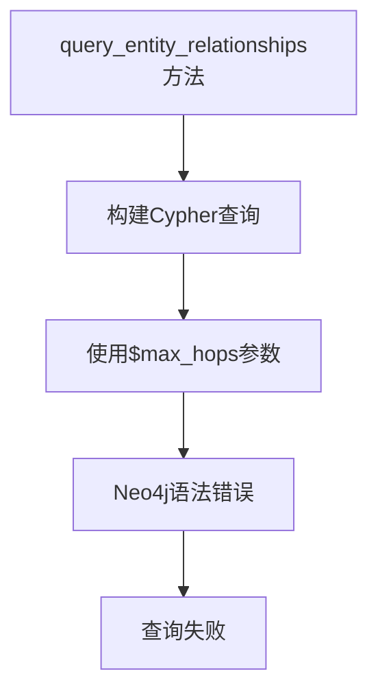
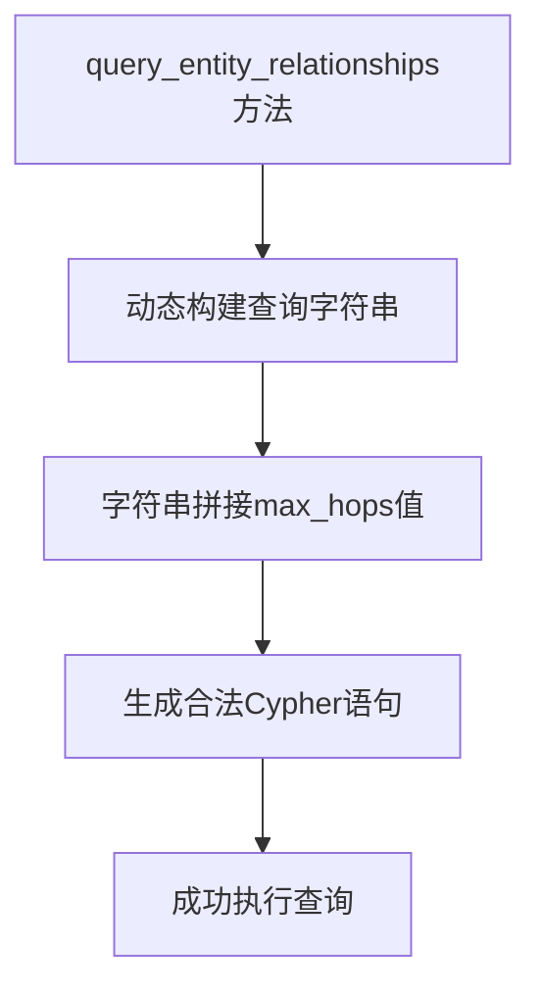
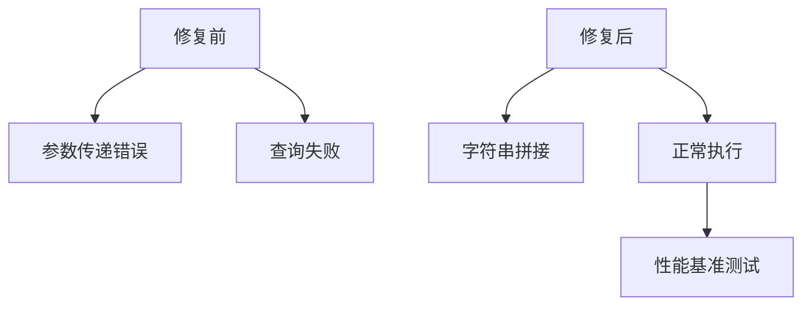

# Neo4j语法错误修复设计文档

## 概述

本设计文档解决政策法规RAG问答系统中Neo4j图查询引擎的语法错误问题。错误产生于在MATCH模式中使用参数映射来指定关系跳数，这在Neo4j中是不被允许的语法。

## 问题分析

### 错误信息
```
Parameter maps cannot be used in `MATCH` patterns (use a literal map instead, e.g. `{id: $max_hops.id}`) (line 4, column 31 (offset: 132))
"        MATCH path = (e)-[*1..$max_hops]-(related)"
```

### 根本原因
在 `backend/graph_query.py` 文件的 `query_entity_relationships` 方法中，使用了不当的参数语法：
```cypher
MATCH path = (e)-[*1..$max_hops]-(related)
```

Neo4j不支持在关系模式的跳数范围中直接使用参数变量。

## 技术架构

### 当前实现问题


### 修复后架构


## 解决方案设计

### 方案1：字符串拼接（推荐）
将 `max_hops` 参数直接拼接到查询字符串中，而不是作为参数传递。

**优点**：
- 简单直接
- 兼容性好
- 性能影响最小

**缺点**：
- 需要验证输入参数
- 理论上存在注入风险（但在整数参数下风险极低）

### 方案2：预定义查询模板
为常用的跳数（1-5）预定义查询模板。

**优点**：
- 完全避免动态SQL
- 性能最优

**缺点**：
- 灵活性有限
- 代码冗余

### 方案3：动态查询构建器
实现查询构建器模式，动态生成查询语句。

**优点**：
- 灵活性最高
- 可扩展性好

**缺点**：
- 实现复杂度高
- 维护成本大

## 实现方案

### 核心修复逻辑

#### 修复前（错误代码）
```python
def query_entity_relationships(self, entity_name: str, max_hops: int = 2) -> Dict:
    query = """
    MATCH (e:Entity) 
    WHERE e.name CONTAINS $entity_name OR e.text CONTAINS $entity_name
    MATCH path = (e)-[*1..$max_hops]-(related)
    WHERE related:Entity OR related:Policy OR related:Agency
    RETURN ...
    """
    
    result = session.run(query, {
        'entity_name': entity_name,
        'max_hops': max_hops,  # 这里是错误的
        'limit': 20
    })
```

#### 修复后（正确实现）
```python
def query_entity_relationships(self, entity_name: str, max_hops: int = 2) -> Dict:
    # 验证max_hops参数
    max_hops = max(1, min(max_hops, 10))  # 限制在1-10范围内
    
    # 动态构建查询字符串
    query = f"""
    MATCH (e:Entity) 
    WHERE e.name CONTAINS $entity_name OR e.text CONTAINS $entity_name
    MATCH path = (e)-[*1..{max_hops}]-(related)
    WHERE related:Entity OR related:Policy OR related:Agency
    RETURN 
        e.name as center_entity,
        [node in nodes(path) | {{
            id: id(node),
            labels: labels(node),
            name: coalesce(node.name, node.title),
            type: coalesce(node.type, 'unknown')
        }}] as path_nodes,
        [rel in relationships(path) | {{
            type: type(rel),
            properties: properties(rel)
        }}] as path_relations
    LIMIT $limit
    """
    
    result = session.run(query, {
        'entity_name': entity_name,
        'limit': 20
    })
```

### 参数验证增强
```python
def _validate_max_hops(self, max_hops: int) -> int:
    """验证并修正max_hops参数"""
    if not isinstance(max_hops, int):
        logging.warning(f"max_hops参数类型错误: {type(max_hops)}, 使用默认值2")
        return 2
    
    if max_hops < 1:
        logging.warning(f"max_hops过小: {max_hops}, 修正为1")
        return 1
    
    if max_hops > 10:
        logging.warning(f"max_hops过大: {max_hops}, 修正为10")
        return 10
    
    return max_hops
```

### 错误处理增强
```python
def query_entity_relationships(self, entity_name: str, max_hops: int = 2) -> Dict:
    """查询实体的关系网络"""
    try:
        # 验证参数
        max_hops = self._validate_max_hops(max_hops)
        
        if not entity_name or not entity_name.strip():
            logging.error("entity_name参数为空")
            return self._empty_relationship_result(entity_name)
        
        # 构建查询
        query = self._build_relationship_query(max_hops)
        
        # 执行查询
        with self.driver.session() as session:
            result = session.run(query, {
                'entity_name': entity_name.strip(),
                'limit': 20
            })
            
            return self._process_relationship_results(result, entity_name)
            
    except Exception as e:
        logging.error(f"关系查询失败: {e}")
        return self._empty_relationship_result(entity_name)

def _build_relationship_query(self, max_hops: int) -> str:
    """构建关系查询语句"""
    return f"""
    MATCH (e:Entity) 
    WHERE e.name CONTAINS $entity_name OR e.text CONTAINS $entity_name
    MATCH path = (e)-[*1..{max_hops}]-(related)
    WHERE related:Entity OR related:Policy OR related:Agency
    RETURN 
        e.name as center_entity,
        [node in nodes(path) | {{
            id: id(node),
            labels: labels(node),
            name: coalesce(node.name, node.title),
            type: coalesce(node.type, 'unknown')
        }}] as path_nodes,
        [rel in relationships(path) | {{
            type: type(rel),
            properties: properties(rel)
        }}] as path_relations
    LIMIT $limit
    """

def _empty_relationship_result(self, entity_name: str) -> Dict:
    """返回空的关系查询结果"""
    return {
        'center_entity': entity_name,
        'paths': [],
        'related_entities': [],
        'related_policies': []
    }
```

## 性能优化考虑

### 查询性能影响


### 建议的性能优化
1. **跳数限制**：将max_hops限制在合理范围（1-10）
2. **结果限制**：添加LIMIT子句控制返回结果数量
3. **索引优化**：确保Entity节点的name和text属性有索引
4. **缓存策略**：对频繁查询的实体关系进行缓存

## 测试策略

### 单元测试用例
```python
def test_query_entity_relationships_valid_params():
    """测试正常参数的关系查询"""
    engine = GraphQueryEngine()
    result = engine.query_entity_relationships("企业", 2)
    assert isinstance(result, dict)
    assert 'center_entity' in result
    assert 'paths' in result

def test_query_entity_relationships_invalid_max_hops():
    """测试无效max_hops参数"""
    engine = GraphQueryEngine()
    
    # 测试负数
    result = engine.query_entity_relationships("企业", -1)
    assert result['center_entity'] == "企业"
    
    # 测试过大值
    result = engine.query_entity_relationships("企业", 100)
    assert result['center_entity'] == "企业"
    
    # 测试非整数
    result = engine.query_entity_relationships("企业", "invalid")
    assert result['center_entity'] == "企业"

def test_query_entity_relationships_empty_name():
    """测试空实体名称"""
    engine = GraphQueryEngine()
    result = engine.query_entity_relationships("", 2)
    assert result['paths'] == []
```

### 集成测试
1. **连接测试**：验证修复后的查询能正常连接Neo4j
2. **数据完整性测试**：确保返回的关系数据结构正确
3. **性能基准测试**：对比修复前后的查询性能

## 部署方案

### 修复步骤
1. **代码修复**：修改 `backend/graph_query.py` 文件
2. **参数验证**：添加输入参数验证逻辑
3. **错误处理**：增强异常处理机制
4. **测试验证**：执行单元测试和集成测试
5. **日志监控**：添加详细的日志记录

### 向后兼容性
- 保持方法签名不变
- 保持返回数据结构不变
- 添加参数验证但不破坏现有调用

### 风险评估
- **低风险**：修复仅涉及字符串拼接，不改变业务逻辑
- **测试覆盖**：完整的单元测试确保功能正确性
- **回滚方案**：如有问题可快速回滚到修复前版本