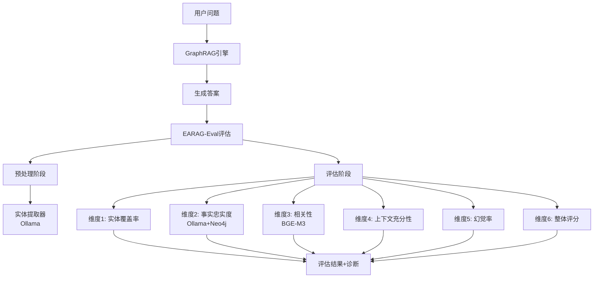
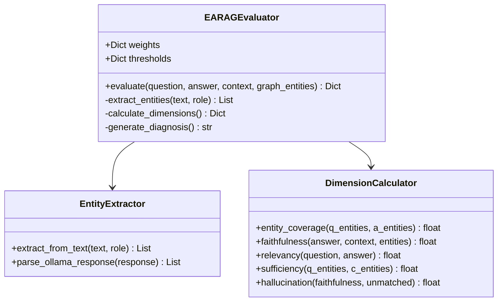

# EARAG-Eval算法设计文档
## Entity-Aware Multi-Dimensional Evaluation Algorithm

## 概述

EARAG-Eval是专为政策法规RAG问答系统设计的多维度评估算法，通过6个核心维度量化评估RAG生成答案的质量。算法强调实体覆盖率在政策问答场景中的重要性，支持实时集成，响应时间控制在5秒以内。

### 核心特性

- **实体感知评估**：基于政策实体的覆盖度和准确性
- **多维度量化**：6个独立维度全面评估答案质量
- **并行计算优化**：支持独立并行的维度计算
- **自适应阈值**：针对政策领域特点调整评估标准
- **诊断报告生成**：提供详细质量分析和改进建议

## 技术架构

### 系统集成架构



### 核心组件设计



## 算法规范

### 输入输出接口

**输入参数**：
- `question`: 用户问题字符串
- `answer`: RAG系统生成的答案
- `context`: 检索上下文列表
- `graph_entities`: Neo4j图谱预提取实体集

**输出格式**：
```json
{
    "overall_score": 0.85,
    "dimension_scores": {
        "entity_coverage": 0.9,
        "faithfulness": 0.8,
        "relevancy": 0.85,
        "sufficiency": 0.9,
        "hallucination": 0.15
    },
    "diagnosis": "答案质量良好，实体覆盖率高",
    "entity_analysis": {
        "question_entities": ["中小企业", "税收政策"],
        "answer_entities": ["中小企业", "税收政策", "财政部"],
        "missing_entities": [],
        "unverified_entities": ["财政部"]
    }
}
```

## 核心算法实现

### 预处理：实体提取

```python
def extract_entities(self, text: str, role: str) -> List[str]:
    """使用Ollama提取关键实体"""
    prompt = f"""
    从以下{role}文本中提取关键政策实体：
    文本: {text[:1000]}
    
    实体类型：政策名称、机构组织、地理位置、法律条款、行业领域
    输出格式：["实体1", "实体2", ...]
    只输出JSON数组，无其他内容。
    """
    
    try:
        response = self.ollama_client.call_model(prompt)
        entities = json.loads(response.strip())
        return entities if entities else []
    except:
        return [] if role != 'question' else ["generic_query"]
```

### 维度1：实体覆盖率

```python
def calculate_entity_coverage(self, q_entities: Set[str], a_entities: Set[str]) -> Dict:
    """计算答案对问题实体的覆盖率"""
    if not q_entities:
        return {"score": 1.0, "diagnosis": []}
    
    covered = q_entities.intersection(a_entities)
    missing = q_entities - a_entities
    score = len(covered) / len(q_entities)
    
    diagnosis = []
    if score < 0.8:
        diagnosis.append(f"实体覆盖不足，遗漏: {list(missing)}")
    
    return {
        "score": score,
        "covered_entities": list(covered),
        "missing_entities": list(missing),
        "diagnosis": diagnosis
    }
```

### 维度2：事实忠实度

```python
def calculate_faithfulness(self, answer: str, context: List[str], 
                          a_entities: Set[str], graph_entities: Set[str]) -> Dict:
    """双重验证机制：LLM评估 + 知识图谱验证"""
    # 1. LLM自评估
    context_text = "\n".join(context[:3])
    prompt = f"""
    评估答案对上下文的事实忠实度，0-1评分：
    上下文: {context_text}
    答案: {answer}
    只输出数字分数。
    """
    
    try:
        llm_score = float(self.ollama_client.call_model(prompt).strip())
        llm_score = max(0, min(1, llm_score))
    except:
        llm_score = 0.5
    
    # 2. 知识图谱验证
    unmatched = a_entities - graph_entities
    unmatched_ratio = len(unmatched) / len(a_entities) if a_entities else 0
    
    # 3. 综合评分
    final_score = max(0, llm_score - 0.1 * unmatched_ratio)
    
    diagnosis = []
    if unmatched_ratio > 0.2:
        diagnosis.append(f"包含未验证实体: {list(unmatched)}")
    
    return {
        "score": final_score,
        "llm_score": llm_score,
        "unmatched_ratio": unmatched_ratio,
        "diagnosis": diagnosis
    }
```

### 维度3：答案相关性

```python
def calculate_relevancy(self, question: str, answer: str) -> Dict:
    """使用BGE-M3计算语义相似度"""
    try:
        q_embedding = self.bge_model.encode(question)
        a_embedding = self.bge_model.encode(answer)
        
        # 余弦相似度
        similarity = np.dot(q_embedding, a_embedding) / (
            np.linalg.norm(q_embedding) * np.linalg.norm(a_embedding)
        )
        similarity = max(0, similarity)
        
        diagnosis = []
        if similarity < 0.7:
            diagnosis.append("答案与问题相关性较低")
        
        return {"score": similarity, "diagnosis": diagnosis}
    except:
        return {"score": 0.5, "diagnosis": ["相关性计算失败"]}
```

### 维度4：上下文充分性

```python
def calculate_sufficiency(self, q_entities: Set[str], c_entities: Set[str]) -> Dict:
    """评估上下文对问题实体的覆盖充分性"""
    if not q_entities:
        return {"score": 1.0, "diagnosis": []}
    
    covered = q_entities.intersection(c_entities)
    score = len(covered) / len(q_entities)
    
    diagnosis = []
    if score < 0.8:
        uncovered = q_entities - c_entities
        diagnosis.extend([
            "上下文覆盖不足",
            f"建议检索更多关于{list(uncovered)}的信息"
        ])
    
    return {"score": score, "diagnosis": diagnosis}
```

### 维度5：幻觉率

```python
def calculate_hallucination(self, faithfulness_score: float, unmatched_ratio: float) -> Dict:
    """复合幻觉检测"""
    base_hallucination = 1 - faithfulness_score
    entity_hallucination = 0.5 * unmatched_ratio
    total_hallucination = min(1.0, base_hallucination + entity_hallucination)
    
    diagnosis = []
    if total_hallucination > 0.2:
        diagnosis.append("检测到潜在幻觉")
    if total_hallucination > 0.5:
        diagnosis.append("高风险，建议重新生成答案")
    
    return {
        "score": total_hallucination,
        "risk_level": "高风险" if total_hallucination > 0.5 else "低风险",
        "diagnosis": diagnosis
    }
```

### 维度6：整体评分

```python
def calculate_overall_score(self, dimension_scores: Dict) -> Dict:
    """加权计算整体评分"""
    # 政策领域权重配置
    weights = {
        "entity_coverage": 0.30,
        "faithfulness": 0.25,
        "relevancy": 0.15,
        "sufficiency": 0.15,
        "hallucination": -0.15
    }
    
    # 加权求和
    overall_score = sum(
        weights[dim] * score for dim, score in dimension_scores.items()
    )
    overall_score = max(0, min(1, overall_score))
    
    # 质量等级
    if overall_score >= 0.8:
        quality_level = "优秀"
    elif overall_score >= 0.7:
        quality_level = "良好"
    elif overall_score >= 0.6:
        quality_level = "一般"
    else:
        quality_level = "较差"
    
    # 综合诊断
    diagnosis = f"答案质量: {quality_level} (评分: {overall_score:.2f})"
    if overall_score < 0.7:
        diagnosis += " - 建议重新生成答案"
    
    return {
        "overall_score": overall_score,
        "quality_level": quality_level,
        "diagnosis": diagnosis,
        "weights_used": weights
    }
```

## 性能优化

### 并行计算策略

```python
import asyncio
from concurrent.futures import ThreadPoolExecutor

class ParallelEARAGEvaluator(EARAGEvaluator):
    """支持并行计算的评估器"""
    
    async def evaluate_parallel(self, question: str, answer: str, 
                               context: List[str], graph_entities: Set[str]) -> Dict:
        # 并行实体提取
        entity_tasks = [
            self._extract_entities_async(question, "question"),
            self._extract_entities_async(answer, "answer"),
            self._extract_entities_async("\n".join(context), "context")
        ]
        q_entities, a_entities, c_entities = await asyncio.gather(*entity_tasks)
        
        # 并行维度计算
        dimension_tasks = [
            self._calculate_entity_coverage_async(q_entities, a_entities),
            self._calculate_faithfulness_async(answer, context, a_entities, graph_entities),
            self._calculate_relevancy_async(question, answer),
            self._calculate_sufficiency_async(q_entities, c_entities)
        ]
        
        results = await asyncio.gather(*dimension_tasks)
        
        # 整体评分
        dimension_scores = {
            "entity_coverage": results[0]["score"],
            "faithfulness": results[1]["score"],
            "relevancy": results[2]["score"],
            "sufficiency": results[3]["score"],
            "hallucination": self.calculate_hallucination(
                results[1]["score"], results[1]["unmatched_ratio"]
            )["score"]
        }
        
        overall_result = self.calculate_overall_score(dimension_scores)
        return {**overall_result, "dimension_scores": dimension_scores}
```

## 系统集成

### API服务集成

```python
# backend/api_server.py 扩展
from backend.earag_evaluator import EARAGEvaluator

evaluator = EARAGEvaluator()

@app.route('/api/ask/evaluated', methods=['POST'])
def ask_with_evaluation():
    """带质量评估的问答接口"""
    data = request.get_json()
    question = data.get('question', '').strip()
    
    # 获取答案
    result = graphrag_engine.answer_question(question)
    
    # 质量评估
    evaluation = evaluator.evaluate(
        question=question,
        answer=result['answer'],
        context=result.get('context', []),
        graph_entities=result.get('entities', set())
    )
    
    result['evaluation'] = evaluation
    result['quality_score'] = evaluation['overall_score']
    
    # 低质量警告
    if evaluation['overall_score'] < 0.7:
        result['quality_warning'] = True
        result['recommendations'] = evaluation.get('recommendations', [])
    
    return jsonify(result)
```

### 配置管理

```yaml
# config/earag_eval.yaml
evaluation:
  weights:
    entity_coverage: 0.30
    faithfulness: 0.25
    relevancy: 0.15
    sufficiency: 0.15
    hallucination: -0.15
  
  thresholds:
    entity_coverage: 0.8
    faithfulness: 0.7
    relevancy: 0.7
    sufficiency: 0.8
    hallucination: 0.2
  
  performance:
    timeout_seconds: 5
    max_text_length: 1000
    parallel_workers: 4
```

## 测试策略

### 关键测试场景

```python
# 测试用例设计
test_cases = [
    {
        "name": "高质量答案",
        "question": "中小企业税收优惠政策有哪些？",
        "answer": "中小企业享受所得税减免、增值税优惠等政策支持",
        "expected_score_range": (0.8, 1.0)
    },
    {
        "name": "实体遗漏答案", 
        "question": "华侨投资审批流程是什么？",
        "answer": "需要提交相关材料进行审批",
        "expected_issues": ["entity_coverage_low"]
    },
    {
        "name": "幻觉答案",
        "question": "企业注册资本要求",
        "answer": "注册资本最低100万元，需要验资报告",
        "expected_issues": ["hallucination_high"]
    }
]
```

## 部署与监控

### 性能监控指标

- **响应时间**：评估流程总耗时 < 5秒
- **准确率**：评估结果与人工标注一致性 > 85%
- **并发性能**：支持10个并发评估请求
- **资源消耗**：内存使用 < 500MB，CPU使用率 < 70%