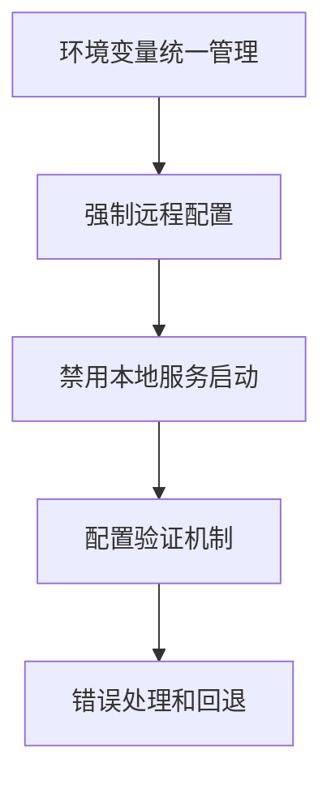

# 远程Ollama服务配置修复设计

## 问题分析

### 当前问题
在GraphRAG数据导入过程中，虽然初始化阶段成功连接远程Ollama服务(`http://120.232.79.82:11434`)，但在实体提取阶段仍然尝试连接本地Ollama服务(`127.0.0.1:64482`)，导致连接超时失败。

### 错误日志分析
```
2025-08-25 19:04:56,470 - ERROR - Ollama API调用失败: HTTPConnectionPool(host='127.0.0.1', port=64482): Read timed out. (read timeout=30)
```

### 根本原因
1. **环境变量不一致**：不同模块读取不同的环境变量配置
2. **客户端库干扰**：可能存在ollama客户端库自动启动本地服务的行为
3. **配置传递失效**：环境变量在模块初始化后被重置或覆盖
4. **依赖组件未同步**：EntityExtractor初始化时未正确应用远程配置

## 解决方案设计

### 架构原则


### 1. 环境变量统一配置

#### 配置策略
- **强制性配置**：在所有可能的入口点设置远程Ollama配置
- **多层保护**：设置所有可能影响Ollama连接的环境变量
- **配置验证**：在初始化时验证配置的正确性

#### 关键环境变量
```bash
# 核心配置
LLM_BINDING_HOST=http://120.232.79.82:11434
OLLAMA_HOST=http://120.232.79.82:11434
OLLAMA_BASE_URL=http://120.232.79.82:11434

# 禁用本地服务
OLLAMA_NO_SERVE=1
OLLAMA_ORIGINS=*

# 模型配置
LLM_MODEL=llama3.2:latest
EMBEDDING_MODEL=bge-m3:latest
```

### 2. 模块配置加固

#### EntityExtractor配置加固
```python
class EntityExtractor:
    def __init__(self):
        # 第一层：强制设置远程配置
        remote_host = 'http://120.232.79.82:11434'
        
        # 第二层：设置所有可能的环境变量
        os.environ['OLLAMA_HOST'] = remote_host
        os.environ['OLLAMA_BASE_URL'] = remote_host
        os.environ['LLM_BINDING_HOST'] = remote_host
        os.environ['OLLAMA_NO_SERVE'] = '1'
        os.environ['OLLAMA_ORIGINS'] = '*'
        
        # 第三层：验证配置
        self.ollama_host = remote_host
        self._validate_remote_connection()
```

#### GraphRAG引擎配置同步
```python
class GraphRAGEngine:
    def __init__(self):
        # 确保所有子组件使用相同配置
        self._force_remote_config()
        self._initialize_components()
    
    def _force_remote_config(self):
        remote_host = 'http://120.232.79.82:11434'
        config_vars = [
            'OLLAMA_HOST',
            'OLLAMA_BASE_URL', 
            'LLM_BINDING_HOST'
        ]
        for var in config_vars:
            os.environ[var] = remote_host
```

### 3. 配置验证机制

#### 连接验证
```python
def validate_remote_ollama_connection(host: str, model: str) -> bool:
    """验证远程Ollama服务连接"""
    try:
        # 测试模型列表API
        response = requests.get(f"{host}/api/tags", timeout=10)
        if response.status_code == 200:
            models = response.json().get('models', [])
            model_names = [m.get('name', '') for m in models]
            return any(model in name for name in model_names)
    except Exception as e:
        logging.error(f"远程Ollama连接验证失败: {e}")
    return False
```

#### 初始化验证
```python
def ensure_remote_config():
    """确保远程配置正确性"""
    required_vars = {
        'LLM_BINDING_HOST': 'http://120.232.79.82:11434',
        'OLLAMA_HOST': 'http://120.232.79.82:11434',
        'OLLAMA_NO_SERVE': '1'
    }
    
    for key, expected in required_vars.items():
        current = os.environ.get(key)
        if current != expected:
            os.environ[key] = expected
            logging.warning(f"修正环境变量 {key}: {current} -> {expected}")
```

### 4. 错误处理和诊断

#### 连接诊断
```python
def diagnose_ollama_connection():
    """诊断Ollama连接问题"""
    checks = {
        '环境变量检查': check_environment_variables(),
        '网络连接检查': check_network_connectivity(),
        '服务可用性检查': check_service_availability(),
        '模型可用性检查': check_model_availability()
    }
    
    for check_name, result in checks.items():
        if result['success']:
            logging.info(f"✓ {check_name}: {result['message']}")
        else:
            logging.error(f"✗ {check_name}: {result['message']}")
    
    return all(check['success'] for check in checks.values())
```

#### 回退策略
```python
def get_ollama_client_with_fallback():
    """获取Ollama客户端，支持回退策略"""
    primary_host = 'http://120.232.79.82:11434'
    
    # 尝试远程服务
    if validate_remote_ollama_connection(primary_host, 'llama3.2:latest'):
        return create_remote_client(primary_host)
    
    # 回退到本地服务（如果可用）
    local_host = 'http://localhost:11434'
    if validate_remote_ollama_connection(local_host, 'llama3.2:latest'):
        logging.warning("远程Ollama不可用，回退到本地服务")
        return create_remote_client(local_host)
    
    raise ConnectionError("无可用的Ollama服务")
```

## 核心修复方案

### 问题定位
从错误日志分析，系统在实体提取阶段尝试连接`127.0.0.1:64482`，表明存在隐藏的ollama客户端在自动启动本地服务。尽管EntityExtractor正确配置了远程地址，但某个地方仍在使用ollama客户端库。

### 修复策略
采用三层防护机制确保完全使用远程Ollama服务：

#### 第一层：环境变量强制覆盖
在所有模块导入前设置：
```python
def force_remote_ollama_config():
    remote_host = 'http://120.232.79.82:11434'
    critical_vars = {
        'OLLAMA_HOST': remote_host,
        'OLLAMA_BASE_URL': remote_host,
        'LLM_BINDING_HOST': remote_host,
        'OLLAMA_NO_SERVE': '1',
        'OLLAMA_ORIGINS': '*',
        'OLLAMA_KEEP_ALIVE': '0'
    }
    for key, value in critical_vars.items():
        os.environ[key] = value
```

#### 第二层：进程监控和终止
```python
def kill_local_ollama_processes():
    import psutil
    for proc in psutil.process_iter(['pid', 'name']):
        if 'ollama' in proc.info['name'].lower():
            try:
                proc.terminate()
                print(f"终止本地ollama进程: {proc.info['pid']}")
            except:
                pass
```

#### 第三层：导入时验证
```python
def validate_no_local_connections():
    import subprocess
    result = subprocess.run(['netstat', '-tlnp'], capture_output=True, text=True)
    if '11434' in result.stdout and '127.0.0.1' in result.stdout:
        raise RuntimeError("检测到本地ollama服务，请停止后重试")
```

## 具体修复实现

### 修复run_graphrag_import.py
在脚本开头添加强制配置：

```python
#!/usr/bin/env python3
import os
import sys
import psutil
import subprocess
from pathlib import Path

def force_remote_only_config():
    """强制使用远程Ollama配置并禁用本地服务"""
    remote_host = 'http://120.232.79.82:11434'
    
    # 1. 终止所有本地ollama进程
    for proc in psutil.process_iter(['pid', 'name']):
        try:
            if 'ollama' in proc.info['name'].lower():
                proc.terminate()
                print(f"已终止本地ollama进程: {proc.info['pid']}")
        except:
            pass
    
    # 2. 强制设置环境变量
    critical_vars = {
        'OLLAMA_HOST': remote_host,
        'OLLAMA_BASE_URL': remote_host,
        'LLM_BINDING_HOST': remote_host,
        'OLLAMA_NO_SERVE': '1',
        'OLLAMA_ORIGINS': '*',
        'OLLAMA_KEEP_ALIVE': '0'
    }
    
    for key, value in critical_vars.items():
        os.environ[key] = value
    
    # 3. 验证配置
    print(f"远程Ollama配置: {remote_host}")
    for key, expected in critical_vars.items():
        actual = os.environ.get(key)
        if actual == expected:
            print(f"  ✓ {key}: {actual}")
        else:
            print(f"  ✗ {key}: {actual} (期望: {expected})")
    
    return True

# 在所有导入前调用
force_remote_only_config()
```

### 修复EntityExtractor初始化
在EntityExtractor的__init__方法中添加：

```python
class EntityExtractor:
    def __init__(self):
        # 再次确保配置（防止被覆盖）
        self._ensure_remote_config()
        
        # 原有初始化代码...
        
    def _ensure_remote_config(self):
        """确保远程配置不被覆盖"""
        remote_host = 'http://120.232.79.82:11434'
        
        # 强制设置
        os.environ['OLLAMA_HOST'] = remote_host
        os.environ['LLM_BINDING_HOST'] = remote_host
        os.environ['OLLAMA_NO_SERVE'] = '1'
        
        # 验证设置
        self.ollama_host = remote_host
        
        # 测试连接
        if not self._test_remote_connection():
            raise ConnectionError(f"无法连接到远程Ollama服务: {remote_host}")
    
    def _test_remote_connection(self):
        """测试远程连接"""
        try:
            import requests
            response = requests.get(f"{self.ollama_host}/api/tags", timeout=5)
            return response.status_code == 200
        except:
            return False
```

## 测试验证

### 完整测试脚本
```python
#!/usr/bin/env python3
"""远程Ollama配置测试脚本"""

import os
import sys
import requests
import subprocess
import psutil
from pathlib import Path

def test_environment_setup():
    """测试环境变量设置"""
    print("1. 测试环境变量设置...")
    
    expected_vars = {
        'OLLAMA_HOST': 'http://120.232.79.82:11434',
        'LLM_BINDING_HOST': 'http://120.232.79.82:11434',
        'OLLAMA_NO_SERVE': '1'
    }
    
    all_correct = True
    for key, expected in expected_vars.items():
        actual = os.environ.get(key)
        if actual == expected:
            print(f"  ✓ {key}: {actual}")
        else:
            print(f"  ✗ {key}: {actual} (期望: {expected})")
            all_correct = False
    
    return all_correct

def test_no_local_ollama():
    """测试没有本地ollama进程"""
    print("\n2. 测试本地ollama进程...")
    
    local_processes = []
    for proc in psutil.process_iter(['pid', 'name']):
        try:
            if 'ollama' in proc.info['name'].lower():
                local_processes.append(proc.info)
        except:
            continue
    
    if local_processes:
        print(f"  ✗ 发现 {len(local_processes)} 个本地ollama进程")
        for proc in local_processes:
            print(f"    进程: {proc['pid']} - {proc['name']}")
        return False
    else:
        print("  ✓ 没有本地ollama进程")
        return True

def test_remote_connection():
    """测试远程连接"""
    print("\n3. 测试远程Ollama连接...")
    
    remote_host = 'http://120.232.79.82:11434'
    
    try:
        response = requests.get(f"{remote_host}/api/tags", timeout=10)
        if response.status_code == 200:
            models = response.json().get('models', [])
            print(f"  ✓ 远程连接成功，发现 {len(models)} 个模型")
            
            # 检查所需模型
            model_names = [m.get('name', '') for m in models]
            required_models = ['llama3.2:latest', 'bge-m3:latest']
            
            for model in required_models:
                if any(model in name for name in model_names):
                    print(f"    ✓ 模型可用: {model}")
                else:
                    print(f"    ✗ 模型缺失: {model}")
            
            return True
        else:
            print(f"  ✗ 远程连接失败: HTTP {response.status_code}")
            return False
    except Exception as e:
        print(f"  ✗ 远程连接异常: {e}")
        return False

def test_entity_extractor():
    """测试EntityExtractor"""
    print("\n4. 测试EntityExtractor...")
    
    try:
        # 添加项目路径
        project_root = Path(__file__).parent
        if str(project_root) not in sys.path:
            sys.path.insert(0, str(project_root))
        
        from backend.entity_extractor import EntityExtractor
        
        extractor = EntityExtractor()
        print(f"  ✓ EntityExtractor初始化成功")
        print(f"  ✓ 使用主机: {extractor.ollama_host}")
        
        # 测试简单调用
        test_prompt = "提取实体：华侨试验区管理委员会负责试验区管理。"
        response = extractor._call_ollama(test_prompt)
        
        if response:
            print(f"  ✓ API调用成功，响应长度: {len(response)}")
            return True
        else:
            print(f"  ✗ API调用失败，无响应")
            return False
            
    except Exception as e:
        print(f"  ✗ EntityExtractor测试失败: {e}")
        return False

def main():
    """主测试函数"""
    print("远程Ollama配置测试")
    print("="*50)
    
    tests = [
        test_environment_setup,
        test_no_local_ollama,
        test_remote_connection,
        test_entity_extractor
    ]
    
    results = []
    for test in tests:
        try:
            result = test()
            results.append(result)
        except Exception as e:
            print(f"  ✗ 测试异常: {e}")
            results.append(False)
    
    print("\n" + "="*50)
    print("测试总结:")
    
    passed = sum(results)
    total = len(results)
    
    print(f"通过: {passed}/{total}")
    
    if passed == total:
        print("✅ 所有测试通过，远程Ollama配置正确")
        return True
    else:
        print("❌ 部分测试失败，需要修复配置")
        return False

if __name__ == '__main__':
    main()
```

## 快速修复指南

### Step 1: 立即修复run_graphrag_import.py
在文件开头第21行之后添加：

```python
# 在load_dotenv()之后立即添加
def kill_local_ollama():
    """强制终止所有本地ollama进程"""
    import psutil
    killed = 0
    for proc in psutil.process_iter(['pid', 'name']):
        try:
            if 'ollama' in proc.info['name'].lower():
                proc.terminate()
                killed += 1
                print(f"已终止本地ollama进程: {proc.info['pid']}")
        except:
            pass
    if killed > 0:
        print(f"总共终止了 {killed} 个本地ollama进程")
    else:
        print("没有找到本地ollama进程")

# 调用终止函数
kill_local_ollama()
```

### Step 2: 验证修复效果
运行以下命令验证：

```bash
# 1. 检查是否有本地ollama进程
ps aux | grep ollama

# 2. 检查11434端口占用
netstat -tlnp | grep 11434

# 3. 运行修复后的导入脚本
python run_graphrag_import.py
```

### Step 3: 如果仍有问题
如果仍然出现127.0.0.1连接，检查是否有隐藏的ollama客户端库：

```bash
# 搜索所有ollama客户端使用
grep -r "ollama.Client" . --include="*.py"
grep -r "Client()" . --include="*.py"

# 检查是否有其他进程在11434端口
sudo lsof -i :11434
```

### 紧急回退方案
如果远程服务不可用，临时使用本地服务：

```python
# 在run_graphrag_import.py中添加
remote_host = 'http://120.232.79.82:11434'
local_host = 'http://localhost:11434'

# 测试远程连接
import requests
try:
    response = requests.get(f"{remote_host}/api/tags", timeout=5)
    if response.status_code == 200:
        print("使用远程Ollama服务")
        ollama_host = remote_host
    else:
        raise Exception("远程服务不可用")
except:
    print("远程服务不可用，切换到本地服务")
    ollama_host = local_host
    # 启动本地ollama
    import subprocess
    subprocess.Popen(['ollama', 'serve'], 
                     stdout=subprocess.DEVNULL, 
                     stderr=subprocess.DEVNULL)
    
# 设置环境变量
os.environ['LLM_BINDING_HOST'] = ollama_host
os.environ['OLLAMA_HOST'] = ollama_host
```

## 排查步骤

### 1. 环境诊断
```bash
# 检查环境变量
echo $OLLAMA_HOST
echo $LLM_BINDING_HOST
echo $OLLAMA_NO_SERVE

# 检查Python环境中的变量
python -c "import os; print('OLLAMA_HOST:', os.environ.get('OLLAMA_HOST'))"
```

### 2. 网络诊断
```bash
# 测试远程连接
curl -f http://120.232.79.82:11434/api/tags

# 检查本地端口占用
netstat -tlnp | grep 11434
netstat -tlnp | grep 64482
```

### 3. 进程诊断
```bash
# 查看所有ollama相关进程
ps aux | grep -i ollama

# 查看网络连接
ss -tulpn | grep ollama
```

## 常见问题解答

### Q: 为什么会连接127.0.0.1:64482？
A: 这通常是ollama客户端库自动启动的临时端口。解决方法是：
1. 完全避免使用ollama.Client()
2. 设置OLLAMA_NO_SERVE=1
3. 在初始化前终止所有ollama进程

### Q: 如何确认使用的是远程服务？
A: 检查以下几点：
1. 环境变量OLLAMA_HOST指向远程地址
2. 没有本地ollama进程运行
3. API调用日志显示远程地址
4. 网络监控显示到远程IP的连接

### Q: 远程服务不稳定怎么办？
A: 实施以下策略：
1. 增加超时时间和重试机制
2. 准备本地服务作为备选
3. 实现智能切换逻辑
4. 添加连接健康检查

## 实施检查清单

- [ ] 修改run_graphrag_import.py添加进程终止逻辑
- [ ] 验证所有环境变量设置正确
- [ ] 确认没有本地ollama进程运行
- [ ] 测试远程Ollama服务连接
- [ ] 运行实体提取测试验证修复
- [ ] 检查日志确认使用远程地址
- [ ] 添加监控脚本持续检查