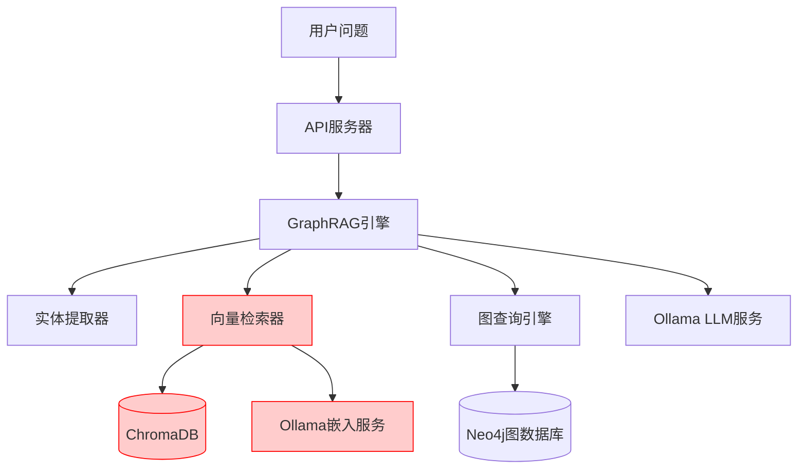
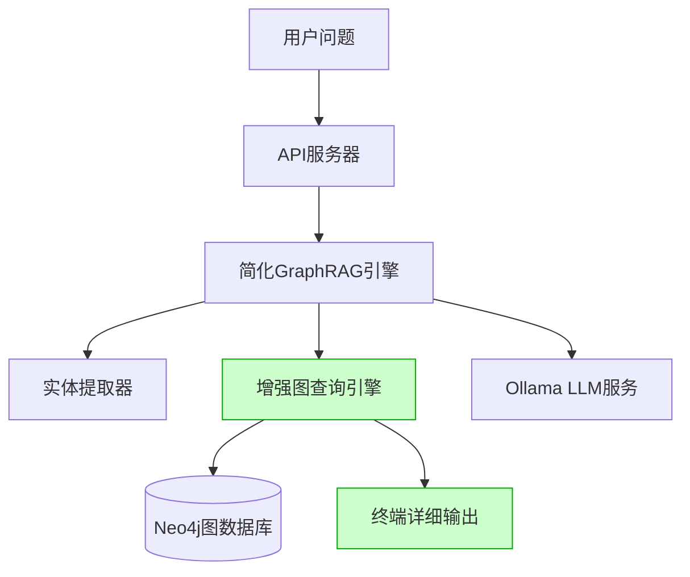

# 移除向量数据库查询功能设计

## 概述

本设计文档描述了如何从政策法规RAG问答系统中移除向量数据库查询功能，并在图查询过程中增强终端详细输出功能。此修改将简化系统架构，专注于基于Neo4j知识图谱的结构化查询，同时提供更好的调试和监控体验。

## 背景与动机

### 当前系统架构问题
- **复杂的依赖**: 系统同时依赖ChromaDB向量数据库和Neo4j图数据库
- **资源消耗**: 向量检索需要大量内存用于嵌入模型和向量存储
- **维护复杂性**: 需要维护两套不同的检索机制（向量检索和图查询）
- **调试困难**: 图查询过程缺乏详细的终端输出，难以跟踪查询逻辑

### 修改目标
1. **简化架构**: 移除向量数据库依赖，专注于图谱查询
2. **增强可观测性**: 在图查询过程中添加详细的终端日志输出
3. **提升性能**: 减少外部服务依赖，降低系统资源消耗
4. **改善调试体验**: 提供清晰的查询步骤追踪

## 架构设计

### 修改前系统架构



### 修改后系统架构



### 核心组件修改

#### 1. GraphRAG引擎简化
- 移除 `VectorRetriever` 组件依赖
- 简化初始化流程，去除向量数据库相关配置
- 调整问答流程，直接使用图查询结果

#### 2. 增强图查询引擎
- 添加详细的查询过程日志输出
- 实现分步骤的图查询追踪
- 增加查询性能统计和结果分析

#### 3. 移除的组件
- `VectorRetriever` 类
- `SafeVectorRetriever` 类  
- `SimpleVectorRetriever` 类
- ChromaDB相关依赖
- Ollama嵌入服务调用

## 详细实现方案

### 1. GraphRAG引擎修改

#### 组件初始化简化
```python
class GraphRAGEngine:
    def __init__(self):
        # 移除向量检索器初始化
        # self.vector_retriever = VectorRetriever()  # 删除此行
        
        self.graph_query_engine = EnhancedGraphQueryEngine()  # 使用增强版
        self.entity_extractor = EntityExtractor()
        self.hallucination_detector = HallucinationDetector(
            self.graph_query_engine, 
            self.entity_extractor
        )
```

#### 问答流程调整
```python
def answer_question(self, question: str, use_graph: bool = True) -> Dict:
    # 1. 实体提取（保持不变）
    question_entities = self.entity_extractor.extract_entities_from_question(question)
    
    # 2. 移除向量检索步骤
    # vector_results = self.vector_retriever.search(question, top_k=5)  # 删除
    
    # 3. 专注于图查询
    graph_context = self._query_graph_context_with_logging(question_entities)
    
    # 4. 构建基于图查询的上下文
    enhanced_context = self._build_graph_only_context(
        question, question_entities, graph_context
    )
    
    # 5. 生成答案
    answer = self._generate_answer(question, enhanced_context)
    
    return {
        'answer': answer,
        'graph_context': graph_context,
        'entities': question_entities
    }
```

### 2. 增强图查询引擎

#### 详细输出功能设计
```python
class EnhancedGraphQueryEngine(GraphQueryEngine):
    def __init__(self):
        super().__init__()
        self.query_logger = self._setup_query_logger()
    
    def _setup_query_logger(self):
        """设置专门的图查询日志器"""
        logger = logging.getLogger('graph_query')
        logger.setLevel(logging.INFO)
        
        # 终端输出处理器
        console_handler = logging.StreamHandler()
        formatter = logging.Formatter(
            '🔍 [图查询] %(asctime)s - %(message)s',
            datefmt='%H:%M:%S'
        )
        console_handler.setFormatter(formatter)
        logger.addHandler(console_handler)
        
        return logger
```

#### 查询过程详细输出
```python
def query_entities_by_name_with_logging(self, entity_names: List[str]) -> List[Dict]:
    """带详细输出的实体查询"""
    self.query_logger.info(f"开始实体查询: {entity_names}")
    self.query_logger.info(f"查询参数: top_k={self.top_k}")
    
    start_time = time.time()
    
    # 构建查询语句
    query = self._build_entity_query()
    self.query_logger.info(f"生成Cypher查询语句")
    self.query_logger.debug(f"查询语句: {query}")
    
    try:
        with self.driver.session() as session:
            self.query_logger.info("执行数据库查询...")
            
            result = session.run(query, {
                'entity_names': entity_names,
                'limit': self.top_k * len(entity_names)
            })
            
            entities = []
            for i, record in enumerate(result, 1):
                entity = {
                    'name': record['entity_name'],
                    'type': record['entity_type'],
                    'text': record['entity_text'],
                    'node_label': record['node_label'],
                    'relations': [r for r in record['relations'] if r['target'] is not None]
                }
                entities.append(entity)
                
                self.query_logger.info(f"  实体 {i}: {entity['name']} ({entity['type']})")
                self.query_logger.info(f"    关系数量: {len(entity['relations'])}")
                
                # 输出关系详情
                for relation in entity['relations'][:3]:  # 只显示前3个关系
                    self.query_logger.info(f"    -> {relation['relation']}: {relation['target']}")
            
            elapsed_time = time.time() - start_time
            self.query_logger.info(f"查询完成: 找到 {len(entities)} 个实体，耗时 {elapsed_time:.2f}s")
            
            return entities
            
    except Exception as e:
        self.query_logger.error(f"实体查询失败: {e}")
        return []
```

#### 关系查询详细输出
```python
def query_entity_relationships_with_logging(self, entity_name: str, max_hops: int = 2) -> Dict:
    """带详细输出的关系查询"""
    self.query_logger.info(f"开始关系网络查询")
    self.query_logger.info(f"中心实体: {entity_name}")
    self.query_logger.info(f"最大跳数: {max_hops}")
    
    start_time = time.time()
    
    # 验证参数
    max_hops = self._validate_max_hops(max_hops)
    if max_hops != max_hops:
        self.query_logger.warning(f"最大跳数已调整为: {max_hops}")
    
    try:
        with self.driver.session() as session:
            # 分步骤执行查询
            self.query_logger.info("步骤 1: 查找中心实体...")
            center_entities = self._find_center_entities(session, entity_name)
            
            if not center_entities:
                self.query_logger.warning(f"未找到中心实体: {entity_name}")
                return self._empty_relationship_result(entity_name)
            
            self.query_logger.info(f"找到 {len(center_entities)} 个匹配的中心实体")
            
            all_paths = []
            all_entities = set()
            all_policies = set()
            
            for center_entity in center_entities:
                self.query_logger.info(f"步骤 2: 探索实体 '{center_entity['name']}' 的关系网络...")
                
                # 执行路径查询
                paths = self._query_entity_paths_with_logging(session, center_entity, max_hops)
                all_paths.extend(paths)
                
                # 统计相关实体和政策
                for path in paths:
                    for node in path.get('nodes', []):
                        if 'Entity' in node.get('labels', []) or 'HotpotEntity' in node.get('labels', []):
                            all_entities.add(node['name'])
                        elif 'Policy' in node.get('labels', []):
                            all_policies.add(node['name'])
            
            elapsed_time = time.time() - start_time
            self.query_logger.info(f"关系网络查询完成:")
            self.query_logger.info(f"  发现路径: {len(all_paths)} 条")
            self.query_logger.info(f"  相关实体: {len(all_entities)} 个")
            self.query_logger.info(f"  相关政策: {len(all_policies)} 个")
            self.query_logger.info(f"  查询耗时: {elapsed_time:.2f}s")
            
            return {
                'center_entity': entity_name,
                'paths': all_paths,
                'related_entities': list(all_entities),
                'related_policies': list(all_policies),
                'query_stats': {
                    'total_paths': len(all_paths),
                    'total_entities': len(all_entities),
                    'total_policies': len(all_policies),
                    'query_time': elapsed_time
                }
            }
            
    except Exception as e:
        self.query_logger.error(f"关系查询失败: {e}")
        return self._empty_relationship_result(entity_name)
```

### 3. 上下文构建调整

#### 基于图查询的上下文构建
```python
def _build_graph_only_context(self, question: str, question_entities: List[str], 
                             graph_context: Dict) -> str:
    """构建仅基于图查询的增强上下文"""
    context_parts = []
    
    # 添加问题信息
    context_parts.append(f"用户问题: {question}")
    
    if question_entities:
        context_parts.append(f"问题中的关键实体: {', '.join(question_entities)}")
    
    # 添加图谱查询结果
    if graph_context and graph_context.get('entities'):
        context_parts.append("\n=== 知识图谱查询结果 ===")
        
        # 实体信息
        entities = graph_context.get('entities', [])
        context_parts.append(f"相关实体 ({len(entities)} 个):")
        for entity in entities[:5]:  # 限制显示数量
            context_parts.append(f"- {entity.get('name', '')}: {entity.get('type', '')}")
            
            # 添加关系信息
            relations = entity.get('relations', [])
            if relations:
                context_parts.append(f"  关系: {', '.join([r.get('relation', '') for r in relations[:3]])}")
        
        # 政策信息
        policies = graph_context.get('policies', [])
        if policies:
            context_parts.append(f"\n相关政策 ({len(policies)} 个):")
            for policy in policies[:3]:  # 限制显示数量
                policy_title = policy.get('title', policy.get('name', ''))
                policy_content = policy.get('content', '')[:200]  # 限制内容长度
                context_parts.append(f"- {policy_title}")
                if policy_content:
                    context_parts.append(f"  内容摘要: {policy_content}...")
    else:
        context_parts.append("\n=== 知识图谱查询结果 ===")
        context_parts.append("未找到相关的图谱信息")
    
    return "\n".join(context_parts)
```

### 4. 依赖项清理

#### requirements.txt 修改
```diff
# 移除向量数据库相关依赖
- chromadb==0.5.5
- sentence-transformers==2.2.2

# 保留核心依赖
flask==3.0.0
neo4j==5.14.1
ollama==0.5.3
requests==2.31.0
flask-cors==4.0.0
python-dotenv==1.0.0
psutil==5.9.6
```

#### 环境变量清理
```diff
# 移除向量数据库相关配置
- CHROMA_PERSIST_DIR=./data/chroma_db
- EMBEDDING_MODEL=bge-m3:latest
- VECTOR_RETRIEVAL_TOP_K=5
- CHUNK_SIZE=512
- CHUNK_OVERLAP=50

# 保留图数据库和LLM配置
NEO4J_URI=neo4j://localhost:7687
NEO4J_USERNAME=neo4j
NEO4J_PASSWORD=password
GRAPH_RETRIEVAL_TOP_K=5
LLM_BINDING_HOST=http://120.232.79.82:11434
LLM_MODEL=llama3.2:latest
```

## 实施计划

### 阶段 1: 组件移除（1-2天）
1. 从 `GraphRAGEngine` 中移除向量检索器依赖
2. 删除向量检索相关文件：
   - `backend/vector_retrieval.py`
   - `backend/vector_retrieval_safe.py` 
   - `backend/simple_vector_retrieval.py`
3. 清理导入语句和配置

### 阶段 2: 图查询增强（2-3天）
1. 创建 `EnhancedGraphQueryEngine` 类
2. 实现详细的查询日志输出功能
3. 添加查询性能统计和分析

### 阶段 3: 上下文重构（1-2天）
1. 修改上下文构建逻辑，移除向量检索部分
2. 优化基于图查询的上下文生成
3. 调整答案生成流程

### 阶段 4: 测试验证（1-2天）
1. 更新单元测试，移除向量检索测试
2. 验证图查询功能的完整性
3. 测试终端输出的详细程度和可读性

### 阶段 5: 文档更新（1天）
1. 更新系统架构文档
2. 修改操作手册和API文档
3. 更新依赖安装说明

## 风险评估与缓解

### 风险识别
1. **查询精度下降**: 失去向量检索的语义匹配能力
2. **性能影响**: 图查询可能比向量检索慢
3. **功能完整性**: 某些依赖向量检索的功能可能失效

### 缓解措施
1. **增强图查询**: 
   - 优化Cypher查询语句
   - 添加文本相似度匹配逻辑
   - 扩展图谱节点的文本属性

2. **性能优化**:
   - 创建适当的数据库索引
   - 实现查询结果缓存
   - 优化查询路径和深度

3. **功能补偿**:
   - 在图查询中增加文本搜索能力
   - 利用实体关系进行语义推理
   - 增强实体提取的准确性

## 预期效果

### 系统简化效果
- **依赖减少**: 移除ChromaDB和嵌入模型依赖
- **内存使用**: 减少约2-4GB内存占用
- **启动时间**: 缩短系统初始化时间
- **维护成本**: 降低系统复杂度和维护难度

### 可观测性改善
- **查询透明度**: 详细的图查询过程追踪
- **性能监控**: 实时的查询耗时和结果统计
- **调试便利**: 清晰的终端输出便于问题定位
- **运维支持**: 更好的系统状态可视化

### 功能专注度提升
- **图谱优势**: 充分发挥知识图谱的结构化查询能力
- **关系推理**: 更强的实体关系发现和推理能力
- **精确匹配**: 基于实体和关系的精确信息检索
- **可解释性**: 查询结果更加可解释和可追溯

## 总结

通过移除向量数据库查询功能并增强图查询的终端输出，系统将变得更加简洁、专注和可观测。这种设计选择体现了"做一件事并做好"的软件设计哲学，将系统的核心价值聚焦在知识图谱的结构化查询能力上，同时通过详细的终端输出提供优秀的开发和运维体验。

虽然可能会失去向量检索的语义匹配能力，但通过优化图查询逻辑和增强实体提取功能，可以在很大程度上补偿这一损失。最终的系统将更加稳定、高效，并且更容易理解和维护。