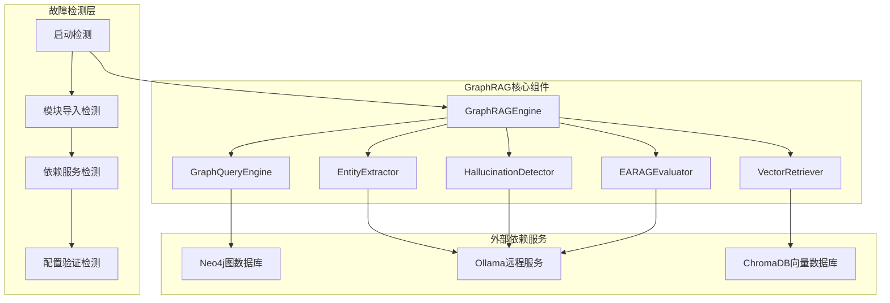
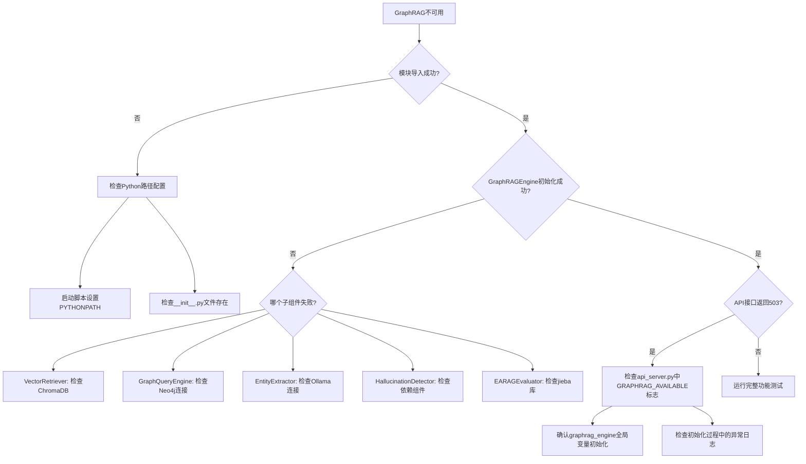
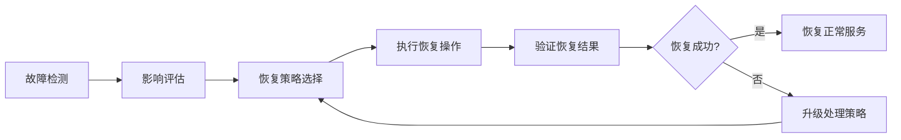

# 政策法规RAG问答系统 - GraphRAG故障诊断设计

## 概述

本设计文档提供政策法规RAG问答系统中GraphRAG功能不可用问题的系统性诊断方案。基于现有系统架构和已知问题模式，设计全面的故障检测、定位和修复流程。

## 系统架构诊断模型



## 故障诊断检查点

### 1. 模块导入故障检查

#### 检查目标
- `backend.graphrag_engine`模块导入状态
- GraphRAGEngine类初始化状态
- 子模块依赖链完整性

#### 检查方法
```python
# 模块导入测试序列
import_checks = [
    ('backend.vector_retrieval', 'VectorRetriever'),
    ('backend.graph_query', 'GraphQueryEngine'), 
    ('backend.entity_extractor', 'EntityExtractor'),
    ('backend.hallucination_detector', 'HallucinationDetector'),
    ('backend.graphrag_engine', 'GraphRAGEngine'),
    ('backend.earag_evaluator', 'EARAGEvaluator')
]
```

#### 常见故障模式
- **ModuleNotFoundError**: Python路径配置问题
- **ImportError**: 依赖库缺失
- **AttributeError**: 类或方法不存在
- **SyntaxError**: 代码语法错误

### 2. 依赖服务连接检查

#### Neo4j连接验证
```yaml
连接参数:
  - NEO4J_URI: neo4j://localhost:7687
  - NEO4J_USERNAME: neo4j
  - NEO4J_PASSWORD: [配置密码]
  - 连接超时: 30秒
  - 最大连接池: 10

检查步骤:
  1. 服务可达性测试
  2. 认证信息验证
  3. 数据库版本兼容性
  4. 基础查询执行测试
```

#### Ollama远程服务验证
```yaml
连接参数:
  - LLM_BINDING_HOST: http://120.232.79.82:11434
  - LLM_MODEL: llama3.2:latest
  - 请求超时: 600秒
  - 强制远程模式: 禁用本地回退

检查步骤:
  1. 远程服务可达性
  2. 模型可用性验证
  3. API响应格式验证
  4. 嵌入向量生成测试
```

#### ChromaDB向量数据库检查
```yaml
存储方式: 本地持久化
数据文件: data/simple_vector_store.json
检查项目:
  - 数据文件存在性
  - 文件格式正确性
  - 向量维度一致性
  - 索引完整性
```

### 3. 环境配置验证

#### 必需环境变量
```yaml
必需配置:
  LLM_BINDING_HOST: "http://120.232.79.82:11434"
  NEO4J_URI: "neo4j://localhost:7687"
  NEO4J_USERNAME: "neo4j"
  NEO4J_PASSWORD: "newpassword"

可选配置:
  LLM_MODEL: "llama3.2:latest"
  LLM_TIMEOUT: "600"
  NEO4J_MAX_POOL_SIZE: "10"
  EXPERIMENT_MODE: "true"
```

#### Python包依赖验证
```yaml
核心依赖:
  - neo4j >= 5.14.1
  - flask >= 3.0.0
  - requests >= 2.31.0
  - python-dotenv
  - flask-cors >= 4.0.0

向量处理:
  - chromadb >= 0.4.15
  - sentence-transformers >= 2.2.2

文本处理:
  - jieba (中文分词)
  - numpy
```

## 故障定位决策树



## 系统健康检查端点设计

### 基础健康检查
```http
GET /api/health/basic
Response: {
  "status": "healthy|degraded|error",
  "timestamp": "2024-01-01T12:00:00Z",
  "services": {
    "api_server": "healthy",
    "neo4j": "healthy|error",
    "ollama": "healthy|error",
    "graphrag": "available|unavailable"
  }
}
```

### GraphRAG专项检查
```http
GET /api/health/graphrag
Response: {
  "graphrag_available": true|false,
  "components": {
    "vector_retriever": "initialized|failed",
    "graph_query_engine": "initialized|failed", 
    "entity_extractor": "initialized|failed",
    "hallucination_detector": "initialized|failed",
    "earag_evaluator": "initialized|failed"
  },
  "dependencies": {
    "neo4j_connection": "active|failed",
    "ollama_connection": "active|failed",
    "vector_db": "loaded|empty|failed"
  },
  "error_details": [...]
}
```

### 深度诊断检查
```http
POST /api/health/diagnose
Request: {
  "check_level": "basic|full|repair",
  "components": ["all|vector|graph|entity|hallucination"]
}
Response: {
  "diagnosis_summary": "...",
  "component_status": {...},
  "recommendations": [...],
  "repair_actions": [...]
}
```

## 自动修复策略

### 配置修复
```yaml
环境变量修复:
  - 强制设置远程Ollama地址
  - 验证Neo4j连接参数
  - 修正Python模块路径

依赖修复:
  - 检查并安装缺失包
  - 更新不兼容版本
  - 清理冲突依赖
```

### 数据修复
```yaml
向量数据库修复:
  - 重建损坏的向量索引
  - 验证嵌入维度一致性
  - 清理无效数据记录

图数据库修复:
  - 验证连接和查询权限
  - 检查数据完整性
  - 重建索引结构
```

### 服务修复
```yaml
模块重新初始化:
  - 重启GraphRAG引擎
  - 重新加载配置
  - 刷新组件状态

连接池重建:
  - 重建数据库连接池
  - 重置超时配置
  - 清理死连接
```

## 监控指标体系

### 系统可用性指标
```yaml
GraphRAG可用性:
  - 模块加载成功率: > 95%
  - API响应成功率: > 99%
  - 组件初始化时间: < 30秒

服务依赖指标:
  - Neo4j连接成功率: > 99%
  - Ollama服务响应率: > 95% 
  - 向量查询延迟: < 2秒
  - 图谱查询延迟: < 5秒
```

### 性能质量指标  
```yaml
答案质量:
  - EARAG评估分数: > 0.7
  - 幻觉检测置信度: > 0.8
  - 实体提取准确率: > 90%

用户体验:
  - 端到端响应时间: < 10秒
  - 会话成功率: > 98%
  - 错误恢复时间: < 5分钟
```

## 故障恢复流程

### 自动恢复机制


### 手动干预流程
```yaml
紧急响应:
  1. 问题确认和影响范围评估
  2. 启用降级模式（传统RAG）
  3. 通知相关人员
  4. 执行诊断和修复

修复验证:
  1. 运行完整系统测试
  2. 验证所有组件功能
  3. 进行压力测试
  4. 确认服务恢复正常
```

## 预防性维护

### 定期检查计划
```yaml
日常检查:
  - 服务状态监控
  - 性能指标采集
  - 错误日志分析

周期性维护:
  - 依赖库版本更新
  - 数据库优化
  - 配置审核

月度评估:
  - 系统架构评估
  - 性能基准测试
  - 容量规划调整
```

### 风险防控措施
```yaml
配置管理:
  - 版本控制所有配置文件
  - 配置变更审批流程
  - 配置备份和恢复

依赖管理:
  - 固定版本号避免意外更新
  - 定期安全扫描
  - 兼容性测试

数据保护:
  - 数据库定期备份
  - 向量数据同步备份
  - 灾难恢复演练
```
```

```

```

```
