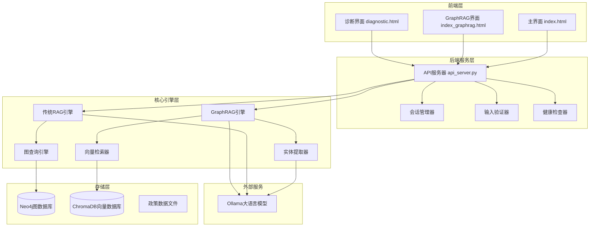

# 政策法规RAG问答系统 - 完整操作手册

## 概述

政策法规RAG问答系统是一个基于检索增强生成（RAG）架构的智能问答系统，结合了Neo4j图数据库、Ollama大语言模型和Web前端，实现对政策法规的语义检索和智能问答功能。

### 核心特性
- **智能问答**：基于RAG架构的政策法规问答
- **知识图谱**：使用Neo4j构建政策法规知识图谱
- **多轮对话**：支持会话管理和上下文理解
- **实时诊断**：内置连接诊断和健康检查
- **双模式支持**：传统RAG和GraphRAG两种检索模式

## 系统架构

### 整体架构图



### 核心组件分析

#### 前端组件
- **index.html**：主要用户界面，支持基础问答功能
- **index_graphrag.html**：增强版界面，支持GraphRAG和传统RAG模式切换
- **diagnostic.html**：系统诊断界面，用于连接测试和故障排查

#### 后端核心模块
- **api_server.py**：Flask API服务器，处理HTTP请求
- **connections.py**：连接管理器，管理数据库和LLM连接
- **session_manager.py**：会话管理，支持多轮对话
- **health_checker.py**：健康检查，监控系统状态
- **validators.py**：输入验证和安全检查

#### 检索引擎
- **graphrag_engine.py**：GraphRAG核心引擎
- **vector_retrieval.py**：向量检索器
- **graph_query.py**：图查询引擎
- **entity_extractor.py**：实体提取器

#### 数据处理
- **import_policy_data.py**：传统数据导入脚本
- **import_graphrag_data.py**：GraphRAG数据导入脚本

## 多余文件分析

### 需要清理的文件和目录

#### 1. Jupyter Notebook缓存文件
```
backend/.ipynb_checkpoints/
database/.ipynb_checkpoints/
scripts/.ipynb_checkpoints/
.ipynb_checkpoints/
```

#### 2. Python缓存文件
```
backend/__pycache__/
scripts/__pycache__/
```

#### 3. 重复的API服务器文件
```
api_server.py (项目根目录)  # 应该删除，使用backend/api_server.py
```

#### 4. 临时测试文件
```
test_graphrag_basic.py
test_import_fix.py
test_ollama_config_fix.py
test_ollama_remote_fix.py
```

#### 5. 重复的配置和诊断文件
```
check_ollama_client_usage.py
final_remote_config_validator.py
ollama_config_diagnostics.py
simple_config_test.py
run_graphrag_import.py
run_import_with_remote_ollama.py
setup_graphrag.py
verify_connection.py
```

#### 6. 重复的文档文件
以下文档可能存在重复或过时内容：
```
64482端口问题分析和解决方案.md
CORS_解决方案.md
GraphRAG_部署指南.md
GraphRAG嵌入模型修复说明.md
Python模块导入问题修复说明.md
test_report.md
最终修复完成总结.md
远程Ollama配置修复完成报告.md
```

### 文件清理建议

```bash
# 删除所有.ipynb_checkpoints目录
find . -name ".ipynb_checkpoints" -type d -exec rm -rf {} +

# 删除Python缓存文件
find . -name "__pycache__" -type d -exec rm -rf {} +

# 删除项目根目录的重复文件
rm api_server.py
rm test_*.py
rm check_ollama_client_usage.py
rm final_remote_config_validator.py
rm ollama_config_diagnostics.py
rm simple_config_test.py
rm run_*.py
rm setup_graphrag.py
rm verify_connection.py

# 删除过时的文档（可选）
rm 64482端口问题分析和解决方案.md
rm CORS_解决方案.md
rm test_report.md
rm 最终修复完成总结.md
```

## 环境配置

### 系统要求

#### 硬件要求
- CPU：双核以上处理器
- 内存：最低4GB，推荐8GB
- 存储：至少1GB可用空间

#### 软件要求
- Python 3.8+
- Neo4j 4.x或5.x
- Node.js（用于前端服务）
- 现代浏览器（Chrome、Firefox、Edge）

### 依赖安装

#### 1. Python依赖
```bash
pip install -r requirements.txt
```

主要依赖包：
- flask==3.0.0
- neo4j==5.14.1
- python-dotenv==1.0.0
- requests==2.31.0
- flask-cors==4.0.0
- ollama==0.5.3
- chromadb==0.4.15
- sentence-transformers==2.2.2

#### 2. 前端依赖
```bash
cd frontend
npm install
```

### 环境变量配置

复制`.env.template`为`.env`并修改配置：

```env
# Neo4j数据库配置
NEO4J_URI=neo4j://localhost:7687
NEO4J_USERNAME=neo4j
NEO4J_PASSWORD=password
NEO4J_MAX_POOL_SIZE=10
NEO4J_CONNECTION_TIMEOUT=30

# Ollama LLM服务配置
LLM_BINDING=ollama
LLM_MODEL=llama3.2:latest
LLM_BINDING_HOST=http://120.232.79.82:11434
LLM_TIMEOUT=120
```

## 系统部署

### 部署流程

#### 1. 启动Neo4j数据库
```bash
# 使用Neo4j Desktop或命令行启动
neo4j start

# 验证连接
python scripts/test_neo4j_connection.py
```

#### 2. 验证Ollama服务
```bash
# 测试远程Ollama连接
python scripts/test_ollama_connection.py

# 或手动测试
curl http://120.232.79.82:11434/api/tags
```

#### 3. 导入政策数据
```bash
# 传统RAG数据导入
python scripts/import_policy_data.py

# 或GraphRAG数据导入
python scripts/import_graphrag_data.py
```

#### 4. 启动后端服务
```bash
# 推荐方式：使用统一启动脚本
python start_server.py api

# 直接启动（需要配置Python路径）
python backend/api_server.py
```

#### 5. 启动前端服务
```bash
cd frontend
npm start
```

### 服务端点

- **主页面**：http://localhost:3000
- **GraphRAG增强版**：http://localhost:3000/index_graphrag.html
- **诊断页面**：http://localhost:3000/diagnostic.html
- **后端API**：http://127.0.0.1:5000
- **健康检查**：http://127.0.0.1:5000/health

## API接口文档

### 核心端点

#### 1. 问答接口
```http
POST /api/ask
Content-Type: application/json

{
    "question": "用户问题",
    "session_id": "会话ID（可选）",
    "mode": "graphrag"  // 或 "traditional"
}
```

**响应格式**：
```json
{
    "answer": "生成的答案",
    "entities": ["相关实体1", "相关实体2"],
    "sources": ["数据源1", "数据源2"],
    "session_id": "会话ID",
    "processing_time": 1.25,
    "confidence": 0.85,
    "warnings": []
}
```

#### 2. 会话管理
```http
POST /api/session/create
{}
```

#### 3. 健康检查
```http
GET /health
```

#### 4. 系统状态
```http
GET /api/status
```

### 错误处理

系统采用分层错误处理机制：

- **ValidationError**：输入验证错误
- **DatabaseError**：数据库连接错误
- **LLMServiceError**：大语言模型服务错误
- **SessionError**：会话管理错误
- **SystemError**：系统级错误

## 功能操作指南

### 基础问答功能

#### 1. 访问主界面
打开浏览器访问 `http://localhost:3000`

#### 2. 开始对话
1. 在输入框中输入问题
2. 点击"发送"按钮或按回车键
3. 系统将返回基于政策法规的答案

#### 3. 多轮对话
1. 点击"新建会话"创建会话
2. 在同一会话中提问，系统会维护对话上下文
3. 点击"清空聊天"清除当前显示的消息

### GraphRAG增强功能

#### 1. 访问增强版界面
打开 `http://localhost:3000/index_graphrag.html`

#### 2. 模式切换
- **GraphRAG模式**：使用向量检索和图查询的混合方法
- **传统RAG模式**：仅使用Neo4j图查询

#### 3. 高级功能
- **置信度显示**：显示答案的可信度评分
- **数据源追踪**：显示答案来源的政策文档
- **幻觉检测**：检测并警告可能的答案幻觉

### 系统诊断功能

#### 1. 访问诊断页面
打开 `http://localhost:3000/diagnostic.html`

#### 2. 连接测试
- **基础连接测试**：测试前后端连通性
- **API端点测试**：测试各API接口
- **CORS测试**：测试跨域请求配置

#### 3. 故障排查
- 检查服务状态
- 查看连接错误详情
- 获取系统性能信息

## 数据管理

### 数据结构

#### 政策数据格式
```json
{
    "政策": "政策标题",
    "发布机关": "发布机构",
    "发布时间": "YYYY-MM-DD",
    "章节": [
        {
            "标题": "章节标题",
            "内容": "章节内容",
            "小节": [
                {
                    "标题": "小节标题",
                    "内容": "小节内容"
                }
            ]
        }
    ]
}
```

#### 知识图谱节点类型
- **Policy**：政策文档节点
- **Section**：章节节点
- **SubSection**：小节节点
- **Agency**：发布机构节点
- **Entity**：实体节点（GraphRAG模式）

### 数据导入

#### 1. 准备数据文件
将政策法规JSON文件放入`database/`目录

#### 2. 传统RAG导入
```bash
python scripts/import_policy_data.py
```

#### 3. GraphRAG导入
```bash
python scripts/import_graphrag_data.py
```

#### 4. 数据验证
```bash
python scripts/test_graphrag_system.py
```

## 测试与验证

### 连接测试脚本

#### 1. Neo4j连接测试
```bash
python scripts/test_neo4j_connection.py
```

#### 2. Ollama连接测试
```bash
python scripts/test_ollama_connection.py
```

#### 3. 后端API测试
```bash
python scripts/test_backend_response.py
```

### 功能测试

#### 1. 系统集成测试
```bash
python scripts/test_enhanced_features.py
```

#### 2. GraphRAG系统测试
```bash
python scripts/test_graphrag_system.py
```

### 性能监控

#### 1. 健康检查
定期访问 `/health` 端点监控系统状态

#### 2. 性能指标
- 查询响应时间
- 数据库连接状态
- LLM服务可用性
- 内存使用情况

## 常见问题解决

### 连接问题

#### 1. Neo4j连接失败
- 检查Neo4j服务是否启动
- 验证连接配置（URI、用户名、密码）
- 检查防火墙设置

#### 2. Ollama服务不可用
- 检查远程服务地址配置
- 验证网络连通性
- 确认模型是否已部署

#### 3. CORS跨域问题
- 使用`npm start`启动前端服务
- 检查后端CORS配置
- 确认访问地址正确

### 功能问题

#### 1. 答案质量差
- 检查数据导入是否完整
- 验证实体提取结果
- 调整Prompt模板

#### 2. 响应速度慢
- 检查数据库查询效率
- 监控LLM服务性能
- 优化向量检索参数

#### 3. 会话管理异常
- 清理过期会话
- 检查会话存储配置
- 重启后端服务

### 性能优化

#### 1. 数据库优化
- 创建合适的索引
- 优化查询语句
- 配置连接池

#### 2. 缓存策略
- 启用查询结果缓存
- 配置会话缓存
- 使用向量缓存

#### 3. 负载均衡
- 配置多个后端实例
- 使用反向代理
- 实现健康检查

## 维护指南

### 日常维护

#### 1. 日志管理
- 定期清理系统日志
- 监控错误日志
- 配置日志轮转

#### 2. 数据备份
- 备份Neo4j数据库
- 备份政策数据文件
- 备份系统配置

#### 3. 安全更新
- 更新Python依赖包
- 升级数据库版本
- 修复安全漏洞

### 系统升级

#### 1. 版本控制
- 使用Git管理代码版本
- 标记稳定版本
- 记录变更日志

#### 2. 测试流程
- 在测试环境验证
- 执行回归测试
- 备份生产数据

#### 3. 部署策略
- 使用蓝绿部署
- 实现回滚机制
- 监控系统状态

### 扩展开发

#### 1. 新功能开发
- 遵循现有架构模式
- 实现单元测试
- 更新文档

#### 2. 性能优化
- 分析性能瓶颈
- 优化关键路径
- 监控改进效果

#### 3. 集成扩展
- 支持新的数据源
- 集成其他LLM服务
- 扩展API接口

## 技术参考

### 架构模式
- **分层架构**：前端、后端、数据层分离
- **RAG模式**：检索增强生成架构
- **微服务思想**：组件解耦，独立部署

### 技术栈
- **前端**：HTML/CSS/JavaScript
- **后端**：Python Flask
- **数据库**：Neo4j + ChromaDB
- **AI服务**：Ollama
- **容器化**：支持Docker部署

### 开发规范
- **代码风格**：遵循PEP 8规范
- **错误处理**：分层异常处理机制
- **API设计**：RESTful接口规范
- **安全机制**：输入验证和CORS配置