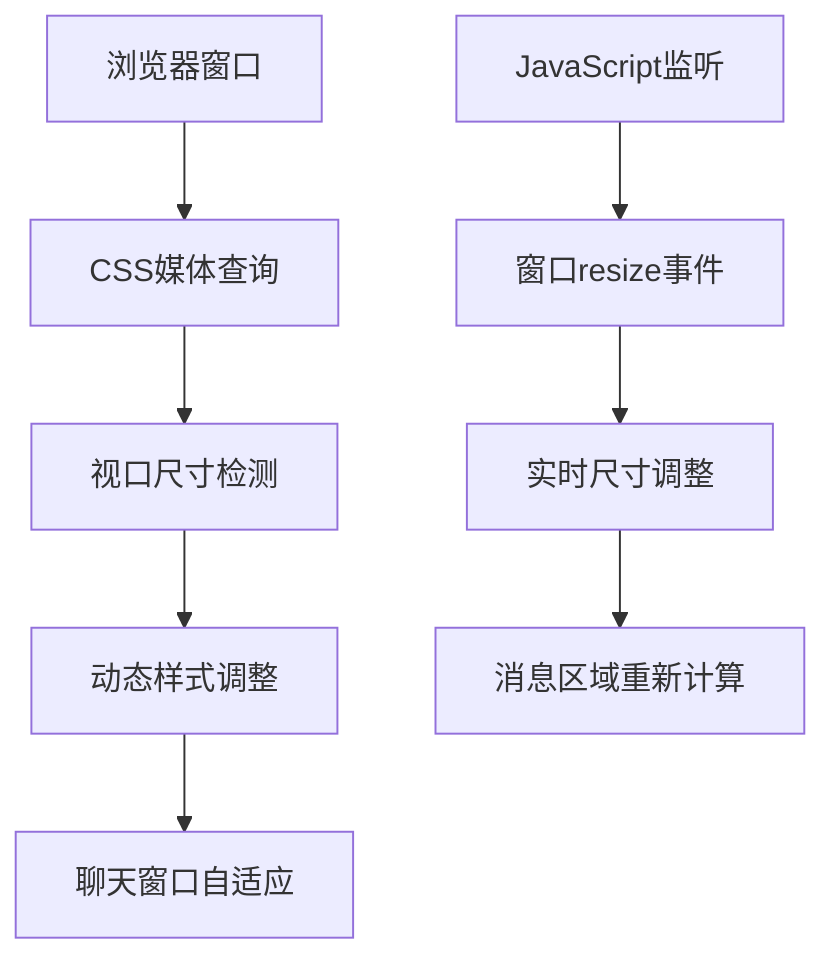

# 前端问答窗口自适应浏览器窗口设计

## 概述

本设计文档旨在解决政策法规RAG问答系统前端页面中问答窗口尺寸固定、无法充分利用浏览器窗口空间的问题，通过响应式设计实现窗口自适应调整，提升用户体验。

## 问题分析

### 当前问题

#### 固定尺寸限制
- **index.html**: 聊天窗口固定为 `width: 80%; max-width: 600px; height: 400px`
- **index_graphrag.html**: 聊天窗口固定为 `width: 80%; max-width: 800px; height: 500px`
- 在大屏幕设备上无法充分利用空间
- 在小屏幕设备上可能显示不完整

#### 用户体验问题
- 聊天内容显示区域受限，需要频繁滚动
- 无法根据设备类型和屏幕尺寸优化显示
- 现代Web应用应具备的响应式特性缺失

## 技术架构

### 响应式设计策略



### 设计原则

#### 移动优先设计
- 基础样式适配移动设备
- 渐进增强适配大屏设备
- 保证核心功能在所有设备上可用

#### 弹性布局
- 使用CSS Flexbox实现自适应布局
- 采用视口单位(vh, vw)替代固定像素
- 设置合理的最小和最大尺寸约束

## 响应式布局设计

### 断点设计

| 设备类型 | 屏幕宽度 | 聊天窗口宽度 | 聊天窗口高度 |
|---------|---------|-------------|-------------|
| 手机 | < 768px | 95% | 60vh |
| 平板 | 768px - 1024px | 90% | 65vh |
| 桌面 | 1024px - 1440px | 85% | 70vh |
| 大屏 | > 1440px | 80% (max 1200px) | 75vh |

### 视口适配策略

#### 高度自适应
```css
.chat-box {
    height: calc(100vh - 200px); /* 减去头部和底部空间 */
    min-height: 400px; /* 最小高度保证可用性 */
    max-height: 800px; /* 最大高度避免过度拉伸 */
}
```

#### 宽度自适应
```css
.chat-box {
    width: min(90vw, 1200px); /* 视口宽度的90%，最大1200px */
    min-width: 320px; /* 最小宽度确保移动端可用 */
}
```

### 消息区域优化

#### 动态高度计算
- 消息显示区域根据窗口高度动态调整
- 输入区域高度固定，保证操作便利性
- 滚动条样式优化，提升视觉体验

#### 自适应字体和间距
```css
@media (max-width: 768px) {
    .message {
        font-size: 14px;
        padding: 6px 10px;
    }
}

@media (min-width: 1200px) {
    .message {
        font-size: 16px;
        padding: 10px 15px;
    }
}
```

## 组件架构设计

### CSS组件结构

#### 基础布局组件
```css
/* 容器组件 */
.container {
    display: flex;
    flex-direction: column;
    align-items: center;
    padding: clamp(10px, 3vw, 20px);
    min-height: 100vh;
}

/* 聊天窗口组件 */
.chat-box {
    display: flex;
    flex-direction: column;
    border-radius: 10px;
    box-shadow: 0 4px 8px rgba(0, 0, 0, 0.1);
    overflow: hidden;
}
```

#### 响应式消息组件
```css
.messages {
    flex: 1;
    padding: clamp(8px, 2vw, 15px);
    overflow-y: auto;
    scroll-behavior: smooth;
}

.message {
    margin: clamp(5px, 1.5vw, 10px) 0;
    padding: clamp(6px, 2vw, 12px);
    border-radius: 8px;
    max-width: min(80%, 600px);
    word-wrap: break-word;
}
```

### JavaScript增强功能

#### 窗口尺寸监听
```javascript
// 窗口尺寸变化监听器
class WindowResizeHandler {
    constructor() {
        this.chatBox = document.querySelector('.chat-box');
        this.messages = document.querySelector('.messages');
        this.init();
    }
    
    init() {
        window.addEventListener('resize', this.handleResize.bind(this));
        this.handleResize(); // 初始化调用
    }
    
    handleResize() {
        this.adjustChatBoxHeight();
        this.scrollToBottom();
    }
    
    adjustChatBoxHeight() {
        const windowHeight = window.innerHeight;
        const headerHeight = 80; // 头部高度
        const footerHeight = 60; // 底部高度
        const controlsHeight = 50; // 控制按钮高度
        
        const availableHeight = windowHeight - headerHeight - footerHeight - controlsHeight;
        const minHeight = 300;
        const maxHeight = 800;
        
        const targetHeight = Math.min(Math.max(availableHeight, minHeight), maxHeight);
        this.chatBox.style.height = `${targetHeight}px`;
    }
    
    scrollToBottom() {
        if (this.messages) {
            this.messages.scrollTop = this.messages.scrollHeight;
        }
    }
}
```

#### 设备类型检测
```javascript
class DeviceDetector {
    static isMobile() {
        return window.innerWidth < 768;
    }
    
    static isTablet() {
        return window.innerWidth >= 768 && window.innerWidth < 1024;
    }
    
    static isDesktop() {
        return window.innerWidth >= 1024;
    }
    
    static applyDeviceSpecificStyles() {
        const body = document.body;
        body.classList.remove('mobile', 'tablet', 'desktop');
        
        if (this.isMobile()) {
            body.classList.add('mobile');
        } else if (this.isTablet()) {
            body.classList.add('tablet');
        } else {
            body.classList.add('desktop');
        }
    }
}
```

## 样式优化方案

### 媒体查询策略

#### 移动端适配 (< 768px)
```css
@media (max-width: 767px) {
    .container {
        padding: 10px;
    }
    
    .chat-box {
        width: 100%;
        height: calc(100vh - 160px);
        border-radius: 0;
        border-left: none;
        border-right: none;
    }
    
    .controls {
        flex-direction: column;
        gap: 8px;
    }
    
    .control-button {
        width: 100%;
        padding: 12px;
    }
    
    .input-area {
        padding: 8px;
    }
    
    input[type="text"] {
        font-size: 16px; /* 防止iOS缩放 */
    }
}
```

#### 平板端适配 (768px - 1023px)
```css
@media (min-width: 768px) and (max-width: 1023px) {
    .chat-box {
        width: 95%;
        max-width: none;
        height: calc(100vh - 180px);
    }
    
    .controls {
        justify-content: center;
        gap: 15px;
    }
    
    .message {
        max-width: 75%;
    }
}
```

#### 桌面端适配 (≥ 1024px)
```css
@media (min-width: 1024px) {
    .chat-box {
        width: min(85vw, 1200px);
        height: calc(100vh - 200px);
        min-height: 500px;
    }
    
    .controls {
        justify-content: space-between;
    }
    
    .message {
        max-width: 70%;
    }
    
    /* 大屏幕专用功能 */
    .chat-box:hover {
        box-shadow: 0 8px 16px rgba(0, 0, 0, 0.15);
    }
}
```

### 动画和过渡效果

#### 平滑过渡
```css
.chat-box {
    transition: all 0.3s ease-in-out;
}

.message {
    transition: all 0.2s ease;
}

@media (prefers-reduced-motion: reduce) {
    * {
        transition: none !important;
        animation: none !important;
    }
}
```

## 性能优化

### CSS优化

#### 使用CSS自定义属性
```css
:root {
    --chat-box-min-width: 320px;
    --chat-box-max-width: 1200px;
    --chat-box-min-height: 300px;
    --chat-box-max-height: 800px;
    --border-radius: 10px;
    --box-shadow: 0 4px 8px rgba(0, 0, 0, 0.1);
}

.chat-box {
    width: min(90vw, var(--chat-box-max-width));
    min-width: var(--chat-box-min-width);
    height: clamp(var(--chat-box-min-height), 70vh, var(--chat-box-max-height));
    border-radius: var(--border-radius);
    box-shadow: var(--box-shadow);
}
```

#### 避免重绘和重排
- 使用 `transform` 替代直接修改尺寸
- 利用 `will-change` 属性优化动画性能
- 避免在resize事件中进行大量DOM操作

### JavaScript优化

#### 防抖处理
```javascript
class ResizeThrottle {
    constructor(callback, delay = 250) {
        this.callback = callback;
        this.delay = delay;
        this.timeoutId = null;
    }
    
    execute() {
        clearTimeout(this.timeoutId);
        this.timeoutId = setTimeout(() => {
            this.callback();
        }, this.delay);
    }
}

// 使用防抖处理resize事件
const resizeHandler = new ResizeThrottle(() => {
    windowResizeHandler.handleResize();
}, 200);

window.addEventListener('resize', () => resizeHandler.execute());
```

## 测试策略

### 响应式测试

#### 设备测试矩阵
| 设备类型 | 屏幕尺寸 | 测试重点 |
|---------|---------|---------|
| iPhone SE | 375x667 | 竖屏最小尺寸适配 |
| iPad | 768x1024 | 平板横竖屏切换 |
| MacBook | 1440x900 | 桌面端标准尺寸 |
| 4K显示器 | 3840x2160 | 超大屏幕适配 |

#### 功能测试场景
1. **窗口缩放测试**: 验证各断点下的布局正确性
2. **横竖屏切换**: 确保移动端方向变化时的适配
3. **极端尺寸测试**: 测试最小/最大尺寸下的可用性
4. **性能测试**: 验证resize事件处理的流畅性

### 自动化测试

#### CSS回归测试
```javascript
// Puppeteer视觉回归测试示例
async function testResponsiveLayout() {
    const page = await browser.newPage();
    
    const viewports = [
        { width: 375, height: 667 }, // Mobile
        { width: 768, height: 1024 }, // Tablet
        { width: 1440, height: 900 }  // Desktop
    ];
    
    for (const viewport of viewports) {
        await page.setViewport(viewport);
        await page.goto('http://localhost:3000');
        await page.screenshot({
            path: `screenshots/layout-${viewport.width}x${viewport.height}.png`
        });
    }
}
```

## 实现指南

### 文件修改清单

#### index.html 修改要点
1. 更新`.chat-box`样式，使用视口单位
2. 添加媒体查询规则
3. 引入JavaScript窗口监听逻辑
4. 优化移动端交互体验

#### index_graphrag.html 修改要点
1. 同步响应式样式更新
2. 适配GraphRAG界面的特殊元素
3. 确保可信度条、警告信息等组件的响应式显示
4. 优化比较模式的布局适配

### 实现优先级

#### 第一阶段：基础响应式
- [ ] 实现基本的视口尺寸适配
- [ ] 添加主要断点的媒体查询
- [ ] 确保核心功能在各设备正常工作

#### 第二阶段：增强体验
- [ ] 添加平滑过渡动画
- [ ] 实现JavaScript动态调整
- [ ] 优化移动端触摸交互

#### 第三阶段：性能优化
- [ ] 实现resize事件防抖
- [ ] 添加CSS自定义属性
- [ ] 完善无障碍访问支持