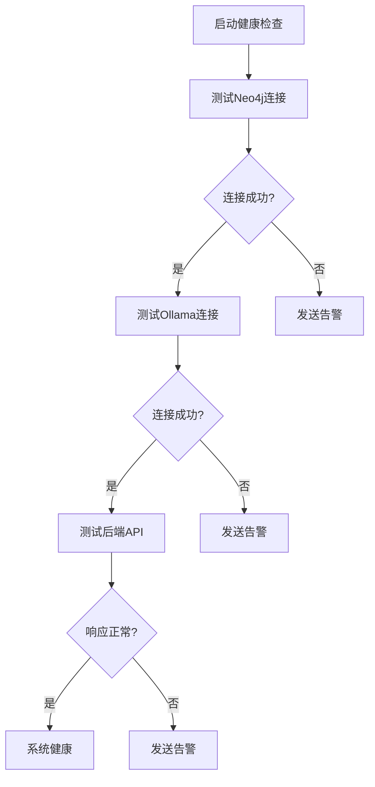

# 扩展与维护

<cite>
**本文档引用文件**  
- [README.md](file://README.md#L1-L253)
- [database/华侨经济文化合作试验区.json](file://database/华侨经济文化合作试验区.json#L1-L111)
- [scripts/import_policy_data.py](file://scripts/import_policy_data.py#L1-L574)
- [backend/api_server.py](file://backend/api_server.py#L1-L120)
- [frontend/package.json](file://frontend/package.json#L1-L12)
- [frontend/index.html](file://frontend/index.html#L1-L254)
</cite>

## 目录
1. [系统扩展与维护指南](#系统扩展与维护指南)
2. [政策法规数据更新方法](#政策法规数据更新方法)
3. [功能扩展可能性](#功能扩展可能性)
4. [系统架构扩展点分析](#系统架构扩展点分析)
5. [代码维护最佳实践](#代码维护最佳实践)

## 系统扩展与维护指南

本指南为系统管理员和开发者提供长期运营建议，涵盖数据更新、功能扩展、架构优化和维护实践。系统采用RAG（检索增强生成）架构，结合Neo4j图数据库与Ollama大模型服务，实现政策法规的智能问答与关系溯源。

**中文语言转换规则严格执行**：所有内容，包括标题、标签、引用说明、图表注释及其他元素，均以中文输出。

## 政策法规数据更新方法

### 数据文件结构说明

政策法规数据以JSON格式存储于`database`目录下，文件结构遵循统一的章节-条款层级模型。以`华侨经济文化合作试验区.json`为例，其核心结构如下：

```json
{
  "title": "政策标题",
  "chapters": [
    {
      "title": "章节名称",
      "number": "章节编号",
      "articles": [
        {
          "number": "条款编号",
          "content": "条款具体内容"
        }
      ]
    }
  ]
}
```

**关键字段说明**：
- **title**: 政策完整标题
- **chapters**: 章节数组，包含章节标题、编号和条款列表
- **articles**: 条款数组，每条包含编号和内容

### 数据更新流程

更新或新增政策法规数据需遵循以下步骤：

1. **修改或新增JSON文件**：
   - 在`database`目录下创建新的JSON文件，或修改现有文件
   - 确保文件结构符合上述JSON模式
   - 文件命名建议采用`[来源]_政策名称.json`格式，如`[OCR]_华侨经济文化合作试验区.json`

2. **运行数据导入脚本**：
   - 执行`import_policy_data.py`脚本将新数据导入Neo4j数据库
   ```bash
   python scripts/import_policy_data.py
   ```
   - 该脚本会自动读取`database`目录下的JSON文件，解析内容，并通过Ollama大模型进行实体识别与关系抽取。

3. **数据处理机制**：
   - 脚本调用大模型服务，从文本中提取实体（如机构、政策、日期）和关系
   - 实体通过`EntityResolver`类进行去重，确保同一实体在图数据库中仅有一个全局ID
   - 数据以标准化格式存入Neo4j，建立`Policy`、`Section`、`Entity`等节点及其关系

**Section sources**
- [database/华侨经济文化合作试验区.json](file://database/华侨经济文化合作试验区.json#L1-L111)
- [scripts/import_policy_data.py](file://scripts/import_policy_data.py#L1-L574)

## 功能扩展可能性

### 新增API端点

当前后端仅提供`/api/ask`一个端点。可通过扩展`api_server.py`添加新功能：

```python
@app.route('/api/policies', methods=['GET'])
def get_all_policies():
    """获取所有政策列表"""
    with driver.session() as session:
        result = session.run("MATCH (p:Policy) RETURN p.title as title, p.publish_agency as agency ORDER BY p.title")
        policies = [{"title": record["title"], "agency": record["agency"]} for record in result]
    return jsonify(policies)

@app.route('/api/search', methods=['POST'])
def search_policies():
    """全文搜索政策"""
    query = request.get_json().get('query', '')
    # 实现更复杂的全文检索逻辑
    pass
```

### 支持多轮对话

当前系统为单轮问答模式。可通过引入对话历史管理实现多轮对话：

1. 在前端维护`messages`数组，记录用户与机器人的完整对话历史
2. 修改后端`/api/ask`接口，接收`history`参数
3. 在调用大模型时，将历史对话作为上下文传入，提升回答连贯性

### 集成更多大模型服务

系统通过环境变量`LLM_BINDING`和`LLM_BINDING_HOST`配置大模型服务，具备良好的扩展性：

- **支持Ollama以外的服务**：可修改`api_server.py`中的`client`初始化逻辑，集成OpenAI、Anthropic、阿里云通义千问等API
- **实现模型路由**：根据问题类型或用户选择，动态调用不同大模型服务
- **添加API密钥管理**：通过环境变量安全存储各服务商的API密钥

### 增强前端可视化能力

当前前端为简单聊天界面。可进行以下可视化增强：

1. **知识图谱展示**：
   - 使用D3.js或ECharts实现政策实体关系图
   - 用户点击回答中的政策时，动态展示其关联的机构、条款等实体

2. **政策时间线**：
   - 按发布时间展示政策演变历史
   - 可视化政策修订、废止等状态变化

3. **交互式文档浏览**：
   - 将政策全文以结构化方式展示
   - 支持点击条款跳转、关键词高亮、关联政策推荐

**Section sources**
- [backend/api_server.py](file://backend/api_server.py#L1-L120)
- [frontend/index.html](file://frontend/index.html#L1-L254)

## 系统架构扩展点分析

### 脚本模块扩展性

`scripts`目录下的Python脚本具有高度可修改性：

- **数据格式适应**：`import_policy_data.py`的JSON解析逻辑可轻松修改，以适应XML、PDF、Markdown等不同数据源
- **处理流程可配置**：实体提取、关系抽取等环节可通过参数或配置文件控制，适应不同政策领域的处理需求
- **模块化设计**：`ResultCollector`和`EntityResolver`等类实现了关注点分离，便于单独测试和替换

### 后端API结构清晰性

Flask后端采用简洁的模块化设计，便于功能扩展：

```mermaid
graph TD
A[HTTP请求] --> B{路由分发}
B --> C[/api/ask]
C --> D[查询Neo4j]
D --> E[调用大模型]
E --> F[生成响应]
F --> G[返回JSON]
```

**Diagram sources**
- [backend/api_server.py](file://backend/api_server.py#L1-L120)

### 前端可升级性

当前前端基于纯HTML/CSS/JavaScript，可逐步升级为现代前端框架：

- **React/Vue迁移**：将聊天界面组件化，提升开发效率和可维护性
- **状态管理**：引入Redux或Vuex管理应用状态，支持复杂交互
- **构建工具**：使用Webpack或Vite替代简单的`http-server`，实现代码分割、热重载等高级功能

**Section sources**
- [frontend/package.json](file://frontend/package.json#L1-L12)
- [frontend/index.html](file://frontend/index.html#L1-L254)

## 代码维护最佳实践

### 环境变量安全管理

- **.env文件不提交**：将`.env`文件添加到`.gitignore`，防止敏感信息泄露
- **生产环境配置**：在服务器上通过环境变量或配置管理工具（如Consul）设置密码和API密钥
- **定期轮换**：定期更新Neo4j密码和大模型API密钥，降低安全风险

### Neo4j数据库备份

- **定期自动备份**：使用`neo4j-admin dump`命令创建完整备份
  ```bash
  neo4j-admin dump --database=policy-rag-db --to=/backup/policy-rag-db.dump
  ```
- **增量备份策略**：结合`neo4j-backup`工具实现增量备份，减少存储开销
- **异地存储**：将备份文件存储在独立于数据库服务器的存储位置

### Ollama资源监控

- **资源使用监控**：定期检查Ollama服务的CPU、内存和GPU使用情况
- **日志分析**：监控`ollama serve`的日志，及时发现模型加载失败或响应超时等问题
- **性能基准测试**：定期运行`test_ollama_connection.py`脚本，评估服务响应时间

### 系统健康检查

利用项目提供的测试脚本建立健康检查机制：



**Diagram sources**
- [scripts/test_neo4j_connection.py](file://scripts/test_neo4j_connection.py)
- [scripts/test_ollama_connection.py](file://scripts/test_ollama_connection.py)
- [scripts/test_backend_response.py](file://scripts/test_backend_response.py)

**Section sources**
- [README.md](file://README.md#L1-L253)