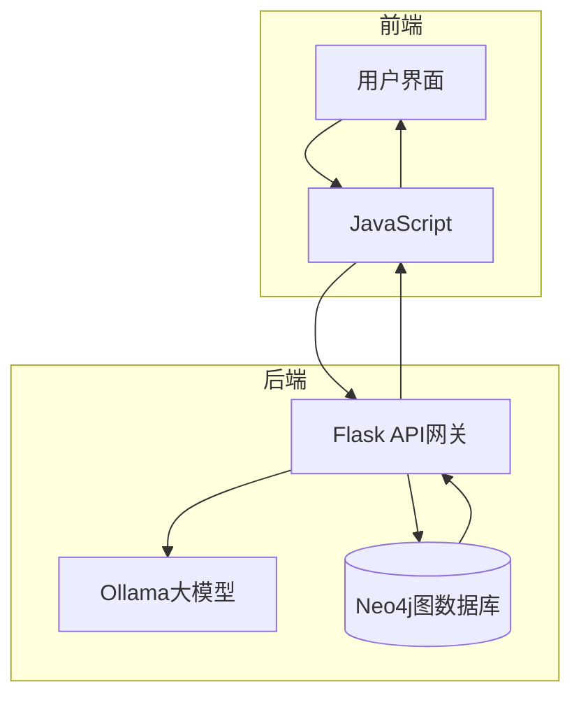
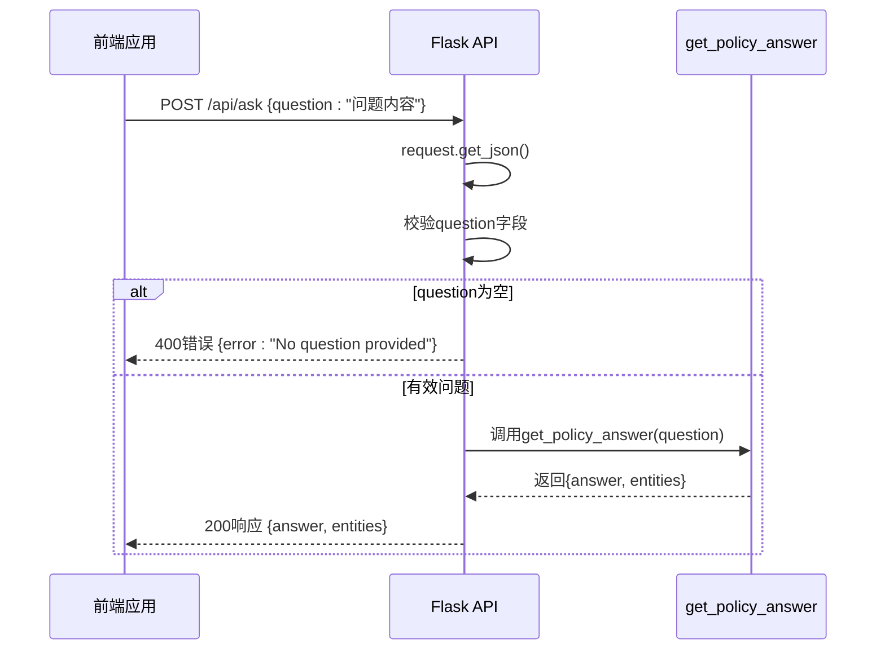
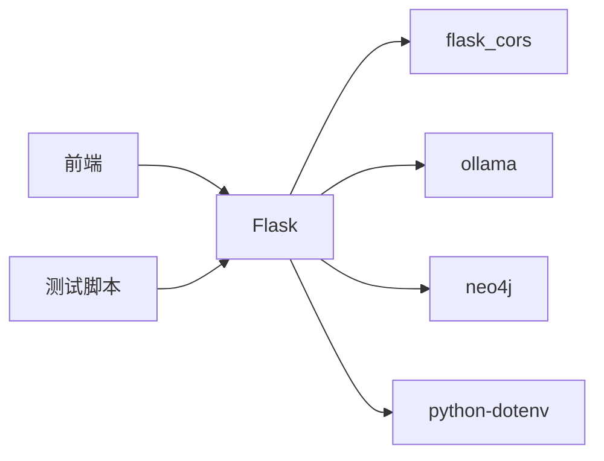

# Flask API 网关实现

<cite>
**本文档引用的文件**   
- [api_server.py](file://backend/api_server.py#L1-L120)
- [test_backend_response.py](file://scripts/test_backend_response.py#L1-L21)
- [index.html](file://frontend/index.html#L1-L254)
- [requirements.txt](file://requirements.txt#L1-L7)
- [README.md](file://README.md#L1-L253)
</cite>

## 目录
1. [项目结构](#项目结构)
2. [核心组件](#核心组件)
3. [架构概述](#架构概述)
4. [详细组件分析](#详细组件分析)
5. [依赖分析](#依赖分析)
6. [性能考虑](#性能考虑)
7. [故障排除指南](#故障排除指南)
8. [结论](#结论)

## 项目结构

项目采用分层架构，将前端、后端、数据库和脚本工具分离，便于维护和扩展。主要目录包括：

- `backend/`：包含Flask后端API服务，核心文件为`api_server.py`
- `database/`：存储政策法规数据的JSON文件
- `frontend/`：前端用户界面，包含HTML、CSS和JavaScript
- `scripts/`：包含数据导入、连接测试和功能演示脚本

这种结构清晰地划分了职责，后端负责业务逻辑和数据处理，前端负责用户交互，脚本用于系统维护和测试。

**Section sources**
- [api_server.py](file://backend/api_server.py#L1-L120)
- [README.md](file://README.md#L1-L253)

## 核心组件

Flask API网关的核心实现在`backend/api_server.py`中，主要功能包括：

- **API路由**：通过`@app.route('/api/ask', methods=['POST'])`暴露RESTful接口
- **请求处理**：使用`request.get_json()`解析前端POST请求体
- **参数校验**：检查`question`字段是否为空，返回400错误
- **响应构造**：统一返回包含`answer`、`sources`（在代码中为`entities`）的JSON格式
- **错误处理**：捕获异常并返回结构化错误信息

该组件作为前后端之间的桥梁，接收前端查询，整合Neo4j图数据库和Ollama大模型服务，返回结构化答案。

**Section sources**
- [api_server.py](file://backend/api_server.py#L1-L120)

## 架构概述



**Diagram sources**
- [api_server.py](file://backend/api_server.py#L1-L120)
- [index.html](file://frontend/index.html#L1-L254)

## 详细组件分析

### Flask应用初始化与CORS配置

Flask应用通过`app = Flask(__name__)`创建，并使用`flask_cors`扩展启用跨域资源共享（CORS）。配置`CORS(app)`允许前端localhost域访问API，解决了开发环境下的跨域问题。

```python
from flask import Flask
from flask_cors import CORS

app = Flask(__name__)
CORS(app)
```

此配置确保前端应用（运行在`http://localhost:3000`）能够安全地调用后端API（运行在`http://127.0.0.1:5000`）。

**Section sources**
- [api_server.py](file://backend/api_server.py#L1-L120)
- [requirements.txt](file://requirements.txt#L1-L7)

### API路由与请求处理

`/api/ask`路由是系统的核心接口，处理前端的POST请求。实现细节如下：

- **路由注册**：使用装饰器`@app.route('/api/ask', methods=['POST'])`注册路由
- **请求解析**：`request.get_json()`解析JSON请求体
- **参数校验**：检查`question`字段，若为空则返回400错误
- **响应返回**：使用`jsonify()`返回JSON响应



**Diagram sources**
- [api_server.py](file://backend/api_server.py#L1-L120)
- [index.html](file://frontend/index.html#L1-L254)

**Section sources**
- [api_server.py](file://backend/api_server.py#L1-L120)

### 统一响应格式

API返回标准化的JSON响应，包含`answer`和`entities`字段：

- `answer`：大模型生成的自然语言回答
- `entities`：相关联的政策法规实体列表，包含政策标题、章节标题、内容和发布机构

```json
{
  "answer": "回答内容...",
  "entities": [
    {
      "policy_title": "政策标题",
      "section_title": "章节标题",
      "content": "具体内容",
      "agency": "发布机构",
      "relation": "发布单位"
    }
  ]
}
```

前端通过`data.answer`和`data.entities`访问这些字段，并在界面中展示。

**Section sources**
- [api_server.py](file://backend/api_server.py#L1-L120)
- [index.html](file://frontend/index.html#L1-L254)

### 错误处理机制

系统实现了多层次的错误处理：

1. **输入验证错误**：当`question`为空时，返回400状态码和错误信息
2. **业务逻辑异常**：在`get_policy_answer`函数中使用try-catch捕获异常
3. **前端网络错误**：在`fetch`调用中使用try-catch处理网络异常

```python
@app.route('/api/ask', methods=['POST'])
def ask():
    data = request.get_json()
    question = data.get('question', '')
    if not question:
        return jsonify({'error': 'No question provided'}), 400

    result = get_policy_answer(question)
    return jsonify(result)

def get_policy_answer(question):
    try:
        # 业务逻辑
        ...
    except Exception as e:
        return {
            "answer": f"查询过程中出现错误: {str(e)}",
            "entities": []
        }
```

这种设计确保了系统在各种异常情况下都能返回有意义的响应，提高了用户体验。

**Section sources**
- [api_server.py](file://backend/api_server.py#L1-L120)
- [test_backend_response.py](file://scripts/test_backend_response.py#L1-L21)

### 应用启动与日志

应用通过`if __name__ == '__main__':`块启动，运行在`debug=True`模式下，便于开发调试。默认端口为5000。

```python
if __name__ == '__main__':
    app.run(debug=True, port=5000)
```

虽然代码中未显式配置日志输出，但Flask默认会输出请求日志到控制台，包括请求方法、路径和响应状态码，为开发者提供了基本的调试信息。

**Section sources**
- [api_server.py](file://backend/api_server.py#L1-L120)

## 依赖分析



**Diagram sources**
- [requirements.txt](file://requirements.txt#L1-L7)
- [api_server.py](file://backend/api_server.py#L1-L120)

## 性能考虑

当前实现中，每次请求都会：
1. 查询Neo4j数据库（最多返回5条记录）
2. 调用Ollama大模型生成回答
3. 构造响应并返回

潜在的性能优化点包括：
- 添加缓存机制，避免重复查询相同问题
- 对Neo4j查询结果进行分页
- 限制大模型响应长度
- 使用异步处理提高并发能力

## 故障排除指南

常见问题及解决方案：

- **跨域错误**：确保`flask_cors`已正确安装和配置
- **数据库连接失败**：检查`.env`文件中的Neo4j连接参数
- **大模型调用失败**：验证`LLM_BINDING_HOST`地址是否可达
- **400错误**：确认前端请求体包含`question`字段
- **500错误**：检查后端日志，查看具体异常信息

使用`scripts/test_backend_response.py`脚本可以快速验证API是否正常工作。

**Section sources**
- [test_backend_response.py](file://scripts/test_backend_response.py#L1-L21)
- [README.md](file://README.md#L1-L253)

## 结论

Flask API网关成功实现了作为后端服务的核心功能，通过简洁的RESTful接口暴露问答能力。系统设计合理，代码结构清晰，具备良好的可维护性和扩展性。通过结合Flask的轻量级特性和丰富的扩展库，实现了高效、可靠的API服务，为政策法规问答系统提供了坚实的基础。