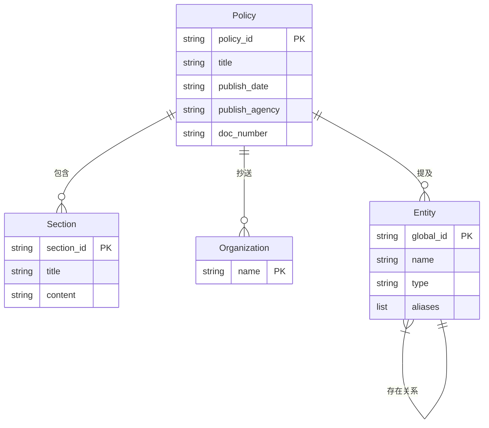

# 数据库设计

<cite>
**本文档引用的文件**
- [README.md](file://README.md)
- [import_policy_data.py](file://scripts/import_policy_data.py)
- [test_neo4j_connection.py](file://scripts/test_neo4j_connection.py)
- [api_server.py](file://backend/api_server.py)
</cite>

## 目录
1. [项目概述](#项目概述)
2. [核心节点类型与属性](#核心节点类型与属性)
3. [节点间关系模型](#节点间关系模型)
4. [Cypher查询示例](#cypher查询示例)
5. [图数据库设计优势](#图数据库设计优势)
6. [图结构示意图](#图结构示意图)

## 项目概述

本项目构建了一个基于Neo4j图数据库的政策法规问答系统，旨在实现政策文本的结构化存储与智能检索。系统通过将非结构化的政策文档解析为图数据模型，结合大语言模型（LLM）实现语义化问答。图数据库作为核心存储引擎，支持高效的实体识别、关系遍历和上下文检索，为RAG（检索增强生成）系统提供精准的数据支持。

**Section sources**
- [README.md](file://README.md#L1-L252)

## 核心节点类型与属性

系统定义了四种核心节点类型：Policy（政策）、Section（章节）、SubSection（子章节）和Agency（机构），每种节点包含特定的属性以描述其语义信息。

### Policy（政策）节点

Policy节点代表完整的政策法规文件，是图模型中的顶层实体。

**关键属性：**
- **policy_id**：政策唯一标识符，基于政策标题的MD5哈希生成
- **title**：政策标题，如"华侨经济文化合作试验区管理办法"
- **publish_date**：发布日期，记录政策生效时间
- **publish_agency**：发布机构，记录政策的发布单位
- **doc_number**：文号，政策的官方编号

```python
# 在import_policy_data.py中的实现
query = (
    "MERGE (p:Policy {policy_id: $policy_id}) "
    "SET p.title = $title, "
    "    p.publish_date = $publish_date, "
    "    p.publish_agency = $publish_agency, "
    "    p.doc_number = $doc_number "
)
```

### Section（章节）节点

Section节点表示政策中的章节，是Policy节点的直接组成部分。

**关键属性：**
- **section_id**：章节唯一标识符，由政策ID和章节标题哈希组合生成
- **title**：章节标题，如"第一章 总则"
- **content**：章节内容文本

```python
# 在import_policy_data.py中的实现
section_query = (
    "MERGE (s:Section {section_id: $section_id}) "
    "SET s.title = $title, "
    "    s.content = $content "
)
```

### SubSection（子章节）节点

SubSection节点表示章节下的具体条款或子章节，是Section节点的细化。

**关键属性：**
- **sub_section_id**：子章节唯一标识符
- **title**：子章节标题，如"第一条"
- **content**：子章节具体内容

（注：代码中通过section_content字段间接表示子章节内容）

### Agency（机构）节点

Agency节点表示政策相关的机构实体，包括发布机构和抄送机构。

**关键属性：**
- **name**：机构名称，如"汕头市人民政府"
- （注：机构节点通过抄送部分提取创建）

```python
# 在import_policy_data.py中的实现
cc_query = (
    "MERGE (o:Organization {name: $org_name}) "
    "MERGE (p:Policy {policy_id: $policy_id}) "
    "MERGE (o)-[:CC]->(p) "
)
```

**Section sources**
- [import_policy_data.py](file://scripts/import_policy_data.py#L314-L349)
- [import_policy_data.py](file://scripts/import_policy_data.py#L383-L417)

## 节点间关系模型

图数据库通过定义明确的关系类型来表达节点间的语义关联，构建了丰富的政策知识网络。

### 主要关系类型

| 关系类型 | 源节点 | 目标节点 | 语义说明 |
|---------|--------|---------|---------|
| BELONGS_TO | Section | Policy | 章节属于某项政策 |
| CC | Organization | Policy | 机构被抄送该政策 |
| MENTIONED_IN | Entity | Policy | 实体在政策中被提及 |
| [动态关系类型] | Entity | Entity | 实体间的语义关系 |

### 关系创建逻辑

- **章节与政策关系**：在创建章节节点时，通过`BELONGS_TO`关系将其连接到所属政策
- **机构与政策关系**：在处理抄送部分时，通过`CC`关系将机构节点连接到政策
- **实体与政策关系**：通过`MENTIONED_IN`关系记录实体在政策中的出现
- **实体间关系**：通过自然语言处理提取的语义关系，动态创建关系类型

```python
# 章节与政策的关系创建
section_query = (
    "MERGE (s:Section {section_id: $section_id}) "
    "SET s.title = $title, "
    "    s.content = $content "
    "MERGE (p:Policy {policy_id: $policy_id}) "
    "MERGE (s)-[:BELONGS_TO]->(p) "
)
```

**Section sources**
- [import_policy_data.py](file://scripts/import_policy_data.py#L383-L417)
- [import_policy_data.py](file://scripts/import_policy_data.py#L499-L533)

## Cypher查询示例

以下是基于Neo4j图数据库的典型Cypher查询语句，用于实现政策法规的智能检索。

### 检索某政策的所有章节

此查询用于获取指定政策下的所有章节及其内容。

```cypher
MATCH (p:Policy {title: "华侨经济文化合作试验区管理办法"})-[:BELONGS_TO]-(s:Section)
RETURN p.title AS policy_title, s.title AS section_title, s.content AS section_content
ORDER BY s.title
```

### 查找特定机构发布的所有政策

此查询用于追溯某机构发布或涉及的所有政策文件。

```cypher
MATCH (o:Organization {name: "汕头市人民政府"})-[:CC]->(p:Policy)
RETURN p.title AS policy_title, p.publish_date AS publish_date, p.doc_number AS doc_number
ORDER BY p.publish_date DESC
```

### 检索包含特定实体的政策条款

此查询结合实体识别，查找提及特定实体（如"华侨"）的政策内容。

```cypher
MATCH (e:Entity {name: "华侨"})-[:MENTIONED_IN]->(p:Policy)
OPTIONAL MATCH (p)<-[:BELONGS_TO]-(s:Section)
RETURN p.title AS policy_title, 
       COALESCE(s.title, "全文提及") AS context,
       COALESCE(s.content, "详见政策全文") AS content
```

**Section sources**
- [api_server.py](file://backend/api_server.py#L46-L71)
- [import_policy_data.py](file://scripts/import_policy_data.py#L314-L349)

## 图数据库设计优势

本系统的图数据库设计为RAG系统提供了强大的上下文检索能力，具有以下显著优势：

### 支持语义检索

通过将政策文本中的实体（如机构、人名、地点）和关系（如"负责"、"管理"、"审批"）显式建模，系统能够理解查询的语义而非简单的关键词匹配。当用户提问"哪些政策涉及华侨投资审批"时，系统可以识别"华侨"、"投资"、"审批"等实体及其关系，精准定位相关条款。

### 高效的关系遍历

图数据库的原生关系存储特性使得多跳查询极为高效。例如，要查找"由A机构发布，涉及B领域，且被C机构执行"的政策，传统数据库需要复杂的JOIN操作，而图数据库只需简单的路径遍历，性能提升显著。

### 提供精准上下文

在RAG系统中，图数据库检索到的结果不仅包含匹配的文本片段，还包含其上下文关系（如所属政策、相关机构、关联条款），这些丰富的上下文信息被整合到提示词（prompt）中，使大语言模型能够生成更准确、更全面的回答。

### 动态知识扩展

系统通过`extract_entities_and_relations`函数从文本中自动抽取实体和关系，使得知识图谱能够随着新政策的导入而动态扩展，保持知识库的时效性和完整性。

**Section sources**
- [README.md](file://README.md#L1-L252)
- [import_policy_data.py](file://scripts/import_policy_data.py#L455-L497)

## 图结构示意图

以下Mermaid图展示了本系统的图数据模型结构：



**Diagram sources**
- [import_policy_data.py](file://scripts/import_policy_data.py#L314-L349)
- [import_policy_data.py](file://scripts/import_policy_data.py#L383-L417)
- [import_policy_data.py](file://scripts/import_policy_data.py#L455-L497)