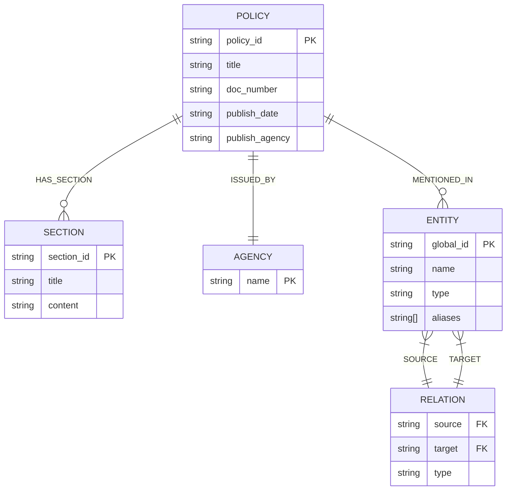
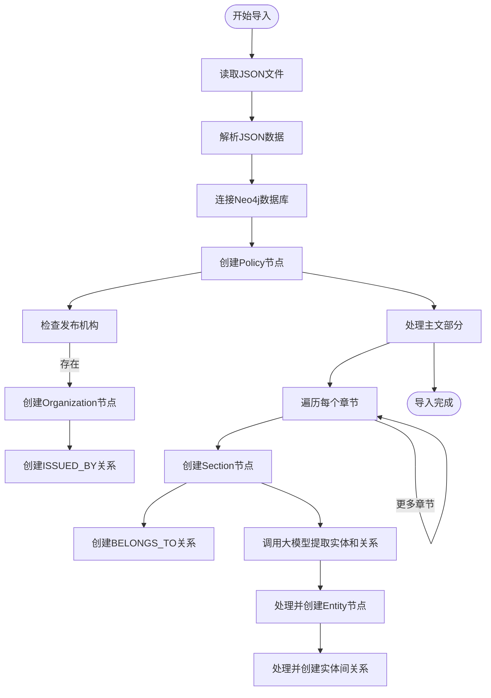

# 数据管理功能

<cite>
**本文档引用的文件**   
- [import_policy_data.py](file://scripts/import_policy_data.py#L0-L573)
- [test_neo4j_connection.py](file://scripts/test_neo4j_connection.py#L0-L24)
- [test_ollama_connection.py](file://scripts/test_ollama_connection.py#L0-L24)
- [[OCR]_华侨经济文化合作试验区.json](file://database/[OCR]_华侨经济文化合作试验区.json#L0-L38)
- [README.md](file://README.md#L13-L229)
</cite>

## 目录
1. [数据导入流程概述](#数据导入流程概述)
2. [JSON文件结构设计](#json文件结构设计)
3. [脚本功能与节点关系创建](#脚本功能与节点关系创建)
4. [运行前提与命令示例](#运行前提与命令示例)
5. [数据预处理与实体去重机制](#数据预处理与实体去重机制)
6. [系统扩展性分析](#系统扩展性分析)

## 数据导入流程概述

`import_policy_data.py` 脚本是本系统中负责将政策法规数据从静态JSON文件导入Neo4j图数据库的核心组件。该脚本读取位于 `database` 目录下的JSON格式政策文件，解析其内容，并将其结构化地存储到图数据库中，为后续的RAG问答系统提供知识图谱支持。

整个流程始于脚本的主程序入口，通过调用 `import_policy_data()` 函数启动。该函数首先加载指定路径的JSON文件（如 `./database/[OCR]_华侨经济文化合作试验区.json`），然后创建一个 `ResultCollector` 实例用于收集和统计处理过程中的各类数据。在成功建立与Neo4j数据库的连接后，脚本会启动一个数据库会话，并执行 `create_policy_nodes` 函数，将解析出的政策数据以节点和关系的形式写入数据库。

**Section sources**
- [import_policy_data.py](file://scripts/import_policy_data.py#L535-L557)
- [import_policy_data.py](file://scripts/import_policy_data.py#L0-L573)

## JSON文件结构设计

JSON格式的政策文件遵循一个清晰的结构化设计，以便于脚本进行解析。文件的主要字段包括：

- **title**: 政策标题，例如 `"汕华管委规"`。
- **doc_number**: 文号，用于标识政策文件的编号。
- **publish_agency**: 发布机构，指明发布该政策的政府部门或组织。
- **publish_date**: 发布日期，记录政策的发布时间。
- **notification_body**: 通知正文，通常包含对政策适用对象的说明。
- **main_body**: 主文部分，这是一个数组，包含多个章节对象。每个章节对象包含 `section_title`（章节标题）和 `content`（章节内容）两个字段。
- **ending**: 结尾部分，用于存放政策的结束语或附加说明。
- **cc**: 抄送部分，列出需要知晓该政策的其他机构。

这种设计使得政策法规的层次结构（如章、节、条）能够被完整保留，并方便地映射到图数据库中的节点。



**Diagram sources**
- [[OCR]_华侨经济文化合作试验区.json](file://database/[OCR]_华侨经济文化合作试验区.json#L0-L38)
- [import_policy_data.py](file://scripts/import_policy_data.py#L315-L453)

**Section sources**
- [[OCR]_华侨经济文化合作试验区.json](file://database/[OCR]_华侨经济文化合作试验区.json#L0-L38)

## 脚本功能与节点关系创建

`import_policy_data.py` 脚本的核心功能是创建图数据库中的节点（Node）和关系（Relationship）。它根据JSON文件的内容，创建以下几种主要节点：

- **Policy节点**: 代表一个完整的政策法规。节点属性包括 `policy_id`、`title`、`doc_number`、`publish_date` 和 `publish_agency`。
- **Section节点**: 代表政策中的一个章节。节点属性包括 `section_id`、`title` 和 `content`。
- **Organization节点**: 代表发布机构或抄送机构。节点属性为 `name`。
- **Entity节点**: 代表从文本中提取出的实体，如人名、地名、组织名等。节点属性包括 `global_id`、`name`、`type` 和 `aliases`。

同时，脚本会建立以下关键关系：

- **HAS_SECTION**: 连接 `Policy` 节点和 `Section` 节点，表示一个政策包含多个章节。
- **ISSUED_BY**: 连接 `Policy` 节点和 `Organization` 节点，表示该政策由哪个机构发布。
- **CC**: 连接 `Policy` 节点和 `Organization` 节点，表示该政策抄送至哪个机构。
- **BELONGS_TO**: 连接 `Section` 节点和 `Policy` 节点，表示一个章节属于某个政策。
- **MENTIONED_IN**: 连接 `Entity` 节点和 `Policy` 节点，表示某个实体在该政策中被提及。
- **实体间关系**: 通过大模型服务提取的实体间关系，如 `RELATED_TO`、`MANAGES` 等，直接以关系类型创建在两个 `Entity` 节点之间。



**Diagram sources**
- [import_policy_data.py](file://scripts/import_policy_data.py#L315-L453)
- [import_policy_data.py](file://scripts/import_policy_data.py#L455-L533)

**Section sources**
- [import_policy_data.py](file://scripts/import_policy_data.py#L315-L453)

## 运行前提与命令示例

在运行 `import_policy_data.py` 脚本之前，必须满足以下前提条件：

1.  **启动Neo4j服务**: 确保Neo4j图数据库服务已经启动并正在运行。可以使用Neo4j Desktop或命令行方式启动。
2.  **配置环境变量**: 在项目根目录下创建 `.env` 文件，并正确配置以下环境变量：
    ```bash
    NEO4J_URI=neo4j://localhost:7687
    NEO4J_USERNAME=neo4j
    NEO4J_PASSWORD=your_password
    LLM_API_URL=http://120.232.79.82:11434
    LLM_MODEL=llama3.2:latest
    ```
3.  **安装依赖**: 确保已通过 `pip install -r requirements.txt` 安装了所有必要的Python包。

运行脚本的命令示例如下：
```bash
python scripts/import_policy_data.py
```

脚本执行后，会输出详细的处理日志，包括成功创建的节点和关系数量，并在最后打印一个数据处理结果摘要。

**Section sources**
- [README.md](file://README.md#L13-L229)
- [import_policy_data.py](file://scripts/import_policy_data.py#L0-L573)

## 数据预处理与实体去重机制

在将数据导入数据库之前，脚本执行了重要的数据预处理步骤。首先，对于OCR识别结果，脚本通过调用大模型服务（Ollama）来清洗和结构化文本。`call_large_language_model` 函数负责向大模型服务发送请求，利用专门设计的prompt指令，从非结构化的文本中提取出结构化的实体和关系。

为了确保数据的唯一性和一致性，系统实现了强大的实体去重机制。`EntityResolver` 类是实现这一机制的核心。它通过以下方式工作：
1.  为每个实体生成一个基于名称和别名的全局唯一ID（`global_id`）。
2.  维护一个 `alias_to_global_id` 映射表，将实体的所有别名（包括全称、缩写、昵称等）映射到同一个全局ID。
3.  当发现一个新出现的实体别名已在映射表中存在时，便将其归并到已有的实体下，从而避免了同一实体的重复创建。

此外，`sanitize_relation_type` 函数会对从大模型提取出的关系类型进行规范化处理，移除特殊字符并转换为驼峰命名法，确保关系类型的格式统一。

**Section sources**
- [import_policy_data.py](file://scripts/import_policy_data.py#L121-L177)
- [import_policy_data.py](file://scripts/import_policy_data.py#L180-L191)
- [import_policy_data.py](file://scripts/import_policy_data.py#L194-L255)

## 系统扩展性分析

当前系统采用静态JSON文件作为数据源，这种方式简单直接，适用于数据量不大且更新不频繁的场景。然而，这也限制了系统的实时性和自动化能力。

未来，系统可以向以下几个方向进行扩展：
- **支持数据库动态获取**: 将数据源从本地文件扩展到关系型数据库（如MySQL、PostgreSQL）或NoSQL数据库，实现与现有业务系统的无缝对接。
- **支持API动态获取**: 通过调用政府公开数据API或第三方数据服务API，实现政策法规数据的自动抓取和实时更新。
- **支持多种文件格式**: 除了JSON，还可以支持PDF、Word等原始文件格式，通过集成更强大的文档解析工具（如Apache Tika）来提取内容。
- **增量导入机制**: 实现基于时间戳或版本号的增量导入，避免每次全量导入带来的性能开销。

这些扩展将使数据管理功能更加灵活和强大，更好地适应复杂多变的应用场景。