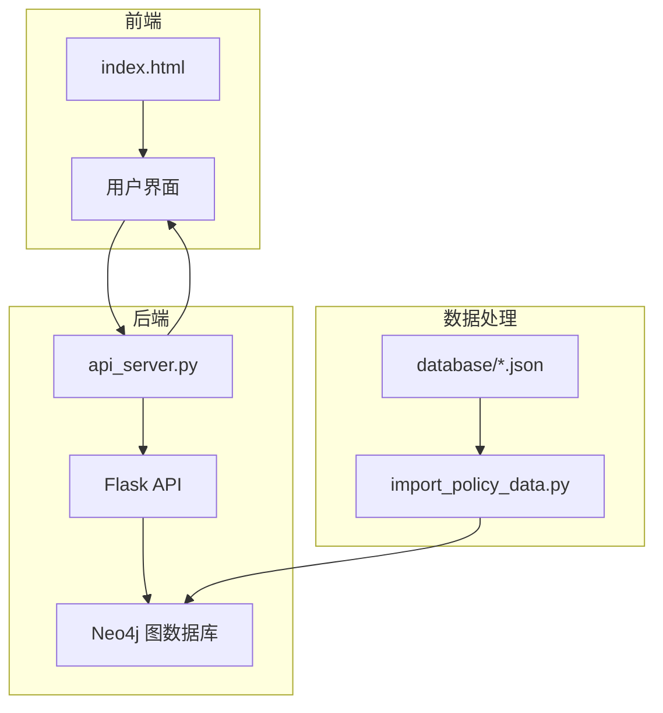
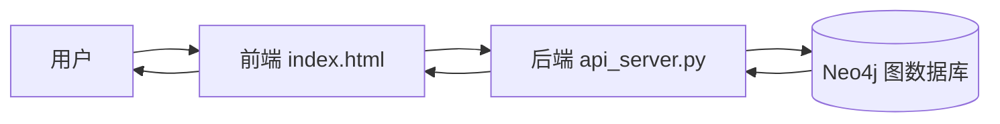
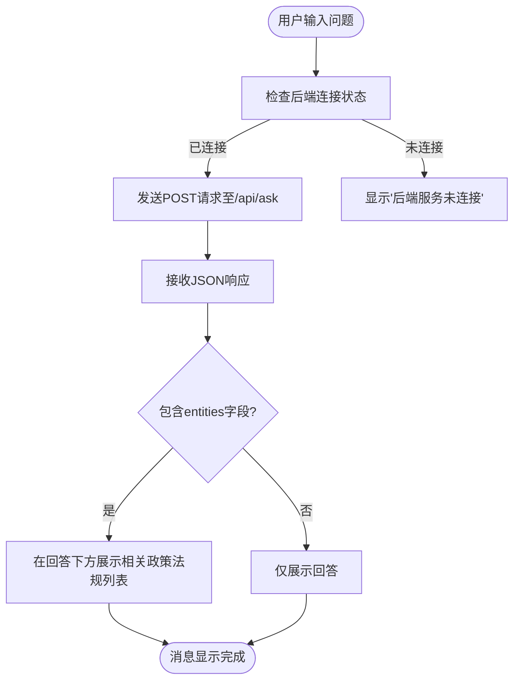
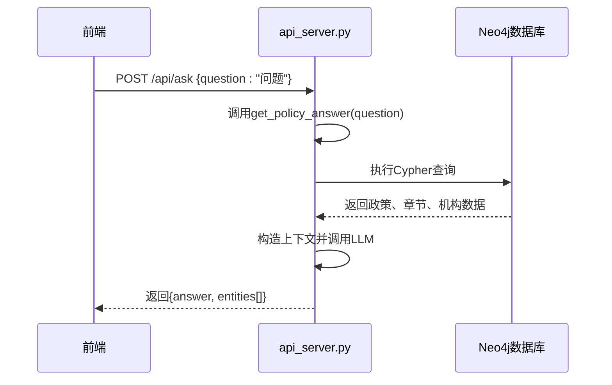
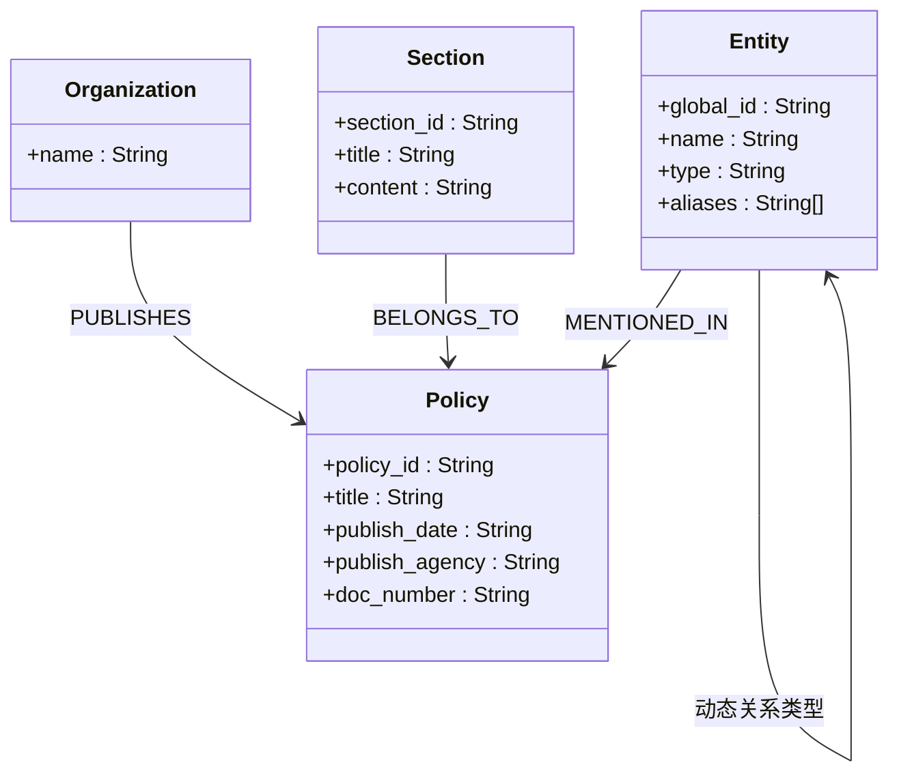
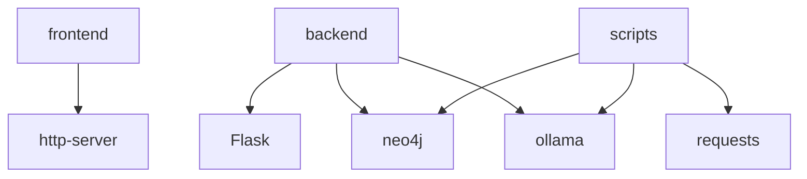

# 实体关系展示功能

<cite>
**本文档引用的文件**  
- [index.html](file://frontend/index.html)
- [api_server.py](file://backend/api_server.py)
- [import_policy_data.py](file://scripts/import_policy_data.py)
- [package.json](file://frontend/package.json)
</cite>

## 目录
1. [项目结构](#项目结构)  
2. [核心组件](#核心组件)  
3. [架构概述](#架构概述)  
4. [详细组件分析](#详细组件分析)  
5. [依赖分析](#依赖分析)  

## 项目结构

本项目采用前后端分离架构，主要分为以下模块：

- `backend/`：后端服务，基于Flask构建，负责与Neo4j图数据库交互并提供API接口。
- `frontend/`：前端界面，包含HTML、CSS和JavaScript，实现用户交互。
- `scripts/`：数据处理脚本，用于将政策法规数据导入Neo4j数据库。
- `database/`：存储原始政策法规数据的JSON文件。

**图源**  
- [index.html](file://frontend/index.html)
- [api_server.py](file://backend/api_server.py)
- [import_policy_data.py](file://scripts/import_policy_data.py)

## 核心组件

系统核心功能围绕政策法规实体关系的构建与展示展开。后端通过`api_server.py`提供问答API，前端通过`index.html`接收用户输入并展示结果。实体关系数据由`import_policy_data.py`脚本从JSON文件解析并导入Neo4j数据库。

**组件源**  
- [api_server.py](file://backend/api_server.py#L1-L120)
- [index.html](file://frontend/index.html#L1-L254)
- [import_policy_data.py](file://scripts/import_policy_data.py#L1-L574)

## 架构概述

系统整体架构为典型的三层结构：前端展示层、后端服务层、数据存储层。用户在前端输入问题，前端通过HTTP请求调用后端API，后端查询Neo4j数据库并结合大模型生成回答，最终将结果返回前端展示。

**图源**  
- [index.html](file://frontend/index.html)
- [api_server.py](file://backend/api_server.py)

## 详细组件分析

### 前端组件分析

前端通过`index.html`实现用户交互界面，包含输入框、消息显示区和连接状态指示。其JavaScript逻辑负责发送用户问题至后端，并将返回的政策实体信息以列表形式展示。

**图源**  
- [index.html](file://frontend/index.html#L54-L253)

**组件源**  
- [index.html](file://frontend/index.html#L1-L254)

### 后端API分析

后端`api_server.py`文件定义了`/api/ask`接口，接收用户问题，通过`query_neo4j`函数在Neo4j中查询相关政策实体，并调用大模型生成自然语言回答。

**图源**  
- [api_server.py](file://backend/api_server.py#L46-L84)

**组件源**  
- [api_server.py](file://backend/api_server.py#L1-L120)

### 数据导入与实体关系构建

`import_policy_data.py`脚本负责将JSON格式的政策数据导入Neo4j。它创建`Policy`、`Organization`、`Section`等节点，并建立`PUBLISHES`、`BELONGS_TO`、`MENTIONED_IN`等关系。

**图源**  
- [import_policy_data.py](file://scripts/import_policy_data.py#L314-L384)

**组件源**  
- [import_policy_data.py](file://scripts/import_policy_data.py#L1-L574)

## 依赖分析

系统依赖关系清晰，前端依赖HTTP服务运行，后端依赖Flask、Neo4j Python驱动和Ollama客户端。数据处理脚本依赖requests库调用大模型API。

**图源**  
- [package.json](file://frontend/package.json)
- [api_server.py](file://backend/api_server.py#L1-L10)
- [import_policy_data.py](file://scripts/import_policy_data.py#L1-L10)

**组件源**  
- [package.json](file://frontend/package.json)
- [api_server.py](file://backend/api_server.py)
- [import_policy_data.py](file://scripts/import_policy_data.py)