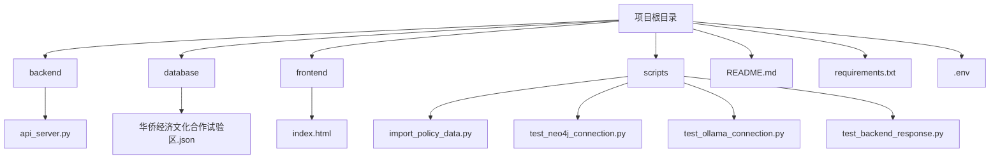
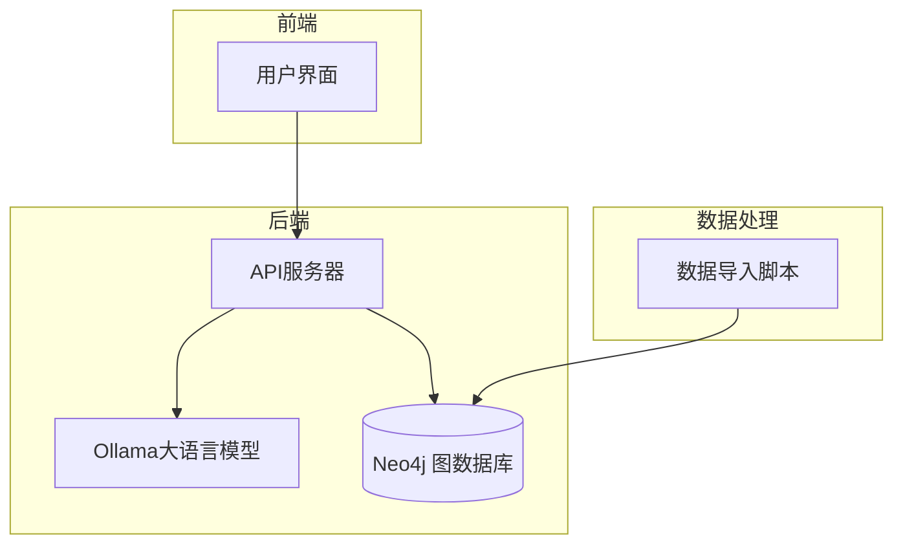
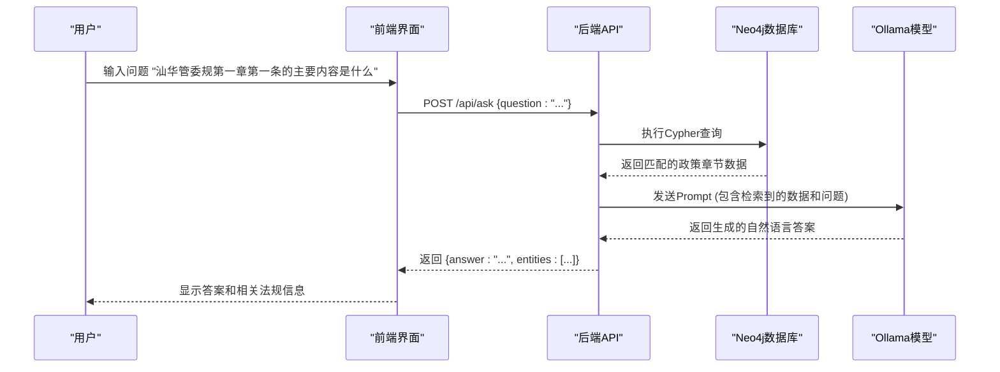

# 系统概述

<cite>
**本文档引用的文件**   
- [api_server.py](file://backend/api_server.py)
- [import_policy_data.py](file://scripts/import_policy_data.py)
- [index.html](file://frontend/index.html)
- [README.md](file://README.md)
- [华侨经济文化合作试验区.json](file://database/华侨经济文化合作试验区.json)
- [.env](file://.env)
</cite>

## 目录
1. [项目结构](#项目结构)
2. [核心组件](#核心组件)
3. [系统架构](#系统架构)
4. [数据流分析](#数据流分析)
5. [数据导入与知识图谱构建](#数据导入与知识图谱构建)
6. [问答功能实现](#问答功能实现)
7. [前端用户界面](#前端用户界面)
8. [环境配置](#环境配置)

## 项目结构

本项目采用分层架构，将前端、后端、数据和脚本分离，确保各组件职责清晰。



**图源**
- [README.md](file://README.md)

## 核心组件

系统由四个核心组件构成，协同工作以实现智能问答功能。

**后端服务 (backend/api_server.py)**: 基于Flask框架构建的RESTful API服务器，负责处理前端请求、与Neo4j数据库交互、调用Ollama大语言模型，并将结果返回给前端。

**图数据库 (Neo4j)**: 作为系统的知识存储核心，Neo4j用于存储从政策法规中提取的实体（如机构、政策、条款）及其复杂关系，形成结构化的知识图谱。

**大语言模型 (Ollama)**: 提供强大的自然语言理解和生成能力。系统利用Ollama进行实体识别、关系抽取，并基于检索到的上下文生成最终的自然语言答案。

**前端界面 (frontend/index.html)**: 一个简单的单页应用（SPA），为用户提供友好的聊天式交互界面，允许用户输入问题并查看系统生成的答案和相关法规信息。

**脚本工具 (scripts/)**: 包含一系列Python脚本，用于数据导入、服务连接测试和系统演示，是系统初始化和维护的关键工具。

**文档来源**
- [README.md](file://README.md)
- [api_server.py](file://backend/api_server.py)
- [index.html](file://frontend/index.html)

## 系统架构

系统采用典型的检索增强生成（RAG）架构，结合了结构化数据查询和非结构化文本生成的优势。



**图源**
- [README.md](file://README.md)

## 数据流分析

从用户提问到答案生成，数据在系统中经历一个清晰的流程。



**图源**
- [api_server.py](file://backend/api_server.py)
- [index.html](file://frontend/index.html)

## 数据导入与知识图谱构建

数据导入脚本 `scripts/import_policy_data.py` 负责将非结构化的JSON政策文件转化为Neo4j中的知识图谱。

1.  **读取原始数据**: 脚本读取 `database/华侨经济文化合作试验区.json` 文件，该文件包含政策的章节和条款。
2.  **调用大模型**: 脚本将文本块（如通知正文、章节内容）发送给Ollama大模型，使用专门的Prompt指令模型识别文本中的实体（如“华侨试验区深汕数字科创产业园管理办公室”）和关系（如“负责”）。
3.  **实体归一化**: 通过 `EntityResolver` 类，脚本确保同一实体的不同表述（如全称和简称）被映射到同一个全局ID，避免数据冗余。
4.  **写入图数据库**: 脚本使用Neo4j的 `MERGE` 语句创建节点（Policy, Section, Entity, Organization）和关系（BELONGS_TO, PUBLISHES, MENTIONED_IN, 以及各种实体间的关系），构建完整的知识图谱。

**文档来源**
- [import_policy_data.py](file://scripts/import_policy_data.py)
- [华侨经济文化合作试验区.json](file://database/华侨经济文化合作试验区.json)

## 问答功能实现

问答功能的核心逻辑在 `backend/api_server.py` 的 `get_policy_answer` 函数中实现。

1.  **接收请求**: Flask后端通过 `/api/ask` 接口接收前端发来的POST请求，获取用户问题。
2.  **检索相关数据**: 后端使用Cypher查询在Neo4j中搜索与问题关键词（如“第一章”、“第一条”）相关的政策、章节和条款内容。
3.  **构造Prompt**: 将检索到的上下文信息（政策标题、章节内容、发布机构等）与用户问题一起，构造一个详细的Prompt，发送给Ollama模型。
4.  **生成答案**: Ollama模型根据提供的上下文，生成一个简洁、准确且引用了具体法规的自然语言回答。
5.  **返回结果**: 后端将生成的答案和检索到的原始法规信息（用于溯源）打包成JSON，返回给前端。

```python
def get_policy_answer(question):
    # ... (与数据库交互)
    prompt = (
        f"你是一个政策法规专家。请根据以下信息回答用户的问题：\n\n"
        f"{context}\n"
        f"用户的问题是：{question}\n"
        f"请用简洁、准确的语言回答，并在回答中引用政策标题和具体章节或条款。"
    )
    response = client.chat(model=LLM_MODEL, messages=[{"role": "user", "content": prompt}])
    return {"answer": response['message']['content'], "entities": results}
```

**文档来源**
- [api_server.py](file://backend/api_server.py#L45-L118)

## 前端用户界面

前端界面 `frontend/index.html` 提供了一个直观的聊天机器人体验。

-   **布局**: 采用现代化的聊天窗口设计，包含消息显示区、输入框和发送按钮。
-   **交互**: 用户可以在输入框中输入问题，按回车或点击发送按钮提交。
-   **状态监控**: 界面右上角有一个状态指示器，通过定时向后端发送测试请求，实时显示“已连接”或“未连接”状态。
-   **结果显示**: 答案以“回答:”开头显示，下方会列出相关的政策法规条目，增强了答案的可信度和可追溯性。

**文档来源**
- [index.html](file://frontend/index.html)

## 环境配置

系统的正常运行依赖于正确的环境配置。

1.  **创建 .env 文件**: 在项目根目录下创建 `.env` 文件，配置以下关键参数：
    ```env
    # Neo4j连接配置
    NEO4J_URI=neo4j://localhost:7687
    NEO4J_USERNAME=neo4j
    NEO4J_PASSWORD=your_password
    
    # Ollama大模型配置
    LLM_BINDING=ollama
    LLM_MODEL=llama3.2:latest
    LLM_BINDING_HOST=http://120.232.79.82:11434
    ```
2.  **启动依赖服务**: 按顺序启动Neo4j数据库和Ollama服务。
3.  **导入数据**: 运行 `python scripts/import_policy_data.py` 将JSON数据导入Neo4j。
4.  **启动后端**: 运行 `python backend/api_server.py` 启动Flask服务。
5.  **启动前端**: 进入 `frontend` 目录，运行 `npm start` 启动前端服务器。

**文档来源**
- [README.md](file://README.md)
- [.env](file://.env)