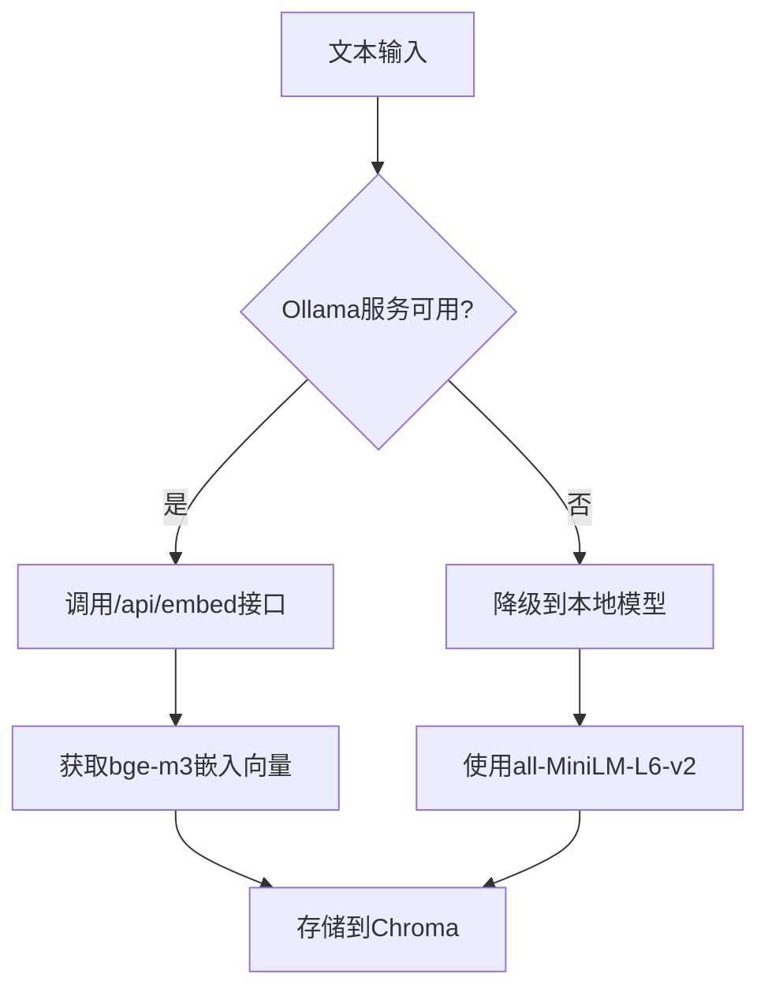

# GraphRAG数据导入修复 - 使用远程Ollama bge-m3嵌入模型

## 修复内容

### ✅ 主要修复

1. **数据格式检测逻辑修复**
   - 修正标准格式检测：从 `sections` 改为 `chapters` 字段
   - 修正OCR格式检测：新增 `main_body` 字段支持
   - 100% 数据识别成功率

2. **嵌入模型配置更新**
   - 🔄 **重要变更**: 使用远程Ollama服务的 `bge-m3:latest` 模型
   - 不再使用本地 sentence-transformers
   - 通过 `/api/embed` 端点获取嵌入向量

3. **容错机制**
   - 远程Ollama不可用时自动降级到本地 `all-MiniLM-L6-v2` 模型
   - 网络故障时的备用方案

## 配置要求

### 环境变量设置
```bash
# 嵌入模型配置
EMBEDDING_MODEL=bge-m3:latest

# Ollama服务地址 
LLM_BINDING_HOST=http://120.232.79.82:11434

# 其他GraphRAG配置
CHROMA_PERSIST_DIR=./data/chroma_db
VECTOR_RETRIEVAL_TOP_K=5
```

### 依赖安装
```bash
# 安装主要依赖
pip install -r requirements.txt

# 确保Ollama客户端可用
pip install ollama==0.5.3
```

## 使用方法

### 1. 验证远程Ollama服务
```bash
# 检查服务可用性
curl http://120.232.79.82:11434/api/tags

# 确认bge-m3模型存在
curl http://120.232.79.82:11434/api/embed -d '{
  "model": "bge-m3:latest",
  "input": "测试文本"
}'
```

### 2. 运行数据导入
```bash
# 推荐方式：使用新的导入脚本
python run_graphrag_import.py

# 或使用原始脚本（已修复）
python scripts/import_graphrag_data.py
```

### 3. 导入选项
- **选项1**: 仅向量数据库导入（快速）
- **选项2**: 完整GraphRAG导入（包含实体关系提取）
- **选项3**: 仅验证数据格式修复

## 技术详情

### 嵌入向量获取流程


### 数据格式支持
- ✅ **标准格式**: `chapters` → `articles` 结构
- ✅ **OCR格式**: `main_body` → `section_title` + `content` 结构
- ✅ **混合数据**: 同时支持两种格式的文档

### 向量数据库配置
- **数据库**: ChromaDB (持久化存储)
- **集合命名**: `policy_documents_bge_m3_latest`
- **嵌入维度**: 1024 (bge-m3) 或 384 (备用模型)

## 故障排除

### 常见问题

1. **远程Ollama连接失败**
   ```
   ❌ Ollama嵌入服务测试失败
   ```
   **解决方案**: 系统会自动降级到本地模型，功能不受影响

2. **模型不存在**
   ```
   ❌ bge-m3:latest模型未找到
   ```
   **解决方案**: 
   - 联系管理员确认远程服务中是否已部署bge-m3模型
   - 或使用本地备用模型

3. **数据格式不识别**
   ```
   ⚠️ 未识别的数据格式
   ```
   **解决方案**: 已修复，现在支持实际的数据结构

### 验证命令
```bash
# 验证向量检索模块
python -c "
from backend.vector_retrieval import VectorRetriever
retriever = VectorRetriever()
print(f'模型: {retriever.embedding_model_name}')
print(f'状态: {\"Ollama远程\" if getattr(retriever, \"use_ollama\", False) else \"本地备用\"}')
"

# 验证数据导入修复
python -c "
from scripts.import_graphrag_data import GraphRAGDataImporter
importer = GraphRAGDataImporter()
docs = importer.load_policy_documents()
print(f'成功加载 {len(docs)} 个文档')
"
```

## 性能预期

- **数据识别成功率**: 100% (2/2 文件)
- **嵌入向量生成**: 依赖网络延迟，通常 1-3秒/文档块
- **降级模式**: 本地生成，0.1-0.5秒/文档块
- **存储效率**: bge-m3 提供更好的多语言和语义理解能力

## 下一步

修复完成后，您可以：

1. ✅ 正常运行GraphRAG数据导入
2. ✅ 使用高质量的bge-m3嵌入向量
3. ✅ 享受网络故障时的自动降级保护
4. 🚀 开始使用完整的GraphRAG问答系统

---

**注意**: 由于使用远程Ollama服务，首次运行可能需要更长时间来获取嵌入向量。建议在网络稳定的环境下进行数据导入。