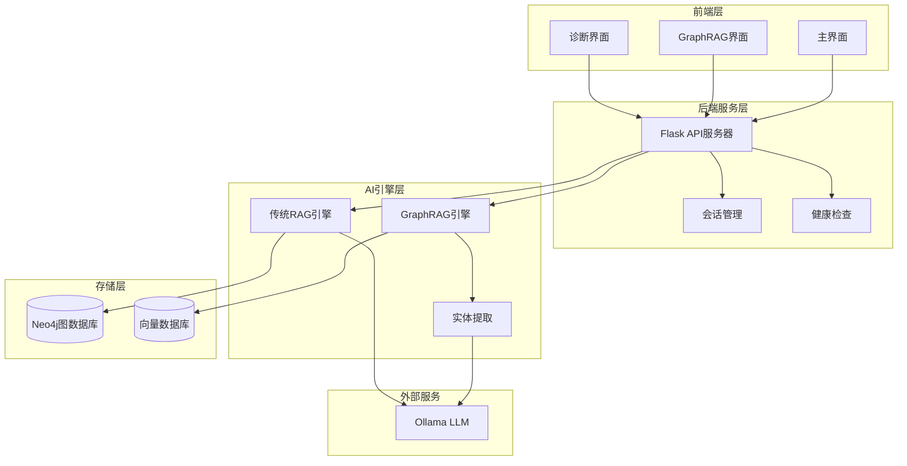

# 政策法规RAG问答系统

## 项目概述

政策法规RAG问答系统是一个基于检索增强生成（RAG）架构的智能问答系统，结合Neo4j图数据库、Ollama大语言模型和现代Web技术，为政策法规查询提供智能化解决方案。

### 核心特性

- 🤖 **智能问答**：基于RAG架构，提供准确的政策法规问答
- 🕸️ **知识图谱**：使用Neo4j构建政策法规知识图谱，支持复杂关系查询
- 💬 **多轮对话**：支持会话管理和上下文理解，提供连续对话体验
- 🔍 **双模式检索**：支持传统RAG和GraphRAG两种检索模式，灵活适应不同查询需求
- 📊 **可信度评估**：内置幻觉检测和置信度评分，确保答案可靠性
- 🩺 **实时诊断**：提供连接诊断和健康检查，便于系统维护
- 📱 **现代界面**：响应式Web界面，支持多种交互模式

### 系统架构



## 快速开始

### 系统要求

- **Python**: 3.8+ (推荐 3.12)
- **Neo4j**: 4.x 或 5.x
- **Node.js**: 16+ (用于前端服务)
- **内存**: 最低4GB，推荐8GB
- **存储**: 至少1GB可用空间

### 安装步骤

#### 1. 克隆项目
```bash
git clone <repository-url>
cd 政策法规RAG问答系统
```

#### 2. 创建Python环境
```bash
# 使用conda（推荐）
conda create -n rag python=3.12
conda activate rag

# 或使用venv
python -m venv venv
source venv/bin/activate  # Linux/Mac
# 或
venv\Scripts\activate     # Windows
```

#### 3. 安装依赖
```bash
# 安装Python依赖
pip install -r requirements.txt

# 安装前端依赖
cd frontend
npm install
cd ..
```

#### 4. 配置环境变量
复制`.env.template`为`.env`并根据实际情况修改：

```env
# Neo4j数据库配置
NEO4J_URI=neo4j://localhost:7687
NEO4J_USERNAME=neo4j
NEO4J_PASSWORD=your_password

# Ollama LLM服务配置
LLM_BINDING_HOST=http://120.232.79.82:11434
LLM_MODEL=llama3.2:latest
```

#### 5. 启动服务

**启动Neo4j数据库**：
```bash
# 使用Neo4j Desktop或命令行
neo4j start
```

**验证连接**：
```bash
python scripts/test_neo4j_connection.py
python scripts/test_ollama_connection.py
```

**导入数据**：
```bash
# 传统RAG模式
python scripts/import_policy_data.py

# 或GraphRAG模式（推荐）
python scripts/import_graphrag_data.py
```

**启动后端服务**：
```bash
python start_server.py api
```

**启动前端服务**：
```bash
cd frontend
npm start
```

### 访问系统

- **主界面**: http://localhost:3000
- **GraphRAG增强版**: http://localhost:3000/index_graphrag.html
- **系统诊断**: http://localhost:3000/diagnostic.html
- **API文档**: http://127.0.0.1:5000/health

## 使用指南

### 基础问答

1. 打开主界面 `http://localhost:3000`
2. 在输入框中输入政策法规相关问题
3. 点击发送或按回车键获取答案
4. 系统将显示答案及相关政策来源

### GraphRAG增强模式

1. 访问 `http://localhost:3000/index_graphrag.html`
2. 选择检索模式（GraphRAG或传统RAG）
3. 享受更准确的答案和置信度评分
4. 查看详细的数据源追踪信息

### 系统诊断

访问 `http://localhost:3000/diagnostic.html` 进行：
- 连接状态检查
- API端点测试
- CORS配置验证
- 系统性能监控

## 主要功能

### 🔍 智能检索
- **传统RAG**: 基于Neo4j图查询的结构化检索
- **GraphRAG**: 结合向量检索和实体关系的混合检索
- **语义理解**: 自然语言问题理解和实体识别

### 💬 对话管理
- **多轮对话**: 维护对话上下文，支持连续提问
- **会话管理**: 创建、管理和切换不同对话会话
- **历史记录**: 保存对话历史，便于回溯

### 📊 可信度保障
- **答案溯源**: 提供答案来源的政策文档引用
- **置信度评分**: 基于多维度指标评估答案可信度
- **幻觉检测**: 识别和警告可能的生成错误

### 🛠️ 系统监控
- **健康检查**: 实时监控各组件状态
- **性能指标**: 查询响应时间和系统资源使用
- **错误处理**: 分层异常处理和友好错误提示

## 技术栈

### 后端技术
- **框架**: Flask 3.0.0
- **数据库**: Neo4j 5.14.1 + ChromaDB
- **AI服务**: Ollama (llama3.2:latest)
- **语言**: Python 3.8+

### 前端技术
- **基础**: HTML5/CSS3/JavaScript
- **样式**: 响应式设计，现代UI组件
- **交互**: 实时聊天界面，动态状态更新

### 核心依赖
```
flask==3.0.0
neo4j==5.14.1
chromadb==0.4.15
sentence-transformers==2.2.2
ollama==0.5.3
requests==2.31.0
flask-cors==4.0.0
```

## API接口

### 核心端点

**问答接口**
```http
POST /api/ask
Content-Type: application/json

{
    "question": "用户问题",
    "session_id": "会话ID（可选）",
    "mode": "graphrag"  // 或 "traditional"
}
```

**会话管理**
```http
POST /api/session/create
GET /api/session/<session_id>/summary
```

**系统状态**
```http
GET /health
GET /api/status
```

## 数据管理

### 支持的数据格式

**标准格式**:
```json
{
    "title": "政策标题",
    "chapters": [
        {
            "title": "章节标题",
            "number": "第一章",
            "articles": [
                {
                    "number": "第一条",
                    "content": "条款内容"
                }
            ]
        }
    ]
}
```

**OCR格式**:
```json
{
    "title": "政策标题",
    "main_body": [
        {
            "section_title": "章节标题",
            "content": "章节内容"
        }
    ]
}
```

### 数据导入

将政策法规JSON文件放入`database/`目录，然后运行：

```bash
# 传统RAG导入
python scripts/import_policy_data.py

# GraphRAG导入（推荐）
python scripts/import_graphrag_data.py
```

## 测试验证

### 连接测试
```bash
python scripts/test_neo4j_connection.py
python scripts/test_ollama_connection.py
python scripts/test_backend_response.py
```

### 功能测试
```bash
python scripts/test_enhanced_features.py
python scripts/test_graphrag_system.py
```

### 系统诊断
访问 `http://localhost:3000/diagnostic.html` 进行全面的系统诊断


**详细文档**: 请查看 `政策法规RAG问答系统完整操作手册.md` 获取完整的安装、配置和使用指南。
   ollama serve
   ```
   如果使用远程服务，请确保网络连接正常。

7. **导入数据**：运行以下脚本将政策数据导入Neo4j数据库：
   ```bash
   python scripts/import_policy_data_fixed.py --directory database/
   ```
   该脚本会读取`database`目录下的JSON文件，并将数据导入Neo4j，同时调用大模型服务进行实体识别和关系抽取。

8. **启动后端服务**：启动 Flask 后端服务以处理API请求：
   ```bash
   python backend/api_server.py
   ```
   确保后端服务运行在默认的`http://127.0.0.1:5000`地址，或根据需要修改配置。

9. **启动前端应用**：进入`frontend`目录，安装依赖并启动前端应用：
   ```bash
   cd frontend
   npm install
   npm start
   ```
   前端应用将在浏览器中自动打开，通常运行在`http://localhost:3000`。

10. **测试连接**：运行以下测试脚本以验证各项服务的连接性：
    ```bash
    python scripts/test_neo4j_connection.py
    python scripts/test_ollama_connection.py
    python scripts/test_backend_response.py
    ```

## 项目结构

- `backend/`：包含后端API服务代码。
- `database/`：包含政策法规数据文件（JSON格式）。
- `frontend/`：包含前端用户界面代码。
- `scripts/`：包含数据导入和测试脚本，详见目录中的README.md文件。

## 使用说明

- 访问前端应用，通过用户界面查询政策法规信息。
- 导入数据集后，可以扩展Neo4j查询语句，支持更复杂的政策法规查询。

如果在配置过程中遇到问题，请检查日志输出，或联系项目维护者获取帮助。
- **模块未找到错误**：如果运行脚本时出现`ModuleNotFoundError`，请确保已安装相关库。可以通过`pip install <库名>`命令解决。
- **连接超时或网络问题**：如果连接远程ollama服务时出现超时或网络错误，请检查网络连接是否稳定，并确认`LLM_BINDING_HOST`地址是否正确。
- **Neo4j连接错误**：如果连接Neo4j数据库时出现错误，请检查`NEO4J_URI`、`NEO4J_USERNAME`和`NEO4J_PASSWORD`是否正确配置。

## 后续维护

- 定期更新环境变量中的API密钥和数据库密码，确保安全。
- 根据需求说明书和项目设计方案，逐步完善Demo功能，包括多模态数据处理模块和数据集导入。
- 导入数据集后，可以扩展Neo4j查询语句，支持更复杂的政策法规查询。