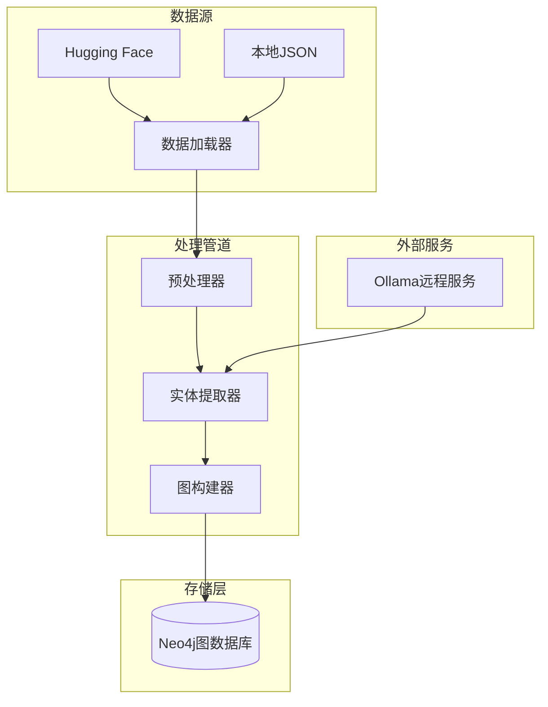

# HotpotQA数据集导入功能使用指南

## 概述

HotpotQA数据集导入功能是政策法规RAG问答系统的重要扩展，用于将HotpotQA开放域问答数据集导入到Neo4j图数据库中，支持GraphRAG系统的研究和评估实验。

### 主要功能

- **数据获取**: 从Hugging Face或本地文件加载HotpotQA数据集
- **智能预处理**: 文本清洗、段落分割、支持事实提取
- **实体关系提取**: 基于Ollama大模型的智能实体识别和关系推断
- **知识图谱构建**: 创建结构化的Neo4j图谱，支持复杂查询
- **批处理支持**: 高效的批量处理和进度监控
- **统计分析**: 详细的导入统计和质量评估

## 架构概览



## 环境准备

### 1. 依赖安装

```bash
# 安装HotpotQA相关依赖
pip install datasets==2.14.0
pip install transformers>=4.21.0
pip install torch>=1.12.0  # 可选，用于本地向量化
```

### 2. 环境变量配置

在项目根目录的`.env`文件中配置以下环境变量：

```bash
# Neo4j数据库配置
NEO4J_URI=bolt://localhost:7687
NEO4J_USERNAME=neo4j
NEO4J_PASSWORD=newpassword

# Ollama服务配置（使用远程服务）
LLM_BINDING_HOST=http://120.232.79.82:11434

# HotpotQA处理配置（可选）
HOTPOTQA_BATCH_SIZE=50
HOTPOTQA_MAX_QUESTIONS=200
HOTPOTQA_CACHE_DIR=./cache/hotpotqa
```

### 3. 服务准备

确保以下服务正常运行：
- **Neo4j数据库**: 版本4.x或5.x
- **Ollama远程服务**: 需要支持llama3.2:latest模型
- **足够的系统资源**: 推荐8GB内存，1GB存储空间

## 使用方法

### 1. 命令行基本用法

```bash
# 导入本地JSON文件
python scripts/import_hotpotqa_data.py database/hotpotqa_dev_subset.json

# 从Hugging Face导入（需要datasets库）
python scripts/import_hotpotqa_data.py hotpot_qa --format dev

# 指定处理参数
python scripts/import_hotpotqa_data.py data.json --batch-size 20 --max-questions 100

# 重建图谱（清除现有数据）
python scripts/import_hotpotqa_data.py data.json --rebuild-graph

# 导出统计信息
python scripts/import_hotpotqa_data.py data.json --export-stats stats.json
```

### 2. 命令行参数详解

| 参数 | 类型 | 默认值 | 说明 |
|------|------|--------|------|
| `dataset_path` | str | 必需 | 数据集路径或Hugging Face数据集名称 |
| `--format` | str | auto | 数据格式：train/dev/test/auto |
| `--batch-size` | int | 50 | 批处理大小，影响内存使用和处理速度 |
| `--max-questions` | int | None | 最大处理问题数，用于测试或资源限制 |
| `--rebuild-graph` | bool | False | 是否清除现有HotpotQA数据重新构建 |
| `--export-stats` | str | None | 统计信息导出文件路径 |
| `--log-level` | str | INFO | 日志级别：DEBUG/INFO/WARNING/ERROR |

### 3. 编程接口使用

```python
from scripts.import_hotpotqa_data import HotpotQAImporter

# 创建导入器
importer = HotpotQAImporter(
    batch_size=50,
    max_questions=200
)

# 执行导入
stats = importer.import_dataset(
    dataset_path="database/hotpotqa_dev_subset.json",
    data_format="dev",
    rebuild_graph=True
)

# 查看结果
print(f"成功导入: {stats['import_summary']['successful_imports']} 个问题")
print(f"总用时: {stats['import_summary']['total_time_formatted']}")

# 导出统计
importer.export_statistics("import_stats.json", stats)
```

## 数据格式

### 输入数据格式

HotpotQA标准格式：
```json
{
  "_id": "question_id",
  "question": "问题文本",
  "answer": "答案文本", 
  "level": "easy|medium|hard",
  "type": "bridge|comparison",
  "context": [
    ["段落标题1", "段落内容1"],
    ["段落标题2", "段落内容2"]
  ],
  "supporting_facts": [
    ["段落标题", 句子索引],
    ["段落标题", 句子索引]
  ]
}
```

### 输出图谱结构

#### 节点类型

1. **HotpotQuestion**: 问题节点
   - `question_id`: 问题唯一标识
   - `question`: 问题文本
   - `answer`: 答案文本
   - `level`: 难度级别
   - `type`: 问题类型

2. **HotpotEntity**: 实体节点
   - `entity_id`: 实体唯一标识
   - `name`: 实体名称
   - `entity_type`: 实体类型（PERSON/LOCATION/ORGANIZATION等）
   - `confidence`: 置信度分数
   - `aliases`: 别名列表

3. **HotpotParagraph**: 段落节点
   - `paragraph_id`: 段落唯一标识
   - `title`: 段落标题
   - `text`: 段落内容
   - `order`: 段落顺序

4. **HotpotSupportingFact**: 支持事实节点
   - `fact_id`: 事实唯一标识
   - `title`: 相关段落标题
   - `sentence_id`: 句子索引
   - `relevance_score`: 相关性评分

#### 关系类型

- `HAS_ENTITY`: 问题包含实体
- `MENTIONS`: 段落提及实体
- `HAS_CONTEXT`: 问题包含段落
- `SUPPORTS_ANSWER`: 支持事实支持答案
- `RELATED_TO`: 实体间关系

## 性能优化

### 1. 批处理配置

根据系统资源调整批处理大小：

```bash
# 内存受限环境
python scripts/import_hotpotqa_data.py data.json --batch-size 10

# 高性能环境
python scripts/import_hotpotqa_data.py data.json --batch-size 100
```

### 2. 网络优化

- 确保到Ollama服务的网络连接稳定
- 考虑使用本地Ollama服务以减少网络延迟
- 调整请求超时设置（默认3000秒）

### 3. 数据库优化

```cypher
-- 创建推荐索引
CREATE INDEX hotpot_question_id IF NOT EXISTS FOR (q:HotpotQuestion) ON (q.question_id)
CREATE INDEX hotpot_entity_name IF NOT EXISTS FOR (e:HotpotEntity) ON (e.name)
CREATE INDEX hotpot_paragraph_title IF NOT EXISTS FOR (p:HotpotParagraph) ON (p.title)
```

## 监控和故障排除

### 1. 日志分析

```bash
# 查看详细日志
python scripts/import_hotpotqa_data.py data.json --log-level DEBUG

# 查看导入日志文件
tail -f hotpotqa_import.log
```

### 2. 常见问题

#### 连接问题

**问题**: Ollama服务连接失败
```
ERROR - 调用Ollama实体提取失败: Connection refused
```

**解决方案**:
1. 检查`LLM_BINDING_HOST`环境变量
2. 确认Ollama服务状态
3. 测试网络连接：`curl http://120.232.79.82:11434/api/tags`

#### 内存问题

**问题**: 内存不足导致处理失败
```
ERROR - 批次处理失败: Out of memory
```

**解决方案**:
1. 减小批处理大小：`--batch-size 10`
2. 限制处理数量：`--max-questions 50`
3. 增加系统内存或使用交换空间

#### 数据库问题

**问题**: Neo4j连接失败
```
ERROR - Neo4j连接失败: ServiceUnavailable
```

**解决方案**:
1. 检查Neo4j服务状态
2. 验证连接配置
3. 确认用户权限

### 3. 性能监控

查看实时统计：
```python
# 获取处理统计
stats = importer.import_stats
print(f"当前进度: {stats['successful_imports']}/{stats['total_questions_processed']}")
print(f"成功率: {stats['successful_imports']/stats['total_questions_processed']*100:.1f}%")
```

## 测试验证

### 1. 运行测试套件

```bash
# 运行完整测试
python scripts/test_hotpotqa_import.py

# 单独测试组件
python -c "from scripts.test_hotpotqa_import import test_preprocessor; test_preprocessor()"
```

### 2. 验证导入结果

```cypher
-- 检查导入的数据量
MATCH (q:HotpotQuestion) RETURN count(q) as questions
MATCH (e:HotpotEntity) RETURN count(e) as entities  
MATCH (p:HotpotParagraph) RETURN count(p) as paragraphs

-- 检查图结构
MATCH (q:HotpotQuestion)-[r]-(n) 
RETURN type(r) as relation_type, count(r) as count
ORDER BY count DESC

-- 查看示例问题
MATCH (q:HotpotQuestion)
RETURN q.question, q.answer
LIMIT 5
```

## 最佳实践

### 1. 数据准备

- 使用较小的数据集进行初始测试（100-200个问题）
- 确保数据格式符合HotpotQA标准
- 预先验证JSON格式的有效性

### 2. 批处理策略

- 根据可用内存调整批处理大小
- 监控处理速度，找到最优批次大小
- 使用`--max-questions`参数进行渐进式测试

### 3. 错误处理

- 定期检查日志文件
- 保存处理统计信息用于分析
- 在生产环境中使用`--rebuild-graph`前备份数据

### 4. 资源管理

- 监控系统资源使用情况
- 在低峰期运行大规模导入
- 考虑分阶段导入大型数据集

## 扩展开发

### 1. 自定义预处理

```python
from scripts.hotpotqa_processor.preprocessor import HotpotQAPreprocessor

class CustomPreprocessor(HotpotQAPreprocessor):
    def clean_text(self, text: str) -> str:
        # 添加自定义清洗逻辑
        text = super().clean_text(text)
        # 自定义处理...
        return text
```

### 2. 扩展实体类型

```python
# 修改实体提取提示模板
def _build_entity_extraction_prompt(self, text: str, context_type: str) -> str:
    return f"""提取实体，包括新的类型：TECHNOLOGY、PRODUCT等...
    
    文本: {text}
    """
```

### 3. 自定义图结构

```python
# 添加新的节点类型和关系
def create_custom_nodes(self, tx, custom_data):
    query = """
    CREATE (c:CustomNode {
        id: $id,
        type: $type,
        properties: $properties
    })
    """
    # 实现自定义节点创建逻辑
```

## 联系支持

如遇到问题或需要帮助，请：

1. 查看日志文件：`hotpotqa_import.log`
2. 运行测试脚本：`python scripts/test_hotpotqa_import.py`
3. 检查环境配置和服务状态
4. 参考项目文档和README文件

---

*更新时间: 2024-12*
*版本: 1.0.0*