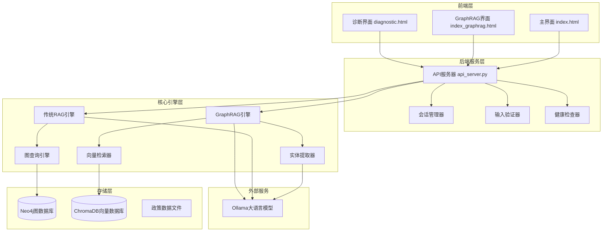

# 政策法规RAG问答系统 - 操作手册

## 概述

政策法规RAG问答系统是一个基于检索增强生成（RAG）架构的智能问答系统，结合了Neo4j图数据库、Ollama大语言模型和Web前端，实现对政策法规的语义检索和智能问答功能。

### 核心特性
- **智能问答**：基于RAG架构的政策法规问答
- **知识图谱**：使用Neo4j构建政策法规知识图谱
- **多轮对话**：支持会话管理和上下文理解
- **实时诊断**：内置连接诊断和健康检查
- **双模式支持**：传统RAG和GraphRAG两种检索模式

## 系统架构

### 整体架构图



### 核心组件分析

#### 前端组件
- **index.html**：主要用户界面，支持基础问答功能
- **index_graphrag.html**：增强版界面，支持GraphRAG和传统RAG模式切换
- **diagnostic.html**：系统诊断界面，用于连接测试和故障排查

#### 后端核心模块
- **api_server.py**：Flask API服务器，处理HTTP请求
- **connections.py**：连接管理器，管理数据库和LLM连接
- **session_manager.py**：会话管理，支持多轮对话
- **health_checker.py**：健康检查，监控系统状态
- **validators.py**：输入验证和安全检查

#### 检索引擎
- **graphrag_engine.py**：GraphRAG核心引擎
- **vector_retrieval.py**：向量检索器
- **graph_query.py**：图查询引擎
- **entity_extractor.py**：实体提取器

#### 数据处理
- **import_policy_data.py**：传统数据导入脚本
- **import_graphrag_data.py**：GraphRAG数据导入脚本


## 环境配置

### 系统要求

#### 硬件要求
- CPU：双核以上处理器
- 内存：最低4GB，推荐8GB
- 存储：至少1GB可用空间

#### 软件要求
- Python 3.8+
- Neo4j 4.x或5.x
- Node.js（用于前端服务）
- 现代浏览器（Chrome、Firefox、Edge）

### 依赖安装

#### 1. Python依赖
```bash
pip install -r requirements.txt
```

#### 2. 前端依赖
```bash
cd frontend
npm install
```

### 环境变量配置

复制`.env.template`为`.env`并修改配置：


## 系统部署

### 部署流程

#### 1. 启动Neo4j数据库
```bash
# 使用Neo4j Desktop或命令行启动
neo4j start

# 验证连接
python scripts/test_neo4j_connection.py
```

#### 2. 验证Ollama服务
```bash
# 测试远程Ollama连接
python scripts/test_ollama_connection.py

# 或手动测试
curl http://120.232.79.82:11434/api/tags
```

#### 3. 导入政策数据
```bash
# 传统RAG数据导入
python scripts/import_policy_data.py

# 或GraphRAG数据导入
python scripts/import_graphrag_data.py
```

#### 4. 启动后端服务
```bash
# 推荐方式：使用统一启动脚本
python start_server.py api

# 直接启动（需要配置Python路径）
python backend/api_server.py
```

#### 5. 启动前端服务
```bash
cd frontend
npm start
```

### 服务端点

- **主页面**：http://localhost:3000
- **GraphRAG增强版**：http://localhost:3000/index_graphrag.html
- **诊断页面**：http://localhost:3000/diagnostic.html
- **后端API**：http://127.0.0.1:5000
- **健康检查**：http://127.0.0.1:5000/health


## 功能操作指南

### 基础问答功能

#### 1. 访问主界面
打开浏览器访问 `http://localhost:3000`

#### 2. 开始对话
1. 在输入框中输入问题
2. 点击"发送"按钮或按回车键
3. 系统将返回基于政策法规的答案

#### 3. 多轮对话
1. 点击"新建会话"创建会话
2. 在同一会话中提问，系统会维护对话上下文
3. 点击"清空聊天"清除当前显示的消息

### GraphRAG增强功能

#### 1. 访问增强版界面
打开 `http://localhost:3000/index_graphrag.html`

#### 2. 模式切换
- **GraphRAG模式**：使用向量检索和图查询的混合方法
- **传统RAG模式**：仅使用Neo4j图查询

#### 3. 高级功能
- **置信度显示**：显示答案的可信度评分
- **数据源追踪**：显示答案来源的政策文档
- **幻觉检测**：检测并警告可能的答案幻觉

### 系统诊断功能

#### 1. 访问诊断页面
打开 `http://localhost:3000/diagnostic.html`

#### 2. 连接测试
- **基础连接测试**：测试前后端连通性
- **API端点测试**：测试各API接口
- **CORS测试**：测试跨域请求配置

#### 3. 故障排查
- 检查服务状态
- 查看连接错误详情
- 获取系统性能信息

## 数据管理

### 数据结构

#### 政策数据格式
```json
{
    "政策": "政策标题",
    "发布机关": "发布机构",
    "发布时间": "YYYY-MM-DD",
    "章节": [
        {
            "标题": "章节标题",
            "内容": "章节内容",
            "小节": [
                {
                    "标题": "小节标题",
                    "内容": "小节内容"
                }
            ]
        }
    ]
}
```

#### 知识图谱节点类型
- **Policy**：政策文档节点
- **Section**：章节节点
- **SubSection**：小节节点
- **Agency**：发布机构节点
- **Entity**：实体节点（GraphRAG模式）

### 数据导入

#### 1. 准备数据文件
将政策法规JSON文件放入`database/`目录

#### 2. 传统RAG导入
```bash
python scripts/import_policy_data.py
```

#### 3. GraphRAG导入
```bash
python scripts/import_graphrag_data.py
```

#### 4. 数据验证
```bash
python scripts/test_graphrag_system.py
```

## 测试与验证

### 连接测试脚本

#### 1. Neo4j连接测试
```bash
python scripts/test_neo4j_connection.py
```

#### 2. Ollama连接测试
```bash
python scripts/test_ollama_connection.py
```

#### 3. 后端API测试
```bash
python scripts/test_backend_response.py
```

### 功能测试

#### 1. 系统集成测试
```bash
python scripts/test_enhanced_features.py
```

#### 2. GraphRAG系统测试
```bash
python scripts/test_graphrag_system.py
```


### 快速启动命令汇总
```bash
# 环境准备
conda create -n rag python=3.12
conda activate rag
pip install -r requirements.txt

# 服务启动
neo4j start                           # 启动Neo4j
python start_server.py api            # 启动后端API
cd frontend && npm start               # 启动前端

# 数据导入
python scripts/import_policy_data.py  # 传统RAG导入
python scripts/import_graphrag_data.py # GraphRAG导入

# 测试验证
python scripts/test_neo4j_connection.py
python scripts/test_ollama_connection.py
python scripts/test_backend_response.py
```
